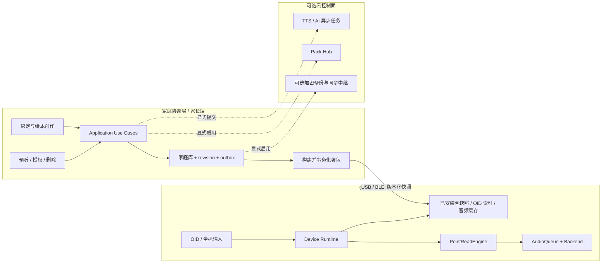

# 益米架构方案探索与比较

> 状态：建议决策稿 v0.1
> 范围：软件运行时、模块边界、数据归属与演进路线。硬件芯片和云厂商选型不在本文范围内。

## 1. 结论

采用 **本地优先的混合架构：设备数据面 + 家庭协调层 + 可选云控制面**。

- 点读解析、播放策略和已安装音频全部留在设备侧，本地命中不经过网络。
- 家长端负责创作、预听、授权、装包和家庭内同步，是家庭私有数据的主要管理入口。
- Pack Hub、跨家庭公开内容、可选备份和重型 TTS/AI 任务放在云端；断云不影响已安装内容。
- 代码继续使用 TypeScript monorepo 和模块化单体，不在当前阶段拆微服务。
- 先用清晰的端口、版本化契约和 outbox 隔离边界；达到明确拆分条件后，再独立部署 TTS worker、Hub 或同步服务。
- 依赖与复用采用[高复用、低维护架构](./reuse-maintainability.md)：稳定内核、单一合同所有者、第二真实消费者抽象门和机器依赖图。

这个选择与两条既有产品不变式一致：本地缓存点读首音目标 `<200ms`，家庭 DIY 与音色默认留在本地。

## 2. 当前架构画像

当前仓库已经具备合理的原型骨架：

```text
apps/device-sim ─┬─> packages/core
                 ├─> packages/content ─> packages/core
                 ├─> packages/audio   ─> packages/core
                 └─> packages/protocol

apps/admin-web ─────> packages/content ─> packages/core
```

优点：

- `core`、`content`、`audio`、`protocol` 的依赖基本单向，没有循环引用。
- `PenSession` 已通过 `Transport` 抽象 WS/BLE/串口，方向正确。
- `AudioPlayer` 通过 `AudioBackend` 隔离运行环境，设备模拟器可以作为组合根。
- `book.json` 和 DIY JSON 让内容可移植，符合开放格式定位。

主要缺口：

| 缺口 | 当前表现 | 扩展后的影响 |
|------|----------|--------------|
| 运行时职责混合 | `device-sim` 同时装载内容、处理协议、编排引擎、持久化和播放 | 真机、桌面模拟器、家长端会复制流程 |
| 领域与存储边界偏紧 | `PointReadEngine` 直接依赖具体 `DiyBindStore` | 切换 SQLite、固件 KV 或远端只读缓存时需改领域层 |
| 文件存储缺少并发语义 | 管理端直接覆盖 JSON；写入无 revision、CAS 和原子替换 | 多设备同步时容易丢更新 |
| 协议只有形状、没有边界校验 | `decodeMessage` 只检查 `type` 存在 | 版本兼容、错误定位和不可信输入处理困难 |
| 包生命周期未闭环 | 有 manifest 校验，但缺 schema 版本迁移、完整性索引和安装事务 | 升级中断可能产生半安装内容 |
| 随机与时间不可注入 | 引擎直接使用 `Math.random()`、`Date.now()` 状态 | 黄金测试、重放和冲突测试不稳定 |

这些是原型进入多运行时阶段前应解决的边界问题，不要求立刻引入远程服务。

## 3. 约束与评价权重

| 约束 | 权重 | 原因 |
|------|------|------|
| 离线能力与点读延迟 | 25% | 核心体验，网络不可进入实时点读关键路径 |
| 家庭数据与音色隐私 | 20% | 录音、照片和儿童内容默认本地 |
| 可演进与可测试性 | 15% | 未来需覆盖真机、移动端、Hub 和多种 TTS |
| 多设备与云能力 | 15% | 需要装包、备份、任务和可选同步 |
| 交付与运维成本 | 15% | 当前项目规模不适合高运维负担 |
| 社区内容生态 | 10% | Pack 发布、发现和版本分发是长期护城河 |

评分使用 1 到 5 分，5 分最佳。

## 4. 候选方案

### A. 纯本地模块化单体

所有能力运行在笔、家长端或同一台家庭主机，使用文件或 SQLite，不设官方云依赖。

适合：硬件 PoC、隐私敏感家庭、单笔单端 MVP。

优势：实现和部署最简单；点读延迟、离线能力和数据主权最佳。

代价：跨设备同步、异步 GPU 任务、Hub 搜索和内容分发需要各自补建；手机卸载后的恢复体验较弱。

### B. 云中心化后端

设备和家长端通过统一 API 读写绑定、内容、音色任务与播放决策，服务端数据库是事实源。

适合：强账号产品、长期在线设备、运营控制优先的内容平台。

优势：账号、多设备、运营和任务调度模型直接；服务端数据治理集中。

代价：网络进入关键路径后违背离线目标；家庭音色与儿童内容集中化；服务故障和持续成本直接影响基本点读。

### C. 本地数据面 + 可选云控制面（推荐）

设备保存可执行内容快照并独立完成 `tap -> resolve -> play`。家长端管理家庭事实源，通过版本化同步日志把变更投影到各支笔。云只提供 Hub、可选备份及异步计算。

适合：益米当前产品原则和从 PoC 到 Gen1 的演进。

优势：保留 A 的实时性和隐私，同时获得 B 的分发与多设备能力；云能力可以按需启用。

代价：必须认真定义同步、冲突、包安装事务和数据归属；端侧状态模型比纯云 CRUD 更复杂。

### D. 事件驱动微服务

将身份、家庭、Pack、同步、TTS、安全审核等拆成独立服务，通过消息总线协作。

适合：多个独立团队、不同扩缩容曲线、明确隔离要求已经出现之后。

优势：部署和伸缩边界清晰，重型 TTS 与 Hub 流量可以独立扩容。

代价：分布式事务、消息幂等、可观测和部署平台成本最高；当前领域模型仍在变化，过早拆分会固化错误边界。

## 5. 加权比较

| 方案 | 离线/延迟 25 | 隐私 20 | 演进 15 | 多设备/云 15 | 交付运维 15 | 生态 10 | 加权总分 |
|------|-------------:|--------:|--------:|-------------:|-------------:|--------:|-----------:|
| A 纯本地单体 | 5 | 5 | 3 | 2 | 5 | 3 | **4.05 / 5** |
| B 云中心后端 | 2 | 2 | 4 | 5 | 3 | 5 | **3.20 / 5** |
| C 本地 + 可选云 | 5 | 5 | 5 | 4 | 3 | 5 | **4.55 / 5** |
| D 事件微服务 | 2 | 2 | 5 | 5 | 1 | 5 | **3.05 / 5** |

敏感性判断：即使把“多设备/云”权重提高到 25%，C 仍优于 B；只有在产品改为长期联网、云端事实源且弱化家庭本地数据原则时，B 才可能成为首选。

## 6. 推荐目标架构



### 6.1 关键边界

**设备数据面**

- 输入：OID、坐标、物理按键和已安装内容版本。
- 输出：本地音频、状态事件和待同步的最小诊断信息。
- 不依赖：账号服务、Hub、在线 TTS、远端播放决策。

**家庭协调层**

- 拥有 DIY 绑定、VoiceProfile 元数据、授权记录、装包计划和家庭设备清单。
- 将可编辑模型编译为设备只读快照；设备不直接消费管理端数据库结构。
- 对同一 OID 的并发修改使用 revision/CAS；冲突显示给家长，不做静默覆盖。

**可选云控制面**

- Hub 只管理公开 Pack 元数据、版本和内容对象。
- TTS/AI 使用 job API：提交、轮询/推送、取消、结果导入；点读时只播放已缓存结果。
- 同步中继以最小化数据为原则；录音样本与照片不因开启普通同步而自动上传。

### 6.2 数据归属

| 数据 | 事实源 | 设备副本 | 云端 |
|------|--------|----------|------|
| 已安装公开 Pack | Pack manifest / 家长端安装记录 | 只读快照 | Hub 公开对象 |
| 家庭 DIY 绑定 | 家庭库 | 可执行投影 | 可选备份 |
| 音色样本 | 家庭库本地安全存储 | 默认不下发原样本 | 单次任务显式授权 |
| 合成音频 | 家庭库缓存 | 装包后持有 | 可选短期任务结果 |
| 点读事件 | 设备短期缓冲 | 本地 | 默认不上云；仅脱敏汇总可选 |
| 授权与删除记录 | 家庭库 | 必要状态投影 | 使用云任务时保存最小审计记录 |

## 7. 代码边界建议

保持现有包，先校正职责，再决定是否新增包：

| 模块 | 应负责 | 不应负责 |
|------|--------|----------|
| `packages/core` | 领域类型、命中算法、播放策略、纯规则 | 文件系统、网络、具体 repository、系统时间与全局随机数 |
| `packages/content` | schema、编解码、版本迁移、包完整性、安装计划 | UI、设备连接、云 API |
| `packages/audio` | 队列状态机、播放器端口、运行时后端 | 内容查找和业务授权 |
| `packages/protocol` | 版本化消息、运行时校验、能力协商、错误码 | WebSocket/BLE 的产品编排 |
| `apps/device-sim` | 设备运行时组合根和交互模拟 | 家庭事实源与云任务实现 |
| `apps/admin-web` | 研发期 Book/内容查看与编辑工具 | 承担正式家庭事实源、监护授权或设备安装职责 |
| `apps/companion-app` | 家庭协调层产品组合根：家庭库、预听授权、构建与安装编排 | 复制 FamilyRepository/Confirmation/Snapshot 的合同语义 |

当用例开始在 `device-sim`、家长端和测试间复制时，再增加 `packages/application`，集中这些端口与用例：

```ts
interface BookRepository { get(id: string): Promise<Book | undefined> }
interface BindingRepository { load(): Promise<BindingSnapshot>; commit(change: Change, revision: number): Promise<number> }
interface PackageInstaller { install(plan: InstallPlan): Promise<void> }
interface SpeechJobPort { submit(request: SpeechRequest): Promise<JobId> }
interface Clock { now(): number }
interface RandomSource { next(): number }
```

这不是要求一次性引入六层抽象。端口只在出现第二个实现或需要隔离副作用时建立。

## 8. 同步与一致性策略

采用 **快照 + 变更日志 + outbox**，不把整个系统做成事件溯源：

1. 家庭库中的每个聚合包含 `revision`。
2. 修改在本地事务中同时写当前状态和 outbox 记录。
3. 装包器按某个 revision 生成不可变设备快照和校验清单。
4. 设备确认安装后记录所持 revision；失败时继续使用上一完整版本。
5. 多端编辑以 `entityId + baseRevision + opId` 去重并检测冲突。
6. 删除使用可传播 tombstone；对音色样本执行物理删除工作流，不只隐藏 UI。

冲突策略按领域定义：

- 不同 OID：自动合并。
- 同一 OID 的文案或音色变化：要求选择版本。
- Pack 安装集合：可做集合合并，但容量超限时重新规划。
- 公开 Pack：按不可变 `packId@version` 引用，不原地改历史版本。

## 9. 演进路线

### 阶段 0：加固当前模块化单体

- 为 engine、queue、manifest 增加单元测试和黄金样例。
- 给协议和内容文件增加运行时 schema 校验与明确的版本错误。
- 文件写入改为临时文件、校验、原子替换；增加 revision。
- 注入 clock/random，使解析可重放。

退出条件：核心路径可以在 CI 中稳定验证，坏包或坏消息不会污染当前状态。

### 阶段 1：建立家庭协调层

- 从 `device-sim` 提取装载、解析、播放的应用用例。
- 家长端使用 repository API，不再直接覆盖领域 JSON。
- 实现快照构建器和 USB/BLE 安装事务；模拟断电回滚。

退出条件：同一内容快照可被模拟器和至少一个设备适配器消费。

### 阶段 2：接入可选云控制面

- 先以一个可部署的云模块化单体提供 Hub、job API、同步中继。
- 大对象进对象存储，元数据进关系数据库，异步任务进队列。
- 家庭端使用 outbox；云不可达时继续编辑和点读。

退出条件：断网、停云和任务失败演练均不影响已安装内容。

### 阶段 3：按指标拆服务

只有满足下列条件之一才独立部署：

- TTS/AI 需要 GPU 队列并有独立扩缩容曲线。
- Hub 下载流量影响家庭同步 API 的可用性。
- 独立团队需要明确发布节奏或故障域。
- 合规要求形成必须隔离的数据边界。

首选拆分顺序通常是 `TTS worker -> Pack delivery -> sync relay`，身份和家庭元数据继续留在云模块化单体，直到规模证明需要变化。

## 10. 暂不采用的复杂度

- 不在点读路径上引入消息总线、服务网格或远端函数调用。
- 不为本地单用户 JSON 立即部署通用分布式数据库。
- 不把所有领域变更建模成永久事件流。
- 不让设备直接理解云端数据库或管理端内部模型。
- 不以微服务数量作为“架构成熟度”指标。

## 11. 近期决策清单

| 决策 | 建议默认值 | 需要实测/确认 |
|------|------------|---------------|
| 家庭库实现 | 开发期 JSON repository，产品期 SQLite | 移动端技术栈与备份方案 |
| 设备快照 | 版本化目录 + manifest + checksums | 固件文件系统与双分区能力 |
| 本地连接 | USB 首先，BLE 做控制与小变更 | Gen1 芯片吞吐与配对能力 |
| 云部署 | 单体 API + worker + 对象存储 | 首批用户量和云区域 |
| 同步模型 | revision/CAS + outbox + tombstone | 多监护人权限模型 |
| 协议格式 | 保持 JSON v1，补 schema 与能力协商 | 真机内存压力后再评估 CBOR/Protobuf |

## 12. 验证指标

- 本地缓存命中时，点到首音 P95 `<200ms`。
- 断网 7 天内，点读、绑定编辑、预听和 USB 装包仍可工作。
- 任意安装中断后，设备启动时只选择上一版或新版完整快照。
- 同一 OID 两端并发编辑不会静默丢失任一版本。
- 删除 VoiceProfile 后，家庭库、设备投影和已授权云任务都有可验证的清理结果。
- 云端 API 整体停止时，已安装内容成功播放率不下降。
