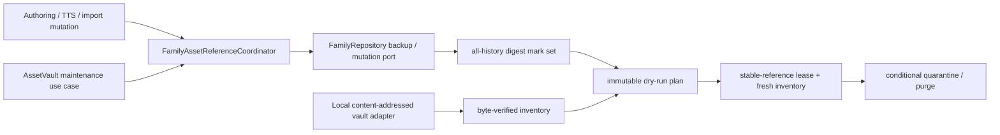

# Family Asset Vault Maintenance v1

> 工作包：`SW-ASSET-VAULT-MAINTENANCE-01`  
> 日期：2026-08-04  
> 范围：companion 主机侧家庭内容寻址资产库；设备安装介质与设备端 GC 保持独立

## 1. 证据来源

本包不是预想式基础设施，而是由两条已经复现的真实路径共同产生：

1. canonical import 先把不可变 WAV 发布到 `assets/sha256/<sha256>.wav`，随后才执行
   FamilyRevision CAS；取消、陈旧头或进程中断可留下没有 revision 引用的完整对象；
2. Family Export v1 已用 `collectReferencedFamilyAssets` 闭合**全部历史 revision**，证明可从
   RepositoryBackup 唯一得到长期保留集合，而不是只扫描当前 head。

因此维护边界复用现有历史引用收集器和 FamilyRepository backup，不复制 revision 遍历、不把文件路径
回写 FamilyRevision，也不让每个录音、TTS 或下载 adapter 各自清理 orphan。

## 2. 架构



新增代码位于：

- `apps/companion-app/src/asset-vault/asset-vault-maintenance-contract.mjs`
- `apps/companion-app/src/asset-vault/family-asset-reference-coordinator.mjs`
- `apps/companion-app/src/asset-vault/asset-vault-maintenance-use-case.mjs`
- `apps/companion-app/src/asset-vault/local-content-addressed-audio-vault.mjs`

合同与用例只认识 reference snapshot、inventory、retention policy 和 conditional delete receipt；本地路径、
文件系统、quarantine 和 `.wav` 命名留在 adapter。

## 3. 两阶段维护协议

### 3.1 Dry-run

`planAssetVaultMaintenance` 要求显式：

- `observedAt`；
- 正整数 `retentionMs`；
- backup、条目、单资产和总字节资源上限；
- ReferenceSnapshot 与 VaultInventory ports。

它对 RepositoryBackup 复用现有 schema、语义和 identity 校验，按 digest 合并全部历史
`assetId + sha256 + bytes` 引用，再对直接位于 `assets/sha256/` 的每个条目重新计算 bytes/SHA-256。
计划只产生以下 disposition：

| disposition | 含义 |
|---|---|
| `PROTECT_REFERENCED` | 任一历史 revision 引用该 digest |
| `RETAIN_YOUNG` | 当前无引用，但仍在显式保留期内 |
| `DELETE_ELIGIBLE` | 合法内容寻址对象、无历史引用且保留期已满 |
| `BLOCK_INTEGRITY` | 篡改、异常类型、非托管名字、引用 bytes 冲突 |
| `BLOCK_CLOCK_SKEW` | 文件修改时间晚于观察时间 |

引用缺失也形成 blocker。`planId` 绑定 reference state、inventory identity、观察时间、保留策略、资源策略、
全部决定和 blocker；dry-run 全程只读。

### 3.2 Apply

`applyAssetVaultMaintenance` 只接受身份完整且 blocker 为 0 的 plan。执行时：

1. 取得稳定引用租约，阻塞经同一 coordinator 进入的 FamilyRevision mutation；
2. 重新建立 RepositoryBackup 与逐字节 inventory；
3. 重新计算 plan，要求 `planId` 与 dry-run 完全一致；
4. adapter 再次核对 inventory identity 和每个 candidate version token；
5. 把候选移入 App-owned quarantine，逐个复算 bytes/SHA-256；
6. 全部匹配后才逐项 purge；中途 quarantine rename 失败时按逆序全回滚；已进入物理 purge 后若捕获到
   I/O 故障，则明确报告已删前缀、恢复未删对象并移除空 quarantine，调用方重新 inventory/plan 后继续。

新引用、文件替换、mtime 变化、篡改、额外条目和资源漂移都会在第 5 步之前使计划失效。完整维护周期再次运行时，
已经清理的对象不再出现，结果为 0 删除和 0 回收字节。

## 4. 组合根不变式

稳定引用租约的权威性依赖一个明确的组合根规则：所有会新增/恢复 FamilyRevision 引用的主机操作，都经同一个
`withReferenceMutation` 入口；维护操作经 `withStableReferenceSnapshot`。该规则现已由
[`FamilyWorkspace v1`](./family-workspace-v1.md) 固化到产品 factory；其34/34验收进一步覆盖 GC lease 期间的
file reimport、authoring 排队、完整导出和 portable adoption。

这个约束不改变 FamilyRepository port。未来换 SQLite、事务数据库或多进程服务时，只替换 lease/transaction
adapter；mark/plan/apply 和本地 vault conformance 保持。

## 5. 可复算验收

```powershell
npm run test:companion-asset-vault-maintenance
npm run test:companion-host
```

当前结果：

- **21/21**；
- 报告：`build/companion-asset-vault-maintenance-validation/report.json`；
- 报告 SHA-256：`c56e2acd468518334d8fb299ceb7d99aa0c4135f6c65b1ee810e067dc9b164df`；
- 同一 runner 连续两次报告字节一致。

覆盖项包括：

- 11个全历史 digest（含已被新 revision 替换的旧资产）全部保护；
- 老 orphan 删除、年轻 orphan 保留、dry-run 零文件变化；
- 新 revision 引用使旧计划失效；稳定租约期间 mutation 排队；
- candidate 换字节、篡改、引用缺失、异常目录、非托管文件和资源上限阻断；
- 第二个 quarantine rename 故障全回滚；第二个物理 purge 故障明确报告已删前缀、恢复其余对象，随后重规划成功；
- 空库/空 vault、重复维护周期和 caller plan 篡改。

## 6. 证据边界

[`Asset Vault Recovery v1`](./asset-vault-recovery-v1.md) 已把 operation/plan/inventory/candidate identity
持久化到 canonical journal，并在 FamilyWorkspace capability 暴露前执行启动恢复。真实 child-process
终止/重启验收为70/70；已删除连续前缀保留、剩余 quarantine 回迁，随后要求 fresh inventory/plan。

当前证明同进程、App-owned 本地目录与显式 coordinator。以下证据保持开放：

- 多进程 writer 的数据库事务/文件锁实现；
- 持续性I/O故障的未恢复路径清单与运维恢复入口；
- 不可信并发进程替换 vault root/junction 的 TOCTOU 防护，以及流式 backup/目录枚举前置资源限额；
- 父目录 fsync 与真实磁盘断电耐久；
- 设备安装介质、A/B Snapshot 与设备端存储回收。

硬件同步结论仍为 `NONE`：HardwareSystem 18条接口和 `IF-STORAGE` 状态没有新 target binding；本包只处理
家庭主机 vault，不改变 DeviceLink、目标文件系统或板级存储耐久门。
