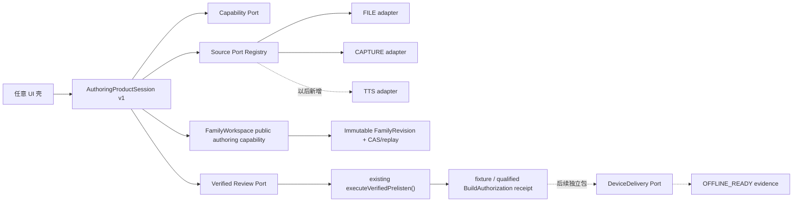
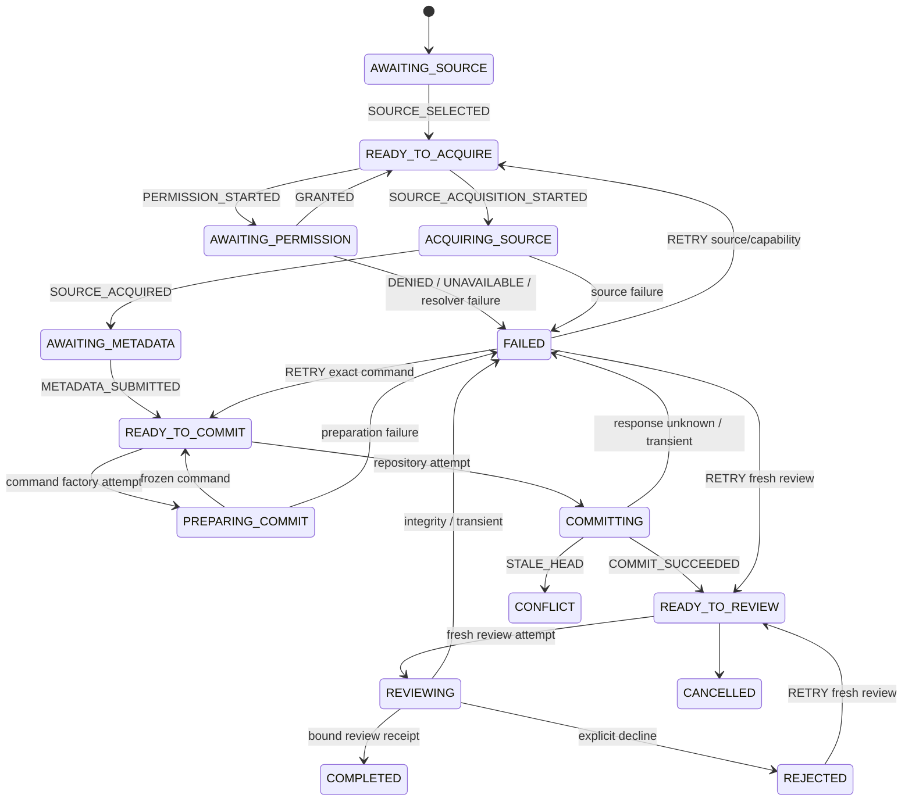

# Authoring Product Shell v1

状态：`SW-AUTHORING-PRODUCT-SHELL-01A` 已形成可执行的 App-local 产品会话基线。它把“选择文件/录音 → 元数据 → 不可变 FamilyRevision → 回听确认 receipt”组合成一个 UI 框架无关的任务，同时继续把生产授权、设备安装、离线就绪、账号、云端和板卡能力留在各自端口与证据门。

## 1. 依据与证据边界

下表只记录 2026-08-04 可访问的成熟产品官方公开流程；最后一列是益米的软件设计推导，不代表竞品内部实现。

| 官方事实 | 来源 | 益米工程推导 |
|---|---|---|
| Yoto App 录音支持暂停/继续；保存后进入录音库，可回听、重命名并加入 playlist。 | [Yoto：Record your own stories](https://support.yotoplay.com/en_gb/record-your-own-stories-BkKi_Fo7fg) | “采集完成”“回听”“组织内容”是三个显式阶段。 |
| Yoto 的录音先进入 playlist，再显式创建并绑定到空白卡；手机或播放器提供完成反馈。 | [Yoto：Create a playlist from recordings](https://support.yotoplay.com/en_gb/how-to-create-a-playlist-from-your-own-recordings-B1piuFiXGl) | 本地内容提交、回听授权、设备交付分别持有 receipt。 |
| Yoto 分享内容由接收者先回听再接受；原创者、分享者、年龄适配和使用权分别判断。 | [Yoto：Safe sharing](https://support.yotoplay.com/en_gb/safe-sharing-with-friends-and-family-S1vytKsmMg) | OS 权限、来源权利与家庭确认不合并成一个布尔值；本地首版只实现麦克风 capability receipt。 |
| Yoto 可查看内容下载状态，并建议断网实际验证离线播放。 | [Yoto：Prepare for a holiday](https://support.yotoplay.com/en_gb/how-to-prepare-your-yoto-for-a-holiday-BJKJtKiXGe) | `offlineReady` 只由未来真实 transfer/verify/activate/断网播放证据产生。 |
| tiptoi Manager 的公开顺序是搜索产品、下载、安装到笔、断开、开机并触碰启动标识。 | [Ravensburger：tiptoi Manager](https://www.ravensburger.de/de-DE/entdecken/tiptoi/tiptoi-manager) | 内容选择与笔端安装是两条事务；FamilyRevision 不携带 USB/板卡路径。 |
| LeapReader 先触碰目标图书，再连 USB，由 Connect 列出并安装 companion audio。 | [LeapFrog：LeapReader downloads](https://www.leapfrog.com/en-us/support/faq/leapreader-downloads) | 物理触发、内容发现、下载和设备激活属于未来 DeviceDelivery adapter。 |
| Tonies 已保存录音先分配并上传到 Creative Tonie，随后由 Toniebox 同步下载。 | [Tonies：Assign recordings](https://support.tonies.com/api/v2/help_center/en-us/articles/29036432866066.json) | 保存、内容归属、同步和设备可用状态保持分离。 |
| Tonies 对上传格式与受限制内容分别给出边界，并建议保留原始音频备份。 | [Tonies：Supported formats](https://support.tonies.com/api/v2/help_center/en-us/articles/29036563051154.json)、[Tonies：Recording backup boundary](https://support.tonies.com/api/v2/help_center/en-us/articles/29036568693522.json) | 来源 adapter 负责格式/权利前置；益米现有 vault、完整导出和恢复路线继续持有家庭资产。 |

公开资料没有披露这些产品的事务 journal、并发控制、崩溃恢复、设备协议或物理码格式。本实现的 CAS、精确重放、会话 revision 和证据绑定来自益米既有可复算合同，不写成竞品事实。

## 2. 产品任务边界



当前纵切的完成状态是 `COMPLETED + bound review receipt`。确定性 runner 的 receipt 明确标为 `fixtureOnly=true`，因此只表达会话接缝、回听顺序和身份绑定已闭合，`buildAuthorized` 仍为 `false`。只有组合根接入经资格化 review adapter 且收到 `fixtureOnly=false` 的 receipt 后，该事实才会变为 `true`。`offlineReady` 固定为 `false`，直到目标板、传输、存储、激活和断网点读证据全部进入 DeviceDelivery 合同。

## 3. 单一职责

| Owner | 持有 | 明确保留在边界外 |
|---|---|---|
| `authoring-product-session-core.mjs` | 纯状态转换、会话 revision、事件幂等、attempt 身份、失败/重试/取消事实 | 文件系统、OS、UI、网络、音频播放、仓库实例 |
| `authoring-product-session.mjs` | 异步效果编排、AbortController、迟到回调隔离、commit barrier | 具体权限弹窗、picker、设备名、时间/operation ID 策略 |
| Source adapter | 文件路径、录音设备、TTS job、临时文件和来源私有参数 | FamilyRevision、review proof、设备安装 |
| `FamilyWorkspace` | 规范化导入、capture cleanup、vault/repository 串行化、CAS、精确重放 | 产品会话状态、UI、confirmation |
| commit command port | operationId、时间、contentRevision | repository、会话状态与任何动态 credential |
| product controller | 固定的非敏感 `sourceProducer` build identity | adapter token、账号或运行期用户输入 |
| verified review port | BuildPlan/preview、natural-end、明确动作、proof、verification、带证据类别的 BuildAuthorization receipt | source picker、FamilyRepository 内部对象、DeviceDelivery；生产实现仍受 `PRODUCTION_CONFIRMATION_TRUST` 门约束 |

`FamilyWorkspace` adapter 公开的 authoring 端口只有：

```text
loadHead()
commitReplacement(frozenCommand)
```

FILE/CAPTURE 各自是 source port。repository、vault、coordinator、workspace roots 与 generic commit 仍为组合根私有对象。

## 4. 会话状态与事实



每份 snapshot 同时记录五个事实，避免 UI 从 phase 或 fixture receipt 猜测持久化/授权结果：

```json
{
  "importedAssetPublished": true,
  "durableRevisionPresent": true,
  "reviewReceiptPresent": false,
  "buildAuthorized": false,
  "offlineReady": false
}
```

- 采集前拒绝权限：五项均为 `false`。
- 导入后取消：immutable asset 由现有 vault maintenance 生命周期处理。
- commit 后取消或拒绝回听：`durableRevisionPresent=true`，授权与交付为空。
- fixture review 完成：`reviewReceiptPresent=true`，但 `buildAuthorized=false`；UI 不得把 fixture receipt 当作生产授权。
- commit 已落盘但响应丢失：会话暂不自报 durable；用同一个 frozen command/operationId 重试，repository replay 后再确认。
- `STALE_HEAD`：同一会话进入 `CONFLICT`；新任务读取新 head 后生成新 command，旧 command 不做隐式 rebase。

## 5. 可复用端口合同

### 5.1 Source descriptor

```js
{
  sourceKind: "FILE" | "CAPTURE" | "FUTURE_SOURCE",
  requiredCapability: null | "MICROPHONE" | "FUTURE_CAPABILITY",
  clipSourceKind: "family-recording" | "system-tts",
  acquire({ sessionId, attemptId, assetId, request, signal })
}
```

产品 core 不枚举具体平台来源；registry 新增一个 adapter 后，状态机、FamilyRevision、回听与设备链保持原样。首版 `FILE` 跳过 OS permission，`CAPTURE` 先取得 `MICROPHONE` receipt。

permission adapter 的原始 receipt ID、OS payload、异常代码与账号信息均留在 adapter。controller 只从 `sessionId / attemptId / capability / status` 派生 `authoring-permission:sha256:<hex>` 公共 receipt；异常只映射为固定的 `AUTHORING_SESSION_<STAGE>_<CATEGORY>` 公共代码。adapter 提供的 token-shaped ID/diagnostic 不进入 snapshot。

### 5.2 进入会话的公开素材 receipt

```json
{
  "assetId": "asset-...",
  "contentPath": "assets/sha256/<sha256>.wav",
  "bytes": 3884,
  "sha256": "<64 hex>",
  "durationMs": 120,
  "codec": "WAV_PCM16_16K_MONO"
}
```

绝对路径、picker handle、麦克风名称、OS permission payload、capture staging 路径和账号 token 不进入会话 snapshot、FamilyRevision、BuildPlan 或 Snapshot。

### 5.3 commit command

command port 一次性生成：

```text
operationId + expectedHeadRevisionId
createdAt + committedAt + contentRevision
bindingId + clipId
sanitized importedAsset + existing clipMetadata
```

controller 在边界处覆盖为固定、非敏感的 `sourceProducer` build identity；adapter 返回的同名字段不进入会话或 FamilyRevision。`COMMIT_PREPARED` 后 command 即被冻结，随后取消也不会改写它。响应丢失只允许原字节重放；更换来源或 metadata 会开启新会话。这样 repository 的 operation fingerprint、CAS 与 replay 仍由原 owner 负责。

### 5.4 review receipt

review port 输出内容寻址 receipt，并同时绑定：

```text
reviewAttemptId / sessionId
familyRevisionId / bindingId / clipId
assetId / assetSha256
buildPlanId / buildSubjectSha256 / previewId
presentationTranscriptSha256 / confirmationId / authorizationId
fixtureOnly / completedAt
```

产品 API 没有 `confirm()`。明确确认只在 verified review port 收到全部 natural-end 证据后发生；会话只接收最终绑定 receipt。

`fixtureOnly=true` 只会设置 `reviewReceiptPresent=true`；它不会设置 `buildAuthorized`。这使 `AUTHORING_PRODUCT_SESSION_V1=CLOSED` 只表示会话结构合同闭合，不替代仍为 `EVIDENCE_PENDING` 的 `PRODUCTION_CONFIRMATION_TRUST`。

## 6. 失败与重试矩阵

| 场景 | 会话结果 | 副作用/下一步 |
|---|---|---|
| capability `DENIED` / `UNAVAILABLE` | `FAILED → READY_TO_ACQUIRE` | source/commit/review 均为零调用；重试重新解析 capability |
| source adapter error | `FAILED → READY_TO_ACQUIRE` | 已发布 orphan 由 vault maintenance 持有；同一 adapter 可重试 |
| capture/source cancel | `CANCELLED` | AbortSignal + source/cleanup settlement barrier；最终 snapshot 发布后无迟到 mutation |
| command factory error | `FAILED → READY_TO_COMMIT` | command 尚未冻结，可修复本地 port 后重试 |
| commit response lost | `FAILED → READY_TO_COMMIT` | command/operationId 保持原字节；repository 返回 `replayed` 后确认 durable |
| `STALE_HEAD` | `CONFLICT` | repository 零变化；新会话读取新 head |
| explicit review decline | `REJECTED → READY_TO_REVIEW` | revision 保留；新 review attempt 生成新 challenge/consume/session identities |
| review receipt 串绑或损坏 | `FAILED → READY_TO_REVIEW` | authorization 不进入 state；fresh attempt 重验 |
| commit 进行中关闭 | commit barrier | 等待 repository outcome，随后按已知 durable 状态关闭 |

## 7. 可复算验收

命令：

```powershell
npm run test:companion-authoring-product-shell
```

当前结果：`33/33`，机器报告：

```text
build/companion-authoring-product-shell-validation/report.json
SHA-256 e4dd6694ece3acfa2bde4ca80d80701c27c1143067eafe70620cd03776d88eeb
```

验收使用真实 `FamilyWorkspace` public capabilities 与真实 FamilyRepository CAS/replay，覆盖：

- FILE happy path 与零 permission 调用；
- CAPTURE permission deny→grant、token-shaped 私有 receipt/异常代码隔离、临时源 cleanup、commit 后取消；
- commit 落盘后响应丢失与原 command 精确 replay；
- explicit review decline 与 fresh attempt；
- stale head 零仓库变化；
- commit close barrier；
- async command factory并发单飞、取消等待与零repository commit；
- cross-asset review receipt；
- malformed source receipt 与私有路径隔离；
- cancel/AbortSignal/settlement barrier 与最终 snapshot 后零 callback 漂移；
- adapter 自主取消直接进入不可重试的 `CANCELLED`，不伪装为普通失败；
- concurrent effect 拦截；
- event exact duplicate、eventId reuse、stale session revision；
- permission bypass 拦截；
- `offlineReady=false` 的硬件边界。

既有 `executeVerifiedPrelisten()` 的 natural-end、确认、proof、consume 和 BuildAuthorization 仍由 `run-verified-prelisten-acceptance.mjs` 独立验收。产品壳 runner 验证的是其窄 fixture receipt 接缝与编排次序，不复制 trust 算法，也不宣称生产 authority 已接入。

## 8. 硬件同步与后续扩展

本包启动输入仍为：`BOARD_TARGET=UNRESOLVED`，18/18 target bindings 为 `TARGET_EVIDENCE_PENDING`；未出现 codec、storage、USB、OID event 或 board adapter 新绑定。因此本包软件影响为 `NONE`，实现保持 target-neutral。

后续变化按一个端口收敛：

| 变化 | 新增点 | 保持稳定 |
|---|---|---|
| TTS | 一个 `TTS` source adapter + 权利/隐私 fixtures | session core、metadata、commit、review |
| 手机录音 | 一个移动平台 capture + permission adapter | FamilyWorkspace capability 和 receipt |
| 新 UI | 订阅 snapshot、调用同一 controller | 全部 use-case 语义 |
| 新家庭存储 | FamilyRepository adapter + conformance | product session、FamilyRevision |
| 新设备/传输 | DeviceDelivery adapter + target receipt | authoring 与 BuildAuthorization |
| BOARD_TARGET 冻结 | board/codec/storage adapter 与 ReleaseGate evidence | FamilyRevision 和产品任务状态机 |

第二个真实产品壳出现前，session 保持 App-local；共享 UI SDK、跨进程服务或通用工作流框架暂不抽取。新增来源的验收标准是“只增 adapter/fixture，原 session core 与 repository tests 零修改”。
