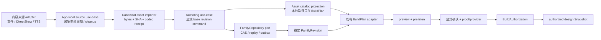

# Family Authoring v1：真实资产到可预听 FamilyRevision

## 1. 状态与目的

`SW-FAMILY-AUTHORING-01A/01B`、`SW-AUTHORING-CAPTURE-ADAPTER-01` 与
`SW-AUTHORING-PRODUCT-SHELL-01A` 的软件纵切已经成立：文件选择或
DirectShow `CapturePort` 产生的 canonical 音频对象，能够以
显式 base revision 命令写入 target-neutral `FamilyRevision`，通过 `FamilyRepository` CAS 提交，再复用
既有 `BuildPlan → CompileDraftProjection → preview → natural-end prelisten → explicit confirmation →
BuildAuthorization → authorized compiler` 链生成与 authored revision 绑定的 `design:` Snapshot。

该纵切解决的是家庭内容创作的**软件事实链**，不选择板卡、OID、音频器件或传输协议。

## 2. 成熟产品依据与证据等级

本流程以成熟产品公开行为作为交互基准，而不推断其内部实现：

| 证据 | 官方事实可支持的基准 | 本项目的工程实现 |
| --- | --- | --- |
| `SRC-FAM-005`，Yoto 官方录音/回听说明，缓存 SHA-256 `8D8CAE2C…F3A2` | 家长录音后先回听，再形成家庭内容 | import receipt、完整预听 natural-end、显式确认分离 |
| `SRC-FAM-006`，Yoto 官方离线内容说明，缓存 SHA-256 `C7A6EEFA…1A95` | 内容库与设备离线缓存是不同层次 | FamilyRevision 不携带设备路径；BuildPlan/安装 adapter 后续投影 |
| `SRC-FAM-007`，Yoto 官方隐私说明，缓存 SHA-256 `7590C507…1824` | 用户录音与云处理有独立保存/删除边界 | 当前资产默认本地；云上传以后由独立同步/授权 adapter 承担 |

完整 URL、字节数、状态码和哈希由
[`hardware/evt0/evidence-sources.json`](../hardware/evt0/evidence-sources.json) 持有；家庭账号、云库与
离线执行的交叉结论见
[`research/product-system-evidence-2026.md`](research/product-system-evidence-2026.md)。

## 3. 分层与单一所有者



| 层 | 当前所有者 | 稳定边界 |
| --- | --- | --- |
| 资产文件与 codec 探测 | `apps/companion-app/src/prelisten/local-audio-assets.mjs` | 生成可验证 import receipt；路径不进入领域 revision |
| 录音来源用例 | `apps/companion-app/src/authoring/capture-source-use-case.mjs` | 只依赖 `capture/discard/import` 端口；临时源清理完成后才把 immutable asset 交给 authoring |
| Windows 录音 adapter | `apps/companion-app/src/authoring/directshow-capture-port.mjs` | 显式设备名、固定 canonical profile、App-owned 路径、一次性 receipt；设备名不进入 durable artifacts |
| 创作用例 | `apps/companion-app/src/authoring/family-authoring-use-case.mjs` | 只依赖 `loadRevision/commit` 端口与稳定 FamilyRevision 合同 |
| revision/CAS/重放 | `contracts/family-revision-v1.mjs`、`tools/family-repository/` | 继续由既有合同和 conformance suite 单一持有 |
| target/path 投影 | `extendFixtureTargetWithImportedAsset` + 既有 family-build adapter | `contentPath/codec` 只进入 BuildPlan asset catalog |
| 本地编译 workspace | `apps/companion-app/src/authoring/local-authoring-workspace.mjs` | 路径 containment、逐资产 bytes/hash、独占写入和完整目录发布 |
| 展示、确认与授权编排 | `apps/companion-app/src/prelisten/verified-prelisten-use-case.mjs` | 静态 preview 与 authored preview 两条可执行链共用；只拥有调用顺序，不复制 presentation/provider 算法 |
| 授权编译 | `apps/companion-app/src/host-orchestrator.mjs` | 继续是 App 内唯一 compiler dispatch 点 |

`packages/*/src`、Family Alpha compiler、Confirmation provider、DeviceLink 和硬件工件均未因本包改变。

## 4. 命令与原子性

`commitImportedClipReplacement` 接受：

- `operationId`；
- 明确的 `expectedHeadRevisionId`；
- `createdAt/committedAt/contentRevision`；
- `bindingId/clipId`；
- import receipt 与目标无关的 clip 元数据。

用例按 `expectedHeadRevisionId` 调用 `loadRevision`，而不是先读当前 head 再隐式覆盖。由此得到三项性质：

1. **精确重放**：相同 operation 和相同 base 可重新构造同一 revision，repository 返回 `replayed`；
2. **并发保护**：另一 operation 使用陈旧 base 时由 repository 返回 `STALE_HEAD`；
3. **零部分 revision**：校验或 CAS 失败时 repository state 不变化。

资产采用“先发布不可变内容对象，再提交 metadata CAS”。CAS 失败时允许留下未引用的内容寻址对象，
但不会形成指向缺失文件的半条 revision；孤儿扫描/保留期/回收现由独立
[`Family Asset Vault Maintenance v1`](./asset-vault-maintenance-v1.md) 用例与 adapter 持有：全部历史
revision 形成 mark set，dry-run 身份在稳定引用租约中重新核对后才进入条件删除。它仍与 repository
事务分离，不伪装成跨介质原子事务。

## 5. 数据边界

| 字段 | FamilyRevision | BuildPlan asset catalog | 本地 adapter receipt |
| --- | :---: | :---: | :---: |
| `assetId/SHA-256/bytes` | 是 | 是 | 是 |
| `sourceKind/transcript/mediaType/language` | 是 | 经投影进入 draft | 输入 |
| `contentPath` | 否 | 是 | 是 |
| `absolutePath` | 否 | 否 | 是 |
| `codec/durationMs` | 否 | codec 是；duration 由 preview 重算 | 是 |
| 板卡/OID/设备文件系统 | 否 | 只由另一个 target adapter 输入 | 否 |

这使后续新增文件选择器、DirectShow 录音、TTS job、云下载或另一应用壳时，只需生成相同 import receipt
并调用同一用例；换 repository 继续跑既有 conformance，而不是复制 revision 规则。

## 6. 可复算验收

执行：

```powershell
npm run test:companion-host
```

authoring 子报告位于 `build/companion-authoring-validation/report.json`，当前为 **15/15**，确定性
SHA-256：`f4387f2666b8dc57d80ae42bed7e7d8f87e63d61e444c37d2d54edece26f5fec`。

覆盖：

- 读取真实 golden WAV、解析 canonical PCM16/16 kHz/mono 并内容寻址导入；
- revision 无路径/codec 泄漏、父子身份和单 binding revision 增量；
- commit、精确 replay、陈旧 CAS、坏 receipt/缺 binding/缺 clip 的零副作用；
- BuildPlan catalog、投影身份、全部资产逐字节验证和 materialized preview；
- 10 个 clip 经注入式 natural-end port 全部完成，presentation 到达 `READY_TO_CONFIRM`。

共享编排的独立报告位于 `build/companion-verified-prelisten-validation/report.json`，当前为 **5/5**，
确定性 SHA-256：`77c589de21123829fdaef5c65be3932069d7be28328a0ae094cbf7def56ac009`。它证明显式动作只在
`READY_TO_CONFIRM` 后发生，confirmation/proof/verification/BuildAuthorization 构成同一绑定链，
拒绝动作只留下未消费 challenge，不生成 confirmation 或授权。

DirectShow capture 接线的确定性报告位于
`build/companion-capture-authoring-validation/report.json`，当前为 **12/12**，SHA-256：
`5eb3a3e70e4960b69ec40b3901d1529a4f7a3f5a3b1ec42ee447ec4d6a0a1d03`。成功场景使用真实 golden WAV
字节模拟 recorder 输出，然后贯穿 canonical import、FamilyRevision、BuildPlan、全部 clip natural-end、
fixture provider、BuildAuthorization 与 design Snapshot；预取消、运行中取消、timeout、坏 recorder receipt、
import 失败和 cleanup 失败均在 revision commit 前结束。报告同时复算临时采集文件已清理，设备名与临时路径
未进入 revision、BuildPlan、preview 或 Snapshot。

真实 authored 组合根执行：

```powershell
npm run verify:companion-real-authored -- `
  --source hardware/evt0/family-alpha-v1/golden/assets/clip-014-1.wav `
  --transcript "这是香蕉，黄黄的，香香的。" `
  --runner-confirm --volume 0
```

真实 DirectShow 入口复用同一组合根：

```powershell
npm run verify:companion-real-authored -- `
  --record-device "MIC_DEVICE" --record-seconds 3 `
  --transcript "宝贝，妈妈在这里。" `
  --runner-confirm --volume 20
```

`build/companion-real-authored-flow/report.json` 为 **10/10**：所选本地文件经固定 ffprobe 导入，形成
新 FamilyRevision/BuildPlan/materialized preview；10 个资产全部经 ffmpeg 完整解码，10/10 clip 经固定
ffplay 自然退出；其后才产生显式动作、fixture proof、provider verification、BuildAuthorization 和
authorized design Snapshot。最新报告 SHA-256 为
`cc162a4a4b637d3ed03e1fa82e465a599b4ae37284ab47d2692757f60c216458`；该次 revision 为
`sha256:04c75f6e8eff76661588a6120e9ae72ae2d6d162a3e7d1cd4694288c6bf2983e`，Snapshot 为
`design:919e21f231511cfa47d2d78398aa0dff48c50c5dfbdeb52751d479a6bd5ccbe6`。

这些报告证明软件用例、真实主机进程回调和设计 Snapshot 绑定，不代表产品 UI 已完成、真实麦克风录音
已被家庭确认、操作者实际听见、生产账号已授权或目标设备音频链已通过。`--runner-confirm` 明确是
fixture 动作；真实主机 `ffplay` 的进程/声学边界继续由
[`codex/capsules/real-prelisten-v1.md`](codex/capsules/real-prelisten-v1.md) 单独持有。

产品任务层的独立报告位于
`build/companion-authoring-product-shell-validation/report.json`，当前为 **33/33**，SHA-256：
`e4dd6694ece3acfa2bde4ca80d80701c27c1143067eafe70620cd03776d88eeb`。它使用真实FamilyWorkspace
capability与repository CAS/replay，证明FILE/CAPTURE、内容寻址permission receipt、metadata、冻结command、review receipt、取消和
失败重试可以由同一个framework-neutral会话持有；产品API没有直接confirmation入口，fixture receipt也不会提升生产授权事实。合同和成熟产品依据见
[`Authoring Product Shell v1`](./authoring-product-shell-v1.md)。

## 7. 后续扩展门

1. CLI `--source` 与 `--record-device` 已汇入同一 downstream 主链；产品壳已实现source/permission/metadata/
   commit/review端口与状态机，实际设备名、OS权限和一次真实麦克风run继续单列host receipt；
2. 新增 binding、删除 clip、排序等命令各自先形成纯函数/零副作用向量，再决定是否抽共享 command helper；
3. 两条 App 内可执行预听链已经触发 **App-local** 最小用例抽取；只有出现第二个独立产品组合根与
   可指认重复后，才提取共享 application package；
4. SQLite、账号 authority、云同步和设备安装分别保持 repository/authority/sync/device ports，按独立证据门进入。

App 内的正式装配入口现由 [`FamilyWorkspace v1`](./family-workspace-v1.md) 持有：文件/录音导入、
authoring commit、资产维护、完整导出与 portable restore 共用一个私有 reference coordinator；产品壳只消费
语义化 capability，避免页面各自构造 repository/vault 后形成并行事务路径。
