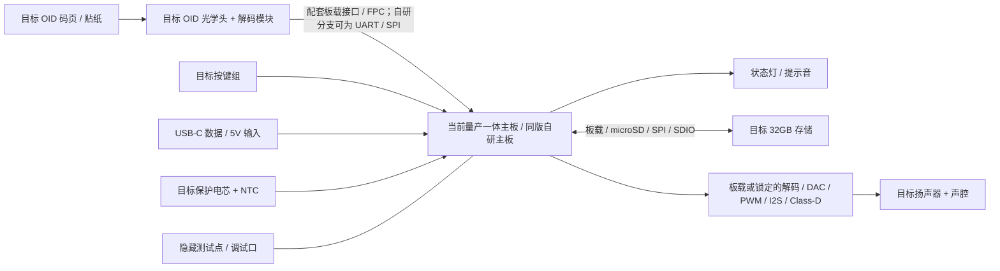

# Gen1 EVT-0 单件目标样机实施基线

> 状态：执行基线 v0.2
> 日期：2026-07-26
> 上位原则：[硬件与 OID](./hardware-oid.md)
> 产品对标：[小鸡球球 / 宝贝 JoJo / 讯飞](./research/mature-products-gen1-p0.md)
> 主板/代际复核：[OID 主板与“第四代”口径](./research/oid-board-generation-survey-2026.md)
> 单件采购：[EVT-0 单件采购清单](./research/gen1-evt0-single-buy.md)
> 系统接口：[HardwareSystem v1 与 EDA 准入](./hardware-system-architecture.md)
> BOM 锁定台账：[hardware/evt0/bom-lock.csv](../hardware/evt0/bom-lock.csv)
> 批量阶段：[Gen1 OID 方案商 RFQ](./research/gen1-p0-oid-rfq.md)

## 1. 定义

这里的 DIY 只表示 **按单件数量采购、由项目方自行集成和验收**，不表示做一支低配原型。

首支实物定义为 `Gen1 EVT-0`：它和目标产品使用同一物理 OID、同一电气架构、同一 PCB/BOM 版本、同一固件、同一内容介质、同一电池/充电链、同一声学与结构指标。后续批量生产只改变采购数量和生产组织，不重新换一套核心方案。

```text
目标 OID 码页/贴纸
  -> 目标 OID 光学头与解码模块
  -> 当前量产的一体点读笔主板，或同版自研目标主板
  -> 本地索引与 32GB 存储
  -> 本地 WAV/MP3 解码
  -> 目标音频输出与扬声器
```

已缓存内容从笔尖接触到首音的 P95 必须 `<200ms`，断网、无账号、无电脑连接时仍能完整点读。

## 2. 等价性合同

### 2.1 必须完全相同

| 项 | EVT-0 与目标产品的约束 |
|----|-----------------------|
| 物理码 | 使用真实目标 OID 码与目标印刷参数，不用二维码、AprilTag 或自定义大点阵代替 |
| 光学链 | 使用目标 OID 光学头、镜头、补光光谱、滤光、解码固件及固定工作距 |
| 主板 | 使用同一原理图、PCB layout、关键器件料号和连接器定义 |
| 固件 | 使用同一源码、构建配置、内容索引与升级格式 |
| 本地内容 | 同一 32GB 存储等级、同一 WAV/MP3 播放路径、同一离线策略 |
| 交互 | 同一电源/播放复用键、音量加减、RGB 灯语和提示音 |
| 电源 | 同一电芯规格、保护、NTC、充电 power-path、电量计和 USB-C 输入 |
| 声学 | 同一功放、扬声器规格、声腔目标、音量曲线和最大声压限制 |
| 结构 | 同一外形包络、笔尖几何、握持区、跌落受力路径和儿童可触边界 |
| 验收 | 同一读码、时延、离线、续航、温升、跌落、按键与耐久通过线 |

### 2.2 只允许这些生产差异

| 差异 | 单件阶段做法 | 不得降低的结果 |
|------|--------------|----------------|
| 采购数量 | 每种关键件单买 2-5 个，批量阶段按 MOQ 采购 | 料号、版本、来源追溯和来料标准相同 |
| PCB 制造 | 采用小批量 SMT；制板厂最低片数可以多于装机数 | Gerber、叠层、铜厚、器件和测试点与目标版一致 |
| 外壳制造 | CNC、MJF 或快速软模；选择能达到目标材料与表面指标的工艺 | 尺寸、重量、强度、手感、声腔、锐边和跌落门不放宽 |
| 装配组织 | 手工总装并逐项记录扭矩、线束和校准值 | 装配顺序、固定方式、绝缘、应力释放和质检项与目标工艺一致 |

开发板、洞洞板、外露飞线和台架电源可以作为故障定位工具，但装进样机、参与演示或参与最终数据时，样机即不合格。

### 2.3 明确排除

- 通用摄像头 + YimiDot/QR/AprilTag 作为主点读输入；
- OpenMV、手机或电脑参与识码；
- 外接充电宝、外接扬声器或两块开发板叠放；
- 只跑 WAV 诊断音而不跑目标 MP3/内容格式；
- 用 3D 打印粗壳掩盖目标尺寸、声腔、材料或跌落不达标；
- 样机用一个料号、量产再换另一个料号而不重新走完整 EVT。

## 3. 目标规格

小鸡球球和宝贝 JoJo用于冻结无屏点读笔的形态、离线内容和低按键负担；讯飞用于冻结即时反馈与错误状态质量，不引入屏幕/OCR 主路径。

| 子系统 | Gen1 EVT-0/目标产品共同规格 |
|--------|-----------------------------|
| 产品形态 | 无屏儿童点读笔，长 `135-155mm`，主要握持直径 `28-36mm`，整机 `<100g` |
| 笔尖 | 目标 OID 近接触式光学头；护口固定工作距，不刮纸，正常握持不遮挡 |
| 印刷 | 使用目标码生成工具、目标点码油墨/色层与印刷参数；白底、浅/深 CMYK、哑膜和亮膜均按目标工艺验证 |
| 读码 | 标准码 1,000 次成功率 `>=98%`，错码 `0`；空白/普通印刷 500 次误触发 `0` |
| 首音 | 已缓存内容 P50 `<150ms`、P95 `<200ms`、P99 `<300ms` |
| 存储 | 32GB，保存内容、索引、系统音、升级包和诊断日志 |
| 音频 | PCM WAV 诊断 + MP3 目标播放；新点读可按固定策略打断上一段 |
| 扬声器 | 阻抗、额定功率、灵敏度和声腔按当前主板/实测锁定；所有内容与提示音 `<=85dBA @ 50cm` |
| 输入 | 目标 3-4 个物理输入位；精确键数/键义由近期主板和竞品实测锁定，幼儿盲操作可区分 |
| 状态 | RGB + 不同节奏短音，区分启动、成功、未绑定、存储错误、低电和升级 |
| 电池 | `650-800mAh` 保护电芯，NTC + power-path；混合点读工况 `>=6h` |
| 接口 | USB-C 5V/1A，支持内容写入、固件升级和充电；无线不进入点读热路径 |
| 离线 | 关闭 WiFi/BLE、断开电脑后，已安装内容永久可点读 |
| 结构 | 电芯不可挤压，镜头/扬声器/PCB 有机械固定，外部无锐边和可拉出小零件 |

## 4. 目标电气架构



首选路线是单买一块仍在供货的当前量产一体主板套件，并让 EVT-0 与以后批量使用同一板号/revision。`ESP32-S3-MINI-1-N8 + MAX98357A + BQ24074 + MAX17048` 保留为同版自研板候选组合，不在近期一体主板调查完成前宣称已经冻结。

### 4.1 当前主板/OID 套件锁定门

当前一体主板与配套 OID 光头是结构 CAD/自研 PCB 前必须先锁定的核心件。零售样品必须同时给出：

1. 完整主板、OID 光头、镜头、补光、排线/连接器、按键、扬声器接口、电池接口和标准码卡；
2. 主板型号/revision/生产状态，正反面高清图、尺寸图、固件/SDK 版本及主控、存储、音频、电源等关键器件清单；
3. USB、存储、音频、按键、灯、电池/充电和 OID 光头的接口、供电、启动、升级、事件时间戳及日志说明；
4. OID 光头机械图、工作距、板载解码/事件 API/实际通信边界，以及至少 24 个唯一有效码、空白区和码生成/印刷说明；
5. 成像器件、LED 和滤光片完整料号/revision，补光峰值波长及容差/FWHM、驱动电流、发光占空比、接收响应和环境光限制；
6. 点码层是 process-K、含碳黑 K 还是专用吸收墨，给出油墨/墨粉 SKU、目标波段反射对比、色层顺序、RIP/ICC/加网、点径/点距、公差、纸张和覆膜参数；
7. 离线永久读码，不依赖账号、云端心跳或在线许可证；
8. 同一主板号、光头料号和固件/码制 revision 后续可按原规格批量采购；
9. 至少能用板载同源时间戳/日志，或明确的测试点与外部仪器，同步定位首个可观察 OID 事件和扬声器首个有效输出。

缺任一项的商品只能做竞品/拆解参考，不能进入目标 BOM。找不到合格的一体主板时，才转入同版自研主板分支；两条分支都使用真实 OID，不回退到视觉大码。

### 4.2 关键器件锁定表

| Ref | 功能 | 目标料号/锁定规则 | EVT-0 数量 |
|-----|------|-------------------|------------:|
| MB1 | 当前一体主板 | `BOARD_TARGET`；按 4.1 取得板号/revision、资料与供货证据后冻结 | 2 |
| M1 | OID 光学头/解码边界 | `OID_TARGET_HEAD`；必须与 MB1 同版成套验证 | 2 |
| SD1 | 存储 | MB1 板载或外置 32GB；样机和批量使用同一品牌、系列和容量 | 3 |
| B1 | 电芯 | 650-800mAh、保护板 + 10k NTC；同厂同型号，带规格书/MSDS/UN38.3 | 3 |
| SP1 | 扬声器 | 与 MB1 输出和目标声腔匹配；冻结阻抗、功率、尺寸、灵敏度和供应料号 | 3 |
| J1 | USB-C 连接器 | 一体主板分支使用 MB1 同版板载连接器；自研板分支冻结精确 MPN、焊盘、保持力与寿命 | 5 |
| U1-U5 | 自研板候选器件 | 一体主板分支 DNP；自研分支完成电源/音频/固件评审后另立精确 MPN | 3 |
| PCB1 | 自研目标主板 | 一体主板分支 DNP；自研分支与量产使用同一 Gerber/BOM/叠层 | 5 |
| ENC1 | 外壳 | 目标 CAD 同版；功能样机 2 套，一套跌落、一套基准 | 2 |

表中未锁定的精确料号必须在原理图评审前补齐，并同步到 [BOM 锁定台账](../hardware/evt0/bom-lock.csv)。`同规格替代` 不等于同一目标；目标分支及 `ALL` 范围的适用行全部到 `LOCKED`，并通过 BOM revision manifest 校验后才发布 `BOM-REV-A`。另一分支专用行不进入当前发布BOM；任何后续替料都建立新 revision 并重跑受影响验收。

## 5. PCB 与结构

### 5.1 主板

- 首选一块细长的一体主板完成 OID 接入/解码、主控、存储、USB、音频、电池/充电、按键和灯；板层数以目标板实物/资料为准；
- OID 头通过带锁 FPC/线束连接，连接器方向和应力释放进入结构 CAD；
- 握柄段板宽目标 `<=22mm`，头部可按电池、扬声器、天线和外壳扩大；最终轮廓由近期主板实测冻结；
- 自研板为 USB D+/D-、OID 总线、音频数字/模拟边界、功放输出、电池电流与主要电源轨保留隐藏测试点；一体主板必须提供等价工厂焊盘、测试模式、日志时间戳或可复现的外部捕获方法；
- 正常使用时没有外露排针、飞线、转接板或可触调试接口；
- 电池与 PCB 之间有绝缘和硬隔离，螺钉/铜柱不侵入电芯膨胀空间。

### 5.2 外壳与声腔

| 项 | 目标 |
|----|------|
| 外形 | 目标 CAD 直接出单件壳，不制作“临时大壳” |
| 笔尖 | 光轴、OID 头和护口同轴；工作距由硬限位决定，可通过校准垫片微调 |
| 握持 | 主按键与音量可盲操作，握持不遮挡笔尖、出声孔或天线区 |
| 声腔 | 扬声器前后腔隔离，软垫密封，无松动异响；网罩不可被儿童取下 |
| 装配 | 螺钉 + 热熔/嵌件结构；电池不以胶带作为唯一固定方式 |
| 材料 | 单件工艺的材料证明与目标阻燃、耐汗、跌落和表面要求一致 |
| 维护 | 外壳可无损拆装，隐藏测试口可在不拆电芯时访问 |

## 6. 固件边界

益米自研固件主体使用 Rust；目标板原生 C BSP、OID SDK 和 codec 通过窄 C ABI
进入板级 adapter。OID 适配边界只把目标主板可观察到的读码事件归一为：

```rust
pub struct PhysicalCodeEvent {
    pub physical_code: Option<PhysicalCode>,
    pub event_at: MonotonicUs,
    pub sensor_at: Option<MonotonicUs>,
    pub ready_at: Option<MonotonicUs>,
    pub quality: Option<u16>,
    pub status: OidStatus,
    pub sequence: u32,
    pub dropped_events: u32,
}
```

核心 crate 为 `no_std` 且禁止 `unsafe`；FFI、芯片 HAL、RTOS、ISR 和 DMA
生命周期只存在于精确 `BOARD_MPN / PCB_REV` 的板级 port。OpenVela、ESP-IDF
和裸机 Embassy/RTIC 是互斥运行时路线。
板级 C provider 通过 `acquire/release` 保证唯一 owner；event sequence、累计
dropped counter 与 queue stats 是成功率和时延报告的强制原始证据。

热路径固定为：

```text
board/head OID event
  -> 连续/重复码过滤
  -> 内存索引 physicalCode -> logicalOid -> audioPath
  -> 打开本地文件
  -> WAV/MP3 解码首缓冲
  -> 板载音频首缓冲 / DAC、PWM 或 I2S 起播
  -> 扬声器首个有效输出
```

要求：

- 最低要求是用同一单调时钟记录 `event -> resolved -> audio-start`；可见的 `sensor/ready/pcm` 阶段继续记录，不可见阶段标记为 unavailable，不用推算值冒充测量；
- 若一体主板不能给同源时间戳，则用逻辑分析仪/高速录像/麦克风同步捕获首个可观察 OID 事件和扬声器首音，并把捕获方法、采样率和误差写入结果；
- 启动时加载并校验索引，点读时不扫描目录、不解析大 JSON；
- 同码冷却、不同码打断、暂停/再听策略写成版本化配置；
- 存储缺失、文件损坏、未绑定码、OID 头故障分别给出错误状态；
- USB 写内容使用临时区、校验和与原子切换，半写包不进入活动状态；
- 所有已安装内容在关闭 WiFi/BLE 后仍可播放。

## 7. 单件实施顺序

### Gate 0：目标锁定

1. 购买并实测小鸡球球、宝贝 JoJo 及至少一套 2024-2026 仍在供货的点读笔一体主板；讯飞用于交互参考，可借用或后买。
2. 从公开零售渠道单买两套同板号/revision 的一体主板、配套真实 OID 光头、码卡和资料。
3. 用目标码生成工具制作两个独立印刷批次的白底、浅/深 CMY、K-rich、process-black/K-only、无 OID、哑膜和亮膜对照页，冻结光学与印刷边界。
4. 核对 OID 光头/解码边界、电芯、扬声器和关键 IC 的精确料号与持续供货信息。
5. 建立 `BOM-REV-A`；后续样机和批量报价都引用该 revision。

### Gate 1：同版目标主板

1. 对两块当前一体主板完成板号、尺寸、主控/存储/音频/电源、OID 接口、固件、事件/起播可观测性和供货证据评审。
2. 一体主板满足产品边界时直接冻结为 `BOARD_TARGET`；它在 EVT-0 与批量产品中保持同版。
3. 一体主板在开放接口、码工具、离线、功能或供货上失格时，才完成自研板原理图、电源预算、OID 时序、USB、音频和 DFM 评审，并以同版目标 Gerber 做 2 块 SMT。
4. 使用限流电源依次验证电源、USB、存储、音频、OID 和电池充电；一块封存基准，一块进入结构/可靠性测试。

### Gate 2：目标外壳

1. 按 `BOARD_TARGET` 实测轮廓、目标 OID 头、目标电池和目标扬声器完成 CAD；自研分支才以目标 PCB 图纸冻结轮廓。
2. 选择能达到目标尺寸、材料、表面和跌落结果的单件工艺。
3. 装入完整电池、目标按键/开关组、状态灯、声腔、USB-C 和 OID 护口。
4. 关闭调试连接，使用内置电池完成全部点读演示。

### Gate 3：目标验收

1. 24 个 OID 逐码确认映射和本地 MP3/WAV。
2. 用两只同版光头跨两个独立印刷批次执行白底、浅/深 CMY、K-rich、process-black/K-only、哑膜和亮膜读码矩阵，并以无 OID 的同图页验证误触发。
3. 执行 1,000 次标准点读、500 次空白/普通印刷和 200 次邻区边界点读。
4. 记录 P50/P95/P99 首音、功耗、续航、声压、温升、充电和错误恢复。
5. 完成跌落、按键、笔尖接触、USB 插拔和连续播放耐久。
6. 通过后才把同一 BOM/图纸发给批量候选，询价不再允许先换架构。

## 8. 完成门

### 8.1 功能与性能

| 指标 | 通过线 |
|------|--------|
| 跨头/跨印刷批读码 | `H1/H2 x P1/P2 x 24 码 x 13 次 = 1,248`；四个头/批组合分别 `>=98%`，全局错码 `0` |
| 负样误触发 | 白纸、CMY 插画、K 文字/网点、二维码/条码、高光反射面各 100 次，合计 `0/500` |
| 邻区边界 | A/B 相邻码边界点 200 次，错误播放 `0` |
| 目标印刷矩阵 | 两批的白底、浅/深 CMY、K-rich、process-black/K-only、哑膜、亮膜各 24 码 x 10 次；每单元 `>=98%`、错码 `0` |
| 同图无 OID 对照 | 与目标插画相同但不印点码，合计 `0/240` 误触发 |
| 光学包络 | 在供应方声明的 `Wmin/Wnom/Wmax`、X/Y 最大倾角及最差距离+角度组合测试；每单元 `>=98%`、错码 `0` |
| 映射与音频 | 24 个码全部播放唯一且正确的本地音频，WAV/MP3 均覆盖 |
| 首音 | P50 `<150ms`、P95 `<200ms`、P99 `<300ms` |
| 离线 | 关闭无线、断开电脑后 `100/100` 正确播放 |
| 连续操作 | 1,000 次随机点读无死机、无串码、无存储损坏 |
| 内容写入 | 500MB 内容原子写入、校验、回滚和重启共 3 轮通过 |

### 8.2 质量与可靠性

| 指标 | 通过线 |
|------|--------|
| 续航 | 50% 音量、每分钟 6 次点读的混合工况 `>=6h` |
| 最大声压 | 所有内容与提示音 `<=85dBA @ 50cm` |
| 温升 | 25C 环境连续播放和充电各 1h，可触表面 `<45C`，无异常复位 |
| 跌落 | 1.2m 到覆板硬地，6 面各 2 次；无电芯外露、松件、锐边或核心功能失效 |
| 按键 | 每键 10,000 次后键值、回弹和误触正常 |
| 笔尖 | 10,000 次纸面接触后护口、焦距、读码率和纸面磨损仍达标 |
| 光学可靠性复测 | 跌落与笔尖耐久后复测工作距/光轴漂移，并重跑 `H1 x P1` 基准和两个最差光学/印刷角点 |
| USB-C | 5,000 次插拔目标；EVT-0 先完成 500 次筛查并保留后续寿命样本 |
| 充电 | 输入、恒流/恒压、终止、NTC、边充边用和低电关机行为均可解释并留记录 |
| 结构 | 摇晃无松件异响；扬声器网罩、键帽和小零件不可被正常使用拉出 |

### 8.3 等价性审计

以下任一项出现即不能称为“目标样机”：

- BOM 中存在未登记的开发板、替料或临时模块；
- 使用非目标物理码或非目标 OID 光学头；
- 外接电源/电脑/手机参与主流程；
- 外壳、声腔、电池或按键没有进入质量验收；
- 样机固件不是准备交付批量版的同一构建配置；
- 批量报价准备更换核心器件却没有建立新 revision 和重新验证。

## 9. 供应商阶段边界

EVT-0 通过前只做 **单件零售采购**，目标是把整支笔做出来并形成实测数据。通过后再把同一份 `BOM-REV-A + BOARD_TARGET/固件资料 + CAD + test report` 发给候选供应商；自研分支另附 Gerber/原理图。工作内容是：

1. 同料号的批量价格、MOQ、交期和生命周期；
2. 同一 OID 码空间、印刷工具和授权的批量条款；
3. DFM/DFT、治具、校准、认证和试产良率；
4. 第二来源评估，但任何替换都必须作为新 revision 验证。

RFQ 不能反过来改变已经通过的产品体验。供应商提出的降本、替料或结构调整只有在重跑受影响验收后才进入下一版。

## 10. 完成定义

以下证据齐全才称为“第一支目标样机已做出来”：

- 使用目标物理 OID、`BOARD_TARGET` 和内置电池的完整手持实物；
- 冻结的 `BOM-REV-A`、目标主板号/revision/资料；自研分支另含 Gerber、原理图；两条分支都保留结构 CAD、固件构建和装配记录；
- 封存的 24 码标准卡、内容快照及 SHA-256；
- 封存的白底、浅/深 CMYK、无 OID、哑膜和亮膜印刷对照页及批次/工艺记录；
- 读码、首音、离线、续航、声压、温升、充电、跌落和耐久原始结果；
- 从来料主板和空存储到完整设备的可重复生产与校准步骤；自研分支另覆盖从空板开始的过程；
- 与小鸡球球、宝贝 JoJo、讯飞参考项的逐项体验对照；
- 批量询价输入包，但尚未因批量采购而改变任何目标规格。

## 11. 自研板候选器件资料

- [ESP32-S3 硬件参考](https://docs.espressif.com/projects/esp-idf/en/latest/esp32s3/hw-reference/index.html)
- [ESP32-S3-MINI-1 / MINI-1U data sheet](https://www.espressif.com/sites/default/files/documentation/esp32-s3-mini-1_mini-1u_datasheet_en.pdf)
- [MAX98357A/MAX98357B data sheet](https://www.analog.com/media/en/technical-documentation/data-sheets/max98357a-max98357b.pdf)
- [BQ24074 data sheet](https://www.ti.com/lit/ds/symlink/bq24074.pdf)
- [MAX17048/MAX17049 data sheet](https://www.analog.com/media/en/technical-documentation/data-sheets/MAX17048-MAX17049.pdf)

当前下一动作是按 [EVT-0 单件采购清单](./research/gen1-evt0-single-buy.md) 筛选并单买两套同版的近期一体主板/OID 套件，完成正反面、板号、尺寸、关键器件、接口、码工具和供货证据评审；评审后再决定直接冻结该板或进入同版自研主板分支。
