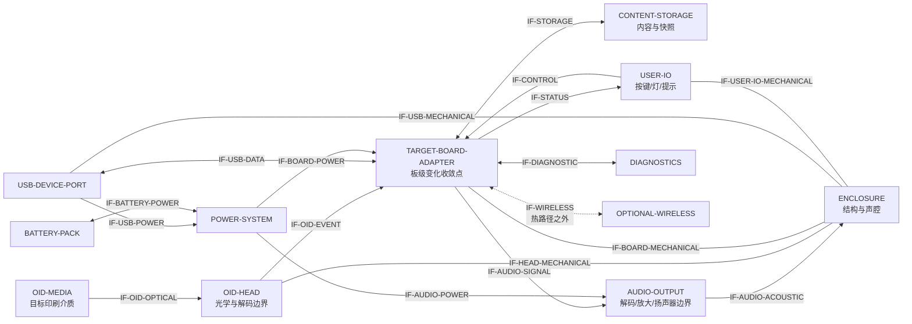

# HardwareSystem v1：硬件系统架构与 EDA 准入

> 状态：需求级系统拓扑已冻结；`BOARD_TARGET` 仍为 `UNRESOLVED`  
> 机器合同：[hardware-system-v1](../hardware/evt0/hardware-system-v1/)  
> 当前拓扑：`hwt:sha256:98a87a1de9ee8dfa52ec68ebd00afbbf23fa3c18e0c2a75e34ba09da4a9c4e5f`

## 1. 这就是当前阶段的硬件设计

当前已经具备产品需求、真实 OID 路线和供应商方案级资料，但尚无一份通过来料
验收的主板/OID 套件记录。此时先画芯片、引脚和网络，会把供应商未公开的边界
写进原理图，随后很可能随主板、光头或固件版本变化而返工。

因此本阶段先冻结两类长期资产：

1. **稳定拓扑**：产品需要哪些逻辑块、端口和接口语义；
2. **目标绑定**：每条接口需要哪些来料观察、实测和 ReleaseGate，何时才进入
   芯片级嘉立创EDA设计。

这不是用文档替代硬件，而是先把硬件变更限制在 `target binding / board adapter`
内。换主板、运行时、存储或音频实现时，OID 事件、Snapshot、DeviceLink 和产品
行为合同继续复用。

## 2. 证据边界

| 当前依据 | 可以支持的结论 | 暂不升级为目标事实的内容 |
|---|---|---|
| [`SRC-OID-001`](../hardware/evt0/evidence-sources.json)、[组创官方方案页](https://www.ztrontech.com/solutions/1.html) | OID 介质、光学头/解码、MCU、本地存储和音频构成成熟方案级链路；页面还描述过 ZC3205L、NAND/TF、95500/Sonix 头、MP3 和 USB 方案 | 当前可采购 PCBA 的板号、revision、接口、固件、32GB 支持和持续供货 |
| [`SRC-OID-002/003`](../hardware/evt0/evidence-sources.json)、[智能点读方案](https://www.ztrontech.com/educational1/118.html)、[方案档位说明](https://www.ztrontech.com/educational1/119.html) | 市场方案存在本地与联网档位，OID 代际名称由供应商方案定义 | 益米目标板的 SoC、无线、码空间、离线许可和工具链 |
| [`SRC-OID-004…010`](../hardware/evt0/evidence-sources.json)、[松翰 OID 产品目录](https://www.sonix.com.tw/products/oid) | 当前官方目录与资料可落到 `SN95310/350/360` 解码器、`SNM9S5X30BC2100A` 模组族、具体 `SNM9S5430/5630BC2100A` 资料和 2-wire 接口 | 这些是芯片/模组 RFQ 依据，不是完整 PCBA、光学笔头 revision、库存或已验证组合 |
| [`SRC-OID-011`](../hardware/evt0/evidence-sources.json)、[春苗官方技术方案](https://www.szdianjiao.com/articles/readpen.html) | 第二家方案商公开描述 PCBA、OID 工具、SDK、本地存储与音频能力，可进入同问卷询证 | 精确 PCBA/头身份、离线授权、资料可复现性、供货和性能 |
| [主板证据矩阵](../hardware/evt0/board-evidence-matrix.csv) | `MB1-CANDIDATE-A` 的待证字段和引用来源 | `BOARD_TARGET` 已冻结 |
| [board/OID intake](../hardware/evt0/intake-v1/board-oid-kit.template.json) | 两套同版样品的统一观察与测试入口 | 尚未收到的样品、未运行的测试或未附原始工件的结果 |
| [供应商回件合同](../hardware/evt0/vendor-evidence-v1/) | `M01–M08`、十项附件、两件待发样品身份及原始文件hash的付款门 | `READY_TO_BUY` 已成为实物 `BOARD_TARGET` |
| [BOM 锁定台账](../hardware/evt0/bom-lock.csv) | 器件决策和阻塞证据的唯一台账 | `CANDIDATE` 或 `BLOCKED` 条目已成为量产 BOM |

`REQ` 表示产品要求；`VENDOR_DOCUMENT / OBSERVED / MEASURED` 表示不同证据层级。
要求值和实现实测值分开保存，避免把“目标 32GB、USB-C 5V/1A、650–800mAh”
误写成某块候选板已经具备的能力。

## 3. 单一事实源

| 事实 | 唯一所有者 | 其他位置的角色 |
|---|---|---|
| 稳定逻辑块、端口、接口语义 | [`topology.json`](../hardware/evt0/hardware-system-v1/topology.json) | 文档只解释，不另建第二套接口编号 |
| 当前目标解析状态和每条接口的证据门 | [`target-binding.json`](../hardware/evt0/hardware-system-v1/target-binding.json) | EDA 和评审读取其状态 |
| 供应商书面回件与付款判定 | [`vendor-evidence-v1`](../hardware/evt0/vendor-evidence-v1/) | 原始文件留在build目录；记录保存hash和候选判定，不替代实物intake |
| 实物观察和测试原始记录 | [`intake-v1`](../hardware/evt0/intake-v1/) | binding 只保存 selector 和 observation/test 引用 |
| 候选汇总 | [`board-evidence-matrix.csv`](../hardware/evt0/board-evidence-matrix.csv) | 不替代 intake 原始记录 |
| 器件行级状态 | [`bom-lock.csv`](../hardware/evt0/bom-lock.csv) | `applicability` 区分公共、一体板和自研板分支 |
| BOM revision、目标绑定与审批 | [`bom-revisions`](../hardware/evt0/bom-revisions/) | 原理图、采购与制造包只消费通过校验的released revision |
| 发布判断 | [`release-gates-v1`](../hardware/evt0/release-gates-v1/) | 各验证器提交可复算证据，不维护私有 blocker 清单 |

`targetIdentity` 只保存 intake selector、身份/供货 observation/test 影响映射和release gate，
没有复制 `BOARD_MPN / PCB_REV / HEAD_MPN / HEAD_REV / FW_VERSION` 的实际值。目标换版时更新
intake 与 binding，稳定拓扑不随之改写；全部 board-kit observation/test 都必须映射到
target identity或某条稳定接口，避免证据变化后漏算受影响测试。

## 4. 稳定系统框图

图中方块是**逻辑责任**，不预设它们位于一块还是多块 PCB。现售一体主板可以把
主控、存储、功放和电源合在同一板上；自研分支仍复用同样的接口编号。



点读热路径只经过 `IF-OID-OPTICAL → IF-OID-EVENT → IF-STORAGE →
IF-AUDIO-SIGNAL → IF-AUDIO-ACOUSTIC`。无线保持在热路径之外，板卡变化通过
`TARGET-BOARD-ADAPTER` 接入既有 Rust `no_std` 核心与窄 C ABI。

## 5. 接口控制表（ICD-0）

当前 18 条接口均由机器合同覆盖。`TARGET_EVIDENCE_PENDING` 表示语义已经确定，
连接器、引脚、电平、时序、功耗、尺寸或声学实现仍等待目标样品证据。

| 接口 | 稳定边界 | 主要 intake 入口 | 当前实现状态 |
|---|---|---|---|
| `IF-OID-OPTICAL` | 印刷介质 → 光学头 | `codeTool / printProfile / headMechanical` | `TARGET_EVIDENCE_PENDING` |
| `IF-OID-EVENT` | 解码事件 → 板级适配器 | `headMpn / headRev / eventInterface / timestampObservability` | `TARGET_EVIDENCE_PENDING` |
| `IF-STORAGE` | 内容读取与 Snapshot 耐久提交 | `storage / storageDurabilityContract` | `TARGET_EVIDENCE_PENDING` |
| `IF-AUDIO-SIGNAL` | 本地选择结果 → 目标音频链 | `audioPath / audioTimestampClass` | `TARGET_EVIDENCE_PENDING` |
| `IF-USB-DATA` | USB 物理流 → DeviceLink | `usbData / transportStreamContract` | `TARGET_EVIDENCE_PENDING` |
| `IF-USB-POWER` | USB 输入 → 充电/电源路径 | `usbData / powerPath` | `TARGET_EVIDENCE_PENDING` |
| `IF-BATTERY-POWER` | 保护电芯/NTC → 电源系统 | `powerPath` | `TARGET_EVIDENCE_PENDING` |
| `IF-BOARD-POWER` | 电源系统 → 目标主板 | `powerPath / mcu` | `TARGET_EVIDENCE_PENDING` |
| `IF-AUDIO-POWER` | 电源系统 → 音频输出 | `powerPath / audioPath` | `TARGET_EVIDENCE_PENDING` |
| `IF-CONTROL` | 物理控制 → 稳定控制事件 | `eventInterface / boardDimensions` | `TARGET_EVIDENCE_PENDING` |
| `IF-STATUS` | 产品状态 → 灯/提示音 | `eventInterface / boardDimensions` | `TARGET_EVIDENCE_PENDING` |
| `IF-DIAGNOSTIC` | build/flash/trace/ABI/HIL | `buildCli / flashCli / cAbiContract / …` | `TARGET_EVIDENCE_PENDING` |
| `IF-WIRELESS` | 可选协调连接，隔离点读热路径 | `wireless` | `TARGET_EVIDENCE_PENDING` |
| `IF-HEAD-MECHANICAL` | 光头工作距、光轴和安装基准 | `headMpn / headRev / headMechanical` | `TARGET_EVIDENCE_PENDING` |
| `IF-BOARD-MECHANICAL` | 板框、安装孔和高度包络 | `boardMpn / pcbRev / boardDimensions` | `TARGET_EVIDENCE_PENDING` |
| `IF-AUDIO-ACOUSTIC` | 扬声器/声腔/声压实测 | `audioPath / boardDimensions` | `TARGET_EVIDENCE_PENDING` |
| `IF-USB-MECHANICAL` | USB 开口、位置和保持力 | `usbData / boardDimensions` | `TARGET_EVIDENCE_PENDING` |
| `IF-USER-IO-MECHANICAL` | 按键、指示和外壳人机边界 | `boardDimensions` | `TARGET_EVIDENCE_PENDING` |

完整的 test 与 ReleaseGate 映射以 `target-binding.json` 为准；验证器强制 18/18
一一覆盖，并检查所有 observation、test、requirement 和 gate 引用真实存在。

## 6. 嘉立创EDA入口门

当前 `eda.readiness = SYSTEM_SKELETON_ONLY`：

| 现在进入 EDA 的内容 | 保持在证据门后的内容 |
|---|---|
| 层级页、系统框图、18 个接口标签、需求/证据注释 | 器件符号和封装、引脚映射、物理网络名、电源轨值、连接器选型、PCB layout |

芯片级入口至少同时读取：

1. `RG-BOARD-TARGET-FROZEN`：两套同 `BOARD_MPN / PCB_REV / HEAD_MPN /
   HEAD_REV / FW_VERSION` 样品通过 accepted intake；
2. `RG-BOARD-SUPPLY-VERIFIED`：书面供货证据绑定同一 revision；
3. `RG-OID-CODE-TOOL-FROZEN`：码工具、码制和印刷边界已锁定；
4. 目标接口的 observation/test 已由原始工件支持，相关 binding 才从
   `TARGET_EVIDENCE_PENDING` 升为 `TARGET_FROZEN`；
5. 一体主板通过时，EDA 只设计确有需要的系统互连/测试/机械边界；一体主板
   失格并留下 `REJECTED` intake 后，再激活自研主板分支及芯片级主板页。

ESP32-S3、MAX98357A、BQ24074、MAX17048 仍属于自研分支候选。它们的官方
datasheet 支持候选评审，但不替代 OID 头接口、电源预算、存储、USB、机械和供货
证据。

## 7. 变更成本控制

| 变化 | 保持不变 | 只需新增/替换 |
|---|---|---|
| 换一体主板或进入自研板 | topology、OID/Snapshot/DeviceLink/播放语义 | accepted intake、target binding、一个 board adapter、HIL 证据 |
| 换存储器件 | Snapshot 原子激活与回滚合同 | storage binding、BOM revision、耐久测试 |
| 换 USB/其他传输 | DeviceLink 事务语义 | framing/transport adapter 与物理传输证据 |
| 换功放/扬声器/外壳 | 播放策略、状态语义、声压上限 | audio/power/acoustic binding 与声学实测 |
| 增加联网能力 | 离线点读热路径 | optional wireless adapter 与功耗/隔离测试 |

修改稳定拓扑需要新的产品需求或第二个真实目标证明现有端口不足；普通替料、板卡
换版和供应商差异只修改 binding、adapter、BOM revision 与受影响测试。

## 8. 验证

```powershell
npm run validate:hardware-system
```

当前结果：Schema、端点、方向、语义、需求所有者、intake 引用、ReleaseGate 引用、
拓扑 JCS SHA-256、目标状态、完整observation/test影响映射和EDA负向探针共 `425/425` 通过；目标状态仍明确为
`UNRESOLVED`。机器报告写入忽略提交的 `build/hardware-system-validation.json`。
