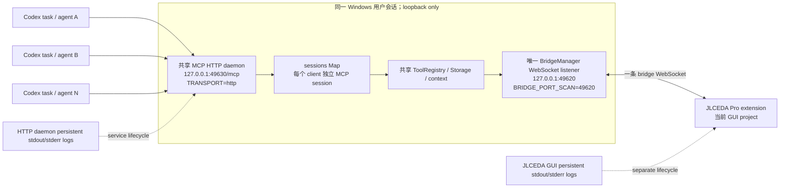

# 嘉立创EDA共享 Streamable HTTP 传输设计（2026-08-04）

> **决策状态：技术路径已由本机运行态与 `easyeda-mcp-pro 0.35.4` 源码支持；实际多 Codex 客户端验收为 `PENDING`。**
>
> 推荐的最终形态是一个固定的本机服务，而非由每个 Codex 任务各自启动一个 stdio 子进程：
>
> `多个 Codex 客户端 -> 127.0.0.1:49630/mcp (单一 Streamable HTTP 服务) -> 127.0.0.1:49620 (单一 EasyEDA WebSocket bridge) -> 嘉立创EDA Pro`
>
> 这会收敛当前的 **10 个 bridge listener/49620–49629 端口分流** 为 **1 个 bridge listener（49620）+ 1 个 HTTP MCP listener（候选 49630）**。它不会替代嘉立创EDA GUI 的独立 `EPIPE` 启动句柄修复；两者属于不同层。

## 1. 问题边界与本轮结论

本报告仅研究本机共享传输设计；本轮没有变更 Codex 全局配置、现有 keeper、进程、服务、已安装 npm 包或 EDA 工程。

| 判断项 | 结论 | 证据强度 |
|---|---|---|
| `easyeda-mcp-pro 0.35.4` 是否具有 Streamable HTTP MCP 模式 | **是**；`TRANSPORT=http`、`HTTP_HOST`、`HTTP_PORT`、`/mcp`、`/healthz`、`/readyz` 都存在 | 本机 README、编译产物、上游 v0.35.4 tag |
| 一个 HTTP 进程是否按会话服务多个 MCP 客户端 | **源码支持**；HTTP transport 维护 `sessions: Map`，每个初始化请求创建独立 MCP session server | 本机 `dist/server/transports/http.js` 与上游同 tag 原码 |
| 多个 HTTP session 是否共用同一个 EasyEDA bridge | **是，按进程架构**；`createServer()` 只构造一个 `BridgeManager` 和一个共享 `context`，session server 复用该 context | 本机编译产物 |
| 共享 HTTP 是否会自然串行化 EasyEDA 调用 | **未证实**；`BridgeManager` 有多请求 `requestMap`，未见全局队列或 session 级调度器 | 本机编译产物 |
| 是否已用两个真实 Codex 客户端完成 HTTP 并发、重连和 project-state 验收 | `PENDING` | 本轮遵守“只研究、不启动/停止服务”范围 |
| 本轮是否进入迁移实施 | **暂缓**；当前硬件收益排序中，供应商 MB1 询证、精确 benchmark 单买/intake、实际实验室仪器登记优先。共享传输在下一次依赖 live EDA 读取的工作包前作为运行前置门。 | `docs/codex/active-task.md` 与当前证据缺口 |

## 2. 本机可复核证据台账

### 2.1 运行态快照

采集时间：`2026-08-04T03:54:41+08:00` 至 `2026-08-04T04:02:08+08:00`。命令均为只读：`codex mcp get ... --json`、`Get-CimInstance Win32_Process`、`Get-NetTCPConnection`。

| 项目 | 当前观察 | 含义 |
|---|---|---|
| Codex CLI | `codex-cli 0.145.0` | `codex mcp add --url <URL>` 明确标为 Streamable HTTP server；`get/remove` 命令存在 |
| EDA 基线 | `hardware/eda/manifest.json` 记录 JLCEDA Pro `3.2.149`；当前可执行文件路径为 `C:\Users\Admin\AppData\Local\Programs\lceda-pro\lceda-pro.exe` | 共享方案继续复用现有 GUI/extension；没有以迁移替代 EDA 本体启动修复 |
| 已登记 MCP | `easyeda-mcp-pro` 是 **stdio** transport，启动命令为 Node 24 + `dist/index.js` | Codex app-server 会按任务/代理启动子进程，不是共享 URL client |
| 已登记环境 | `BRIDGE_HOST=127.0.0.1`、`BRIDGE_PORT=49620`、`TRANSPORT=stdio`；没有 `BRIDGE_PORT_SCAN` | 包的默认 scan 范围仍生效 |
| 共享 keeper | Python PID `21904` 启动 Node PID `10344`；该进程监听 `127.0.0.1:49620` | 当前唯一连到 EDA 的 bridge server |
| Codex app-server | PID `15148`，命令行为 `codex.exe ... app-server` | 9 个同包 Node 子进程的共同父进程 |
| 同包 Node 子进程 | PID `3900, 14136, 25104, 22324, 11280, 22928, 22968, 15196, 24600` 均由 PID `15148` 启动，命令均为同一 `easyeda-mcp-pro/dist/index.js` | 每个 Codex task 的 stdio MCP 进程各自初始化 bridge |
| listener 集合 | `49620`（PID 10344）及 `49621–49629`（9 个 app-server 子进程）均为 `127.0.0.1` listener | 明确的 fallback-port split |
| 已建立 bridge socket | 只有 `lceda-pro.exe` PID `14508` 与 PID `10344` 在 `127.0.0.1:49620` 建立连接 | 只有 keeper 的 bridge 真正接到 EDA extension |
| 持久报告 | `build/jlceda-mcp-singleton.json` 于 `2026-08-04T03:48:23+08:00` 记录 `processCount=10`、`listenerCount=10`、`singleton=false`、`connectedPorts=[49620]` | 与实时快照一致 |

当前登记项的只读 JSON 表明：`BRIDGE_PORT=49620` 已设置，`BRIDGE_PORT_SCAN` 未设置。该差异是端口分流的直接配置原因之一，而非 PCB、原理图、OID 或项目文件问题。

### 2.2 本机包与一手上游核验

| 资料 | 版本/定位 | 核验结果 |
|---|---|---|
| 本机 npm 包 | `C:\Users\Admin\.codex\tools\easyeda-mcp-pro\node_modules\easyeda-mcp-pro` | `package.json` 声明 `easyeda-mcp-pro 0.35.4`，Node 范围 `>=24 <25` |
| 本机 README | 同目录 `README.md` | SHA-256 `c522260620d5d919e7530f9ead6182d481f5551a6f3de49db2eead96c2ada992`；上游 tag 的 README 字节和 SHA-256 相同（43,680 bytes） |
| 本机入口 | `dist/index.js` | SHA-256 `4fca20b24212b1c025f5262e514c113ab3bfec12338349a46f69c02606122fcc` |
| npm Registry | `easyeda-mcp-pro@0.35.4` | `gitHead=69892876b5cf2ddcc1de1b590c0ce35c61a36698`；`dist.integrity=sha512-c8Iqy0y+/82k3z0dowj2ERC/QPux/7FTtPB+ZbX7WqsxK09K/gNdaxcVBusv3dksxPeedHQ30+6nzvw5rRp/7w==` |
| GitHub tag | `easyeda-mcp-pro-v0.35.4` | `git ls-remote --tags --refs` 返回同一 commit `69892876b5cf2ddcc1de1b590c0ce35c61a36698` |
| 上游原码 | `src/server/transports/http.ts` | HTTP 200；SHA-256 `965781115b7ff92e634b5844eb94f9e7da1d27c38939c3114b9f810263d38d66` |
| 上游原码 | `src/server/factory.ts` | HTTP 200；SHA-256 `d109f2bced797271de5aa37ba8cd9dfc79e23056c9650584ac685ea1fcf66433` |
| 上游原码 | `src/bridge/manager.ts` | HTTP 200；SHA-256 `b2d5134e1eecd9424f21c985b3e0e252b3d02f8b907e52960fe54d463d11f42a` |

上述上游资料于 `2026-08-04T04:00+08:00` 通过 GitHub raw 和 Git 只读访问。源仓库：[oaslananka/easyeda-mcp-pro](https://github.com/oaslananka/easyeda-mcp-pro)，固定 tag：[easyeda-mcp-pro-v0.35.4](https://github.com/oaslananka/easyeda-mcp-pro/tree/easyeda-mcp-pro-v0.35.4)。

### 2.3 Sol 集成期隔离运行探针

在不触碰全局 Codex 配置、现有 keeper、49620–49629 或 EDA 工程的前提下，新增并执行：

```powershell
npm run eda:shared-http-probe
```

探针临时使用 `HTTP=127.0.0.1:49641`、`bridge=127.0.0.1:49640`，显式将
`BRIDGE_PORT_SCAN=49640`，完成 `/healthz`、`/readyz`、MCP `initialize`、session ID、
`notifications/initialized` 和 `easyeda_bridge_status`，随后终止临时进程。结果为 10/10 PASS：

- server/version：`easyeda-mcp-pro 0.35.4`；
- MCP protocol：`2025-11-25`；
- `active_port=49640`；
- `connected=false`，符合“隔离端口没有 EDA extension”的预期，未伪造 live EDA 连接；
- `dist/index.js` SHA-256：`4fca20b24212b1c025f5262e514c113ab3bfec12338349a46f69c02606122fcc`。

原始结构化报告为 `build/jlceda-shared-http-isolated-probe.json`，本次 2,971 bytes，SHA-256
`36092760dc825f43d25f731ea19f664fde1d9a2ae59fcc09cdb6a6ed6dfcf392`。该探针把“HTTP 路径可启动并
完成一个 MCP session”从源码推断提升为本机运行证据；真实 49620 bridge、双 Codex client、并发、
重连、Desktop 配置刷新与回滚门仍保持 `PENDING`。

## 3. 根因分层：EPIPE 与多实例是两件事

### 3.1 A 层：嘉立创EDA Electron `EPIPE`

已有可追溯运行审计：`docs/codex/capsules/hardware-p0-run-audits.md` 的 **2026-08-03 JLCEDA EPIPE launcher repair** 记录了捕获堆栈：嘉立创EDA主进程在 `console.warn -> writeSync` 写入一个已关闭的父进程 pipe，触发 `EPIPE: broken pipe, write`。该审计的修复是让 GUI 由 `scripts/check-jlceda-codex.ps1` 的 `Start-JLCEDAWithPersistentLogs` 用独立持久 stdout/stderr 日志文件启动。

这层的结论：

- 该异常属于 **Electron GUI 的 stdout/stderr 继承与启动生命周期**；不代表 EDA 工程、WebSocket 协议、OID、主板或 BOM 错误。
- 共享 HTTP 服务不会自动处理 GUI 已关闭 pipe；迁移后仍须保留当前 GUI 持久日志启动路径。
- 新的 HTTP daemon 也应写入自己的持久日志，避免从短生命周期捕获 shell 继承输出句柄。
- 本轮未重现该异常，当前 keeper stderr 仅有 `easyeda-mcp-pro ready on stdio transport`、bridge listener 初始化和一次 loopback connection 日志；这只说明当前记录窗口干净，EPIPE 的长期回归状态仍应在独立启动验收中记录。

### 3.2 B 层：每个 stdio MCP 实例各自绑定 bridge listener

该层由当前配置和包源码直接解释：

1. Codex 当前将 `easyeda-mcp-pro` 登记为 `transport.type=stdio` 的命令型 MCP。
2. 每个 stdio 子进程执行 `dist/index.js`。`dist/index.js:42–56` 调用 `createServer(config)`；默认路径会连接 stdio transport。
3. `dist/server/factory.js:38–40` 在每个 `createServer()` 内新建 `BridgeManager` 并调用 `await bridge.connect()`。
4. `dist/config/env.js:41–43` 的默认值是 `BRIDGE_PORT=49620`、`BRIDGE_PORT_SCAN=49620-49629`。
5. `dist/bridge/manager.js:121–167` 实际监听的是 `parsePortScanSpec(BRIDGE_PORT_SCAN)` 返回的每个 port；占用时继续尝试下一个 port。这里没有以 `BRIDGE_PORT` 作为“只监听该端口”的替代分支。
6. 当前 Codex stdio env 没有显式 `BRIDGE_PORT_SCAN`，所以 9 个新实例依次取得 `49621–49629`。keeper 则显式使用 `BRIDGE_PORT_SCAN=49620`，因此占据唯一正确 bridge listener `49620`。
7. EasyEDA extension 连接到 PID `10344` 的 49620；其他 listener 只是在等待 bridge client。任何某任务落在 49626/49629 的诊断结果都可能是 `connected=false`，不应进入 EDA 工程证据链。

**B 层的最小根因**：`stdio` 的“每任务一个服务器进程”语义，加上 package 的 fallback scan 默认范围。它与 A 层的 GUI `EPIPE` 有时间相关性时，也仍是两个可独立复现、独立回归的故障域。

## 4. 为什么共享 Streamable HTTP 能收敛实例

### 4.1 0.35.4 的实现证据

| 位置 | 观察 | 设计含义 |
|---|---|---|
| `dist/config/env.js:30–36` | `TRANSPORT` 只接受 `stdio` 或 `http`；HTTP host/port/rate-limit 均有 schema | HTTP 是包内正式运行路径，而非外部代理猜测 |
| `dist/index.js:42–56` | `TRANSPORT=http` 时在一个 server instance 上调用 `createHttpTransport(... serverFactory: instance.createSessionServer)` | daemon 仅构造一次 `BridgeManager`，然后挂 HTTP transport |
| `dist/server/factory.js:55–114` | `context.bridge.call`、`connected`、`activePort` 都闭包引用一个 `bridge` | 所有 HTTP session 走同一条 bridge connection |
| `dist/server/factory.js:115–135` | `createSessionServer()` 新建 MCP server，却把 tool registry 和共享 `context` 注册进去 | MCP 协议 session 相互分开，EDA bridge 共享 |
| `dist/server/transports/http.js:364–478` | 建立 `sessions = new Map()`；初始化请求生成 UUID session，按 `MCP-Session-Id` 路由；每 session 调用 `serverFactory()` | 代码明确支持多 session 生命周期 |
| `dist/server/transports/http.js:489–535` | session 可 DELETE/close，service close 会收口全部 session；暴露 `/healthz`、`/readyz` | 单进程可管理 session 与 liveness |
| `dist/bridge/manager.js:484–590` | request id 递增、`requestMap` 记录多条未完成请求，response 逐 id 收敛 | 请求复用一个 socket 时有 in-flight 对应机制 |
| `codex mcp add --help` | `--url <URL>` 描述为 “URL for a streamable HTTP MCP server” | Codex CLI 可登记 URL 型 MCP，而非每 task 启动 command |

因此，只要 Codex 配置切换为 URL 型 MCP，并且只有一个独立 HTTP daemon 被启动，Codex app-server 无需再为每个 task 执行 `dist/index.js`。这一点直接移除了导致 `49621–49629` 的进程生成路径。

### 4.2 必须保留的反证与边界

“源码具备多 session”与“真实嘉立创EDA在多客户端并发下稳定”是两个不同的结论：

- `BridgeManager` 的 `requestMap` 支持多条 in-flight 请求，但当前检查范围内没有发现全局 FIFO/互斥队列。单一 GUI 项目状态、导出路径、选中对象或扩展 dispatcher 的并发语义仍为 `PENDING`。
- HTTP rate limiter 的 key 是 IP；全部本机 Codex 客户端都来自 `127.0.0.1`，所以默认 `100 req/min` 是共享配额，不是每 client 配额。
- `GET /readyz` 在 `dist/server/transports/http.js:501–503` 仅返回 `{status:'ok', uptime}`；它不证明 `BridgeManager.connected=true`。HTTP liveness 必须叠加 MCP 的 `easyeda_bridge_status` 或 `easyeda_health_check`。
- 所有 HTTP session 复用同一 `TOOL_PROFILE`、`TOOL_SCOPES`、Storage、bridge 与当前 GUI project。它不提供 session 级权限隔离，也不提供 session 级 project 隔离。
- 当前稳定配置只开放读取 scopes。未来有任何 write scope 时，共享 daemon 会把该能力暴露给每个本地 MCP client；这种变更应走独立的授权、队列和审计设计，而不是沿用本方案。
- 包 README 描述 HTTP 为适合 remote deployment 的 transport，源码展示 session router；当前项目尚未得到供应商或包作者关于 EasyEDA extension 多 client 压测的专项保证。

## 5. 建议目标拓扑



### 5.1 端口与配置合同

| 合同项 | 目标值 | 原因 / 验证门 |
|---|---|---|
| `BRIDGE_HOST` | `127.0.0.1` | 继续限定 EasyEDA bridge 为本机回环 |
| `BRIDGE_PORT` | `49620` | 现有 extension 已建立的稳定 bridge port |
| `BRIDGE_PORT_SCAN` | **`49620`** | 必须显式单值；避免 49621–49629 fallback 分流 |
| `TRANSPORT` | `http` | 一个独立 daemon 供多个 Codex URL client 使用 |
| `HTTP_HOST` | `127.0.0.1` | 维持 loopback-only 网络边界 |
| `HTTP_PORT` | `49630`（候选） | 当前 `49620–49629` 监听快照中未占用；实施前重新作 bind-free preflight，冲突时记录新值 |
| MCP endpoint | `http://127.0.0.1:49630/mcp` | Codex 使用 `codex mcp add ... --url` 登记 |
| liveness | `GET /healthz` | 返回 package 进程存活与版本 |
| process readiness | `GET /readyz` + `easyeda_bridge_status` | `/readyz` 只显示 HTTP 进程 uptime；后者才验 bridge 连接/active port |
| MCP profile/scopes | 复用当前 `core` 和 `diagnostics:read,schematic:read,bom:read,checks:read,pcb:read` | 不扩大本轮已核验的只读边界 |
| HTTP auth | loopback only + `OAUTH_ENABLED=false` 为当前候选 | 0.35.4 在 OAuth 关闭时将 HTTP auth middleware 直接放行；该选择仅适合单机回环。若未来越出回环，须先具备 JWKS/issuer/audience 和 Codex bearer env 方案。 |
| rate limit | 先保留 `HTTP_RATE_LIMIT_MAX=100`，压测后决定 | 包默认值；所有本机 client 共享同一 IP 配额 |

### 5.2 生命周期合同

1. **唯一服务 owner**：未来新增一个专属、可审计的 service wrapper；它拥有 PID、`127.0.0.1:49630` 和 `127.0.0.1:49620`。现有 `build/keep-easyeda-bridge.py` 保留为 rollback 输入，而不是与新 daemon 并存。
2. **启动顺序**：嘉立创EDA GUI 已启动并保持持久日志 → 共享 daemon 绑定 49620/49630 → EDA extension 连接 49620 → `/healthz`、`/readyz` → MCP `easyeda_bridge_status` 显示 `connected=true`、`activePort=49620` → Codex URL clients 使用服务。
3. **实例锁**：wrapper 在启动前检查 PID 文件、49630 HTTP health 与 49620 listener；发现健康同配置服务时复用，发现冲突时输出诊断并停止本次启动路径。包的 HTTP `app.listen()` 本身未在当前检查范围中提供跨进程单例锁。
4. **断开行为**：源码中的 bridge 在 extension socket close 后保留 WSS listener、清理 pending request、进入 reconnect 状态；MCP 调用可等待 `BRIDGE_WAIT_FOR_EDA_MS`。监控应以 `easyeda_bridge_status` 判断，不能以 `/readyz` 替代。
5. **关停顺序**：停止接收新的 Codex request → 关闭 MCP HTTP sessions → 停止 daemon → 再处理 GUI。`http.js:516–524` 会先 close active sessions，再 close transport/HTTP server；GUI 仍用其独立持久日志路径。
6. **日志**：未来 service wrapper 应分离写入候选 `build/easyeda-shared-http.stdout.log` 与 `build/easyeda-shared-http.stderr.log`，并追加启动参数摘要（排除 token）、PID、时间、版本、端口与 scope hash。GUI 日志继续位于 `%LOCALAPPDATA%\LCEDA-Pro\codex-launch-logs\`。这些路径为提案，本轮尚未创建。

### 5.3 并发合同：先小范围验收，再决定是否增加队列

当前只读阶段采用以下顺序：

- 多 client 的 MCP protocol session 由包自带 session map 负责。
- 低风险 health/status 请求可在双 client 试验中交错发送，验证 session id、响应对应关系及 49620 单 bridge。
- 影响 EDA project state、导出文件或长耗时遍历的请求先按 **全局一次一条** 的运行规则操作，直到基于真实 EDA project 的并发试验取得时间线、原始日志与结果一致性证据。
- 若实测显示需要强制排队，单独新增一个有 request-id、timeout、cancel、审计和回归测试的排队适配层；不要把未验证的互斥假设写进 package 源码或 EDA 工程。

## 6. 最小、可回滚迁移步骤（未来受控实施包）

以下是待批准的操作设计，不是本轮执行记录。由于 EasyEDA extension 只应服务一个 bridge websocket listener，迁移需要一个短维护窗口；它没有零切换承诺。

1. **冻结与备份**：读取并保存 `codex mcp get easyeda-mcp-pro --json`；保存现有 `~/.codex/config.toml` 的受控备份；记录 keeper PID `10344`、现有 bridge/HTTP 端口与 EDA GUI 状态。
2. **清理旧 client 生命周期**：结束或重新加载仍持有 stdio MCP 的 Codex task，确认 49621–49629 listener 消失。只针对由 `easyeda-mcp-pro/dist/index.js` 启动、且有可追溯父进程/端口证据的实例操作。
3. **切换唯一 owner**：在受控窗口停止现有 keeper，释放 49620；启动未来共享 HTTP daemon，使用固定 env：

   ```text
   TRANSPORT=http
   HTTP_HOST=127.0.0.1
   HTTP_PORT=49630
   BRIDGE_HOST=127.0.0.1
   BRIDGE_PORT=49620
   BRIDGE_PORT_SCAN=49620
   TOOL_PROFILE=core
   TOOL_SCOPES=diagnostics:read,schematic:read,bom:read,checks:read,pcb:read
   BRIDGE_RAW_EXEC_ENABLED=false
   MCP_RAW_EXEC_EXPERIMENTAL=false
   JLCPCB_ENABLE_ORDERING=false
   JLCPCB_MODE=disabled
   JLCSEARCH_ENABLED=false
   KEYLESS_SOURCING_ENABLED=false
   MCP_BRIDGE_BACKEND=local_bridge
   ```

4. **检查服务而非猜测**：确认只有一个 package Node PID；49620 为唯一 bridge listener，49630 为唯一 HTTP listener；`GET /healthz`、`GET /readyz` 成功；MCP `easyeda_bridge_status` 指向 `activePort=49620` 且 `connected=true`。
5. **变更 Codex 为 URL client**：使用已核验 CLI 语义将同名 MCP 改为：

   ```powershell
   codex mcp add easyeda-mcp-pro --url http://127.0.0.1:49630/mcp
   ```

   实施包应先按步骤 1 保存原 stdio 定义，再用 `codex mcp get --json` 复核 transport 已成为 URL。具体 remove/add 次序以当时 CLI 和桌面客户端配置刷新行为为准；该刷新行为当前为 `PENDING`。

6. **双 client 验收**：新开两个独立 Codex task，以最低风险 diagnostic/read 工具执行初始化、tools/list、bridge status、交错读取。所有结论保存原始日志与 process/port 快照。
7. **回滚门**：任何 HTTP 初始化、EDA handshake、多 client 一致性或 scope 回归失败时，停止新 daemon、恢复备份的 stdio MCP 定义、重新启动原 keeper、让 extension 重连 49620，并再次运行原来的只读 doctor/singleton 检查。保留失败日志与时间线。

## 7. 验证矩阵

| 编号 | 验证 | 通过标准 | 当前状态 |
|---|---|---|---|
| V1 | 包版本/上游一致性 | package `0.35.4`、npm `gitHead`、Git tag 和 README SHA 一致 | **PASS（本轮只读）** |
| V2 | Codex URL 能力 | `codex mcp add --help` 含 `--url` Streamable HTTP 语义 | **PASS（本轮只读）** |
| V3 | HTTP 多 session 静态结构 | 源码有 `sessions Map`、独立 session server、共享 context/bridge | **PASS（源码审计）** |
| V3A | 隔离 HTTP 单 session 运行探针 | 49641 health/ready、initialize/session、bridge-status、进程收口均通过；不连接真实 EDA | **PASS（10/10，本机隔离端口）** |
| V4 | 当前 stdio split 定位 | 10 个 package PID、49620–49629 listeners、仅 49620 connected | **PASS（本机运行态）** |
| V5 | 单 bridge / 单 HTTP daemon | future process snapshot：package PID=1，bridge listener=49620，HTTP listener=49630，49621–49629=0 | `PENDING` |
| V6 | 一 client MCP | URL client 初始化、tools/list、bridge status；`connected=true` / `activePort=49620` | `PENDING` |
| V7 | 两 client session 隔离 | 两个独立 MCP session ID 均可读；不会创建额外 bridge listener | `PENDING` |
| V8 | 两 client 交错只读 | 固定小请求集响应完整、ID 不串、EDA project 观察一致；保存 p95/timeout/日志 | `PENDING` |
| V9 | EDA extension 重连 | extension reconnect 后唯一 bridge 仍是 49620；等待期和恢复期均有可追溯日志 | `PENDING` |
| V10 | HTTP crash/restart | server 退出、wrapper 记录状态、重启后 session 重建；旧 session 得到明确失败/重连语义 | `PENDING` |
| V11 | 权限与网络 | 仅 `127.0.0.1`；read scopes 原样；raw exec/ordering 全为 false；外网 bind 不出现 | `PENDING` |
| V12 | EPIPE 回归 | GUI 使用持久 stdout/stderr 启动，HTTP daemon 也有持久日志；独立 EDA 操作窗口无 `EPIPE` | `PENDING` |
| V13 | 回滚演练 | 还原 stdio + keeper 后 `npm run eda:doctor` 与 singleton 检查通过 | `PENDING` |

## 8. 风险、未决项与当前建议

### 风险与未知项

| 主题 | 状态 | 收敛动作 |
|---|---|---|
| 多 client 对真实 EDA extension 的并发语义 | `PENDING` | 使用同一真实 project 做双 session 低风险读操作，保留原始响应、时间线、端口和 GUI 状态 |
| Codex Desktop 对全局 URL MCP 配置的热刷新 | `PENDING` | 迁移窗口中用新 task 验证；需要重启/重新加载时记录为明确运维步骤 |
| HTTP auth | loopback 候选；远程部署 `PENDING` | 当前锁定 `127.0.0.1`；若出现远程访问需求，先建立 OAuth JWKS/issuer/audience 和 bearer env 验收 |
| 全局 scope / project 隔离 | 当前仅只读、无 session 隔离 | 将 write 权限与多项目隔离留给独立设计包；本服务保持 read-only |
| 服务单例 | package源码未发现跨进程 lock | 在未来 wrapper 中实现 PID/health/port preflight 与明确 owner |
| `EPIPE` | 已有 GUI 启动修复路径，长期回归证据 `PENDING` | 保留 GUI 持久日志；共享 HTTP 日志单独落盘，分别验收 |
| HTTP port 49630 | 当前快照空闲 | 实施前 bind-free 检查；冲突时记录重新分配端口与 URL |

### 收益重新评分

当前候选名称：`HW-EDA-SHARED-HTTP-POC`。采用项目既定权重（关键路径解锁 / 证据就绪度 / 实物闭环距离 / 复用收益 / 时间成本 / 返工风险）：

| 候选 | 分项 | 总分 | 说明 |
|---|---:|---:|---|
| 真实 MB1 询证并冻结 | `30/20/20/10/7/7` | **94** | 直接解除主板/OID 实物闭环的最高价值外部证据 |
| 精确 benchmark SKU 单买与 intake | `24/18/18/8/7/7` | **82** | 取得可追溯样品与对标实物 |
| 实际 LAB1–LAB6 仪器登记 | `18/18/15/9/8/7` | **75** | 让已有通用测试方法接入真实仪器 |
| 共享 HTTP POC | `16/18/5/10/7/7` | **63** | 高复用、收敛 live EDA 运行态；尚未产出主板/OID/实物证据 |
| EDA skeleton | `15/16/5/9/7/5` | **57** | 必须等待 target-binding 解锁，当前仍受证据门控制 |

**当前收益最高的下一硬件任务仍是发送 `docs/research/gen1-mb1-prepay-pack.md` 并获取供应商原始书面回件。** 共享 HTTP 设计已经给出了受控实施边界；当下一项硬件工作确实依赖可靠的 live JLCEDA 多 task 读取时，再启动 `HW-EDA-SHARED-HTTP-POC`，并按第 7 节收集首轮实测证据。

## 9. 本轮研究复核命令

以下命令本轮均保持只读，或仅用于本报告的 diff 检查：

```powershell
codex --version
codex mcp --help
codex mcp add --help
codex mcp get easyeda-mcp-pro --json
Get-CimInstance Win32_Process
Get-NetTCPConnection
npm view easyeda-mcp-pro@0.35.4 version dist.integrity dist.tarball gitHead repository.url engines --json
git ls-remote --tags --refs https://github.com/oaslananka/easyeda-mcp-pro.git
git diff --check -- docs/research/jlceda-shared-transport-design-2026-08-04.md
```

本报告没有把 HTTP 双客户端实际运行写成已通过，也没有把 EPIPE 与 port split 混为同一个根因。
