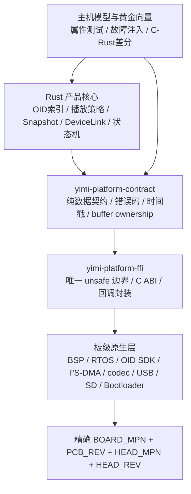

# 益米 Gen1 Rust 点读笔固件可行性报告（证据版）

> 状态：活文档 v0.1  
> 核验日期：2026-08-03  
> 适用范围：无屏、离线优先、真实 OID、本地音频、USB 装入、Snapshot A/B 内容快照的益米 Gen1  
> 机器可读来源：[`hardware/evt0/rust-firmware-evidence.json`](../../hardware/evt0/rust-firmware-evidence.json)  
> 边界：本文评估语言、运行时、板级适配、音频、存储、调试和量产路径；它不表示 `BOARD_TARGET`、OID 光头或固件 SDK 已冻结。

## 1. 结论先行

### 1.1 结论

Rust 本身及其通用嵌入式基础已经足以承担益米的**产品自有逻辑**；当前证据尚未证明任一精确点读笔主板能够用“全栈纯 Rust”完成 OID、音频、USB、存储、升级和量产闭环。风险集中在点读笔垂直供应链，而不是 Rust 语言本身。

本项目采用以下量产导向定义：

> **Rust 主体 + 板级原生实现 + 窄 C ABI + 同输入交叉验证。**

Rust 负责：

- OID 事件归一化之后的质量过滤、去重、冷却和查表；
- 常驻 OID 索引、播放决策、设备状态机；
- Snapshot 内容事务、DeviceLink、诊断事件和版本策略；
- 可在主机运行的纯逻辑、属性测试和故障注入模型。

板级原生层负责：

- 供应商 OID 解码 SDK 或光头协议；
- BSP、时钟、中断、DMA、I²S/音频外设、USB 控制器、存储介质和 Bootloader；
- 经目标板验证的音频 codec；
- 工厂烧录、校准和芯片安全配置。

### 1.2 对“Rust 技术是否不成熟”的精确回答

| 层面 | 当前判断 | 证据强度 | 对益米的含义 |
|---|---|---:|---|
| 语言、`no_std`、所有权和状态机表达 | 可进入产品核心 | `P` + 主机 R0 实现；目标板仍待验证 | Snapshot、OID索引、DeviceLink事务和恢复核心已落地，板级结论仍走 G0–G5 |
| `embedded-hal 1.0` 接口层 | 稳定基础 | `P` | 统一接口已经稳定；精确芯片 HAL、DMA 和驱动质量另行验收 |
| Embassy / RTIC / probe-rs / defmt | 工程化基础较完整 | `P` | 适合裸机分支的执行、调试和日志；不代表点读业务驱动已经齐备 |
| ESP32-S3 Rust 裸机生态 | 可做板级 Spike | `O/P` | `esp-hal` 明确列出 S3；Xtensa 工具链和目标外设仍需冻结与实测 |
| OpenVela 中集成 Rust | 构建链存在 | `O` | 官方构建文件能产出并链接 Rust 静态库；这不是 OID/音频 Rust 驱动证据 |
| ESP-IDF Rust 包装层 | 可做混合应用 | `P` | 原始绑定和安全包装存在；上游同时标明社区维护与 HIL 缺口，应由益米补足实机门 |
| OID 专有链路 | 当前主要缺口 | `G` | 精确光头、码工具、协议/ABI、时间戳和印刷矩阵仍待样品证据 |
| MP3 解码 | 有多种候选，无量产结论 | `P`，缺 `M` | 纯 Rust 和 C codec 都进入同一黄金音频/资源/可靠性测试 |
| USB、TF/FAT、掉电恢复 | 组件可用，系统闭环待测 | `P`，缺 `M` | 组件自述不足以替代 500MB 装包、满盘、断电和介质老化实测 |
| 工厂与售后链 | 待板级建立 | `G` | 烧录、校准、序列号、日志读取、回滚和复现构建均是冻结门 |

**决策：** 保留 Rust 主体路线；取消“纯 Rust”作为目标；用板级 Spike 决定 Rust 的最终边界。

## 2. 证据等级与使用纪律

| 等级 | 含义 | 本报告允许的结论 |
|---|---|---|
| `O` | 芯片厂、OpenVela 等官方平台一手仓库 | 记录其公开实现和接口边界；具体板适配仍待 `M` |
| `P` | 库/框架上游项目的一手仓库、固定 commit | 记录上游自述、代码和限制；不自动升级为量产适用 |
| `M` | 益米对精确 `BOARD_MPN / PCB_REV / HEAD_MPN / HEAD_REV / FW_VERSION` 的实物测量 | 可进入该 revision 工程基线 |
| `E` | 益米工程目标或架构决策 | 用作设计和验收，不反写成上游事实 |
| `I` | 由多条来源得出的工程推论 | 必须同时保留关闭它的实测门 |
| `G` | 证据缺口 | 保持开放，等待明确交付物或测试结果 |

证据规则：

1. 固定 commit 的 README/源码证明“上游当时公开了什么”，不证明精确板卡已经工作；
2. 下载量、星标和语言流行度不作为实时性、可靠性或量产性的替代指标；
3. “支持某芯片”至少拆成构建、烧录、调试、外设、性能、功耗、故障恢复和工厂链八项；
4. 二进制供应商库必须记录版本、哈希、工具链、许可证、ABI 和适用 revision；
5. 所有 `M` 结论绑定样品身份，不跨 revision 外推；
6. 本报告不会提前写入具体 `BOARD_TARGET`。

## 3. 一手来源交叉验证

### 3.1 通用接口、运行时与工具

| 来源 | 已核验事实 | 它没有证明的事项 | 益米结论 |
|---|---|---|---|
| [`embedded-hal`](https://github.com/rust-embedded/embedded-hal/blob/41f29f6bfced1cae0cbe712ba96ee32c075b3125/README.md) `SRC-RUST-001` | 上游宣布 v1.0，并分别提供 blocking、async、polling 核心 traits | 某颗 MCU 的 I²S、USB、SD、DMA 或 OID 驱动质量 | traits 可作 HAL 契约；选板仍看精确实现和 HIL |
| [Embassy README](https://github.com/embassy-rs/embassy/blob/eeb9bf681f66ff73bc6c620be62983c91ad9c427/README.md) `SRC-RUST-002` | async task 编译成状态机、协作式 executor、无需每任务栈；上游定位为传统 RTOS 的裸机替代 | 在 OpenVela/FreeRTOS 内叠加第二个 executor 的正确性 | Embassy executor 只进入裸机分支 |
| [`embassy-usb`](https://github.com/embassy-rs/embassy/blob/eeb9bf681f66ff73bc6c620be62983c91ad9c427/embassy-usb/src/lib.rs) `SRC-RUST-003` | 源码标记 `#![no_std]`，提供设备态 USB 和 driver 抽象 | 候选 MCU 的 USB 控制器 driver、吞吐、主机兼容和拔线恢复 | 用目标板 USB HIL 决定采用范围 |
| [`embassy-boot`](https://github.com/embassy-rs/embassy/blob/eeb9bf681f66ff73bc6c620be62983c91ad9c427/embassy-boot/README.md) `SRC-RUST-004` | 上游声明固件升级具备掉电保护、trial boot 和 rollback，并列出 nRF/RP/STM32 硬件 crate | ESP32 或任意供应商板直接适配；也不等同于益米内容 Snapshot | 固件 A/B 与内容 A/B 分开评审，且按目标芯片选 Bootloader |
| [`probe-rs`](https://github.com/probe-rs/probe-rs/blob/ccc6b01a363b6e44c68ef74be2c31eed669da269/README.md) `SRC-RUST-005` | 上游列出 Arm、RISC-V、Xtensa 调试，支持烧录、DAP/GDB、RTT/`defmt` | 精确芯片的 flash algorithm、探针连接和量产节拍 | 作为研发调试候选；工厂烧录另建节拍与治具门 |
| [`defmt`](https://github.com/knurling-rs/defmt/blob/2e300dfb6b948a3b732926e3f5d81b472d3a53ef/README.md) `SRC-RUST-006` | 设备侧延迟格式化、主机侧解码，面向受限 MCU | 供应商 RTOS 日志、崩溃转储和售后协议的兼容 | 裸机开发日志优先候选；发布日志仍走稳定 DeviceLink 事件 |
| [RTIC](https://github.com/rtic-rs/rtic/blob/ba6b87972367f9a8c81017d46b7f39a8396b8892/README.md) `SRC-RUST-010` | 上游定位为中断驱动实时并发，声明覆盖 Cortex-M 和多数 RISC-V | 特定芯片后端、点读外设和供应商 SDK | 它是另一条裸机调度候选，与 Embassy 二选一 |

### 3.2 Espressif 两条路线必须分开

| 路线 | 一手事实 | 风险解释 | 当前定位 |
|---|---|---|---|
| ESP32-S3 + `esp-hal` + Embassy | [`esp-hal`](https://github.com/esp-rs/esp-hal/blob/20552c2c470d970b6aa85d347ff5bac2fdd48dae/README.md) `SRC-RUST-007` 明确是 bare-metal `no_std` HAL，并列出 ESP32-S3；[`espup`](https://github.com/esp-rs/espup/blob/26bafc6ebe7d40da69d8d87a73f187521cbc6b2d/README.md) `SRC-RUST-008` 管理 Espressif Rust 工具链；[`espflash`](https://github.com/esp-rs/espflash/blob/75cc6cd698f8e01a0282d0badb18e6bdeaf8e298/README.md) `SRC-RUST-009` 提供串口烧录工具 | S3 属于 Xtensa 路线，工具链、I²S DMA、USB、TF、功耗和 codec 均要锁版本；`esp-hal` 的芯片支持不等于点读笔整机证据 | 可做裸机 Rust Spike；不是已选 `BOARD_TARGET` |
| ESP32-S3 + ESP-IDF + Rust | [`esp-idf-sys`](https://github.com/esp-rs/esp-idf-sys/blob/8369f610a31e9c90a5479ed7f366f983589dfa0a/README.md) `SRC-RUST-013` 提供原始 ESP-IDF 绑定和混合 Rust/C；[`esp-idf-hal`](https://github.com/esp-rs/esp-idf-hal/blob/f1bac2d93fe9e92a1df2ad0acd34ef702a791ba4/README.md) `SRC-RUST-014` 包装 GPIO/SPI/I²C/I²S/UART 等驱动 | 两个上游 README 都标明 `esp-idf-*` 属社区投入、可能滞后、缺 HIL；益米需补版本锁定、板级 HIL 和回归 | 对依赖 ESP-IDF 音频/USB/供应商组件的首代产品更务实；执行器归 ESP-IDF/FreeRTOS |

**互斥规则 `E`：** ESP-IDF/FreeRTOS 与 bare-metal `esp-hal + Embassy` 是两个独立固件目标，不在一个镜像里混用调度器。两条分支可以共享纯 Rust 产品核心和测试向量。

### 3.3 OpenVela 的真实 Rust 边界

固定 commit 的官方 [`tools/Rust.mk`](https://github.com/open-vela/nuttx-apps/blob/42c054f420d8b65cef54fbe47a58a834ced07c26/tools/Rust.mk) `SRC-RUST-011` 映射 Arm、Thumb、RISC-V 等 NuttX target，并调用 Cargo 构建静态 archive；[`cmake/nuttx_add_rust.cmake`](https://github.com/open-vela/nuttx-apps/blob/42c054f420d8b65cef54fbe47a58a834ced07c26/cmake/nuttx_add_rust.cmake) `SRC-RUST-012` 生成统一 Rust library 并把 `librust_unified_lib.a` 接入 NuttX 构建。

这两条 `O` 级证据支持：

- OpenVela/NuttX 构建系统具备 Rust crate → 静态库 → 系统链接的正式路径；
- Rust 产品核心可以通过 C ABI 接入 OpenVela 应用；
- target 与 LLVM/NuttX 配置相关，目标板仍需构建验证。

这些文件没有展示：

- 益米候选 OID 光头的 Rust 驱动；
- 目标板音频 codec、I²S DMA、USB、TF 或电源驱动的 Rust 覆盖；
- 工厂烧录、校准和售后日志闭环；
- Rust 与 OpenVela ABI 在候选 SDK 版本上的长期兼容承诺。

**互斥规则 `E`：** 选择 OpenVela 后，由 OpenVela/NuttX 调度线程、消息队列和中断。Rust 以静态库/应用模块运行；Embassy executor 和 RTIC scheduler 不进入该镜像。

### 3.4 音频解码候选

| 候选 | 上游证据 | 产品风险 | 本轮处理 |
|---|---|---|---|
| 供应商/芯片原厂 C codec | 等待精确 SDK、版本和许可证，当前为 `G` | 二进制 ABI、线程上下文、DMA 对齐、升级延续性 | 首代优先对照候选；通过窄 C ABI 暴露 frame decode |
| [Symphonia](https://github.com/pdeljanov/Symphonia/blob/ea66e4c3c53d248d964b26350a02c8101902f551/README.md) `SRC-RUST-015` | 上游称其为 pure Rust 多媒体解码库，并把 MP3 状态列为 Excellent | 它是通用多媒体栈；README 未给出 `no_std` 目标承诺，目标 MCU 的代码体积、分配、CPU/RAM 仍无 `M` 证据 | 主机参考解码器或具备 `std`/充足资源的 RTOS 候选；裸机先做裁剪与测量 |
| [minimp3-rs](https://github.com/germangb/minimp3-rs/blob/9f9fcdde624c8f9bf3eee1b2688a6847a7b61716/README.md) `SRC-RUST-016` | 上游是 minimp3 绑定和高层 wrapper；README 明确警告多个 memory unsoundness 问题，并不推荐新项目 | 安全边界与维护投入不符合新产品核心要求 | `NO-GO`，只允许作为历史结果对照，不进入产品依赖 |
| [nanomp3](https://github.com/robbie01/nanomp3/blob/91b2d3961ffd3c4d321b6d71b4422867cd620288/README.md) `SRC-RUST-017` | 上游称 pure Rust、`no_std`，由 minimp3 经 c2rust 转换；版本仍处早期，且要求维护 read-ahead buffer | corpus 覆盖、错误输入、CPU/RAM、定点输出和长期维护尚无益米实测 | 仅进入受控 Spike，与 C codec/Symphonia 跑同一黄金语料 |

音频选择以以下实测排序，而不是以“纯 Rust”排序：

1. 益米允许的 WAV/MP3 profile 全覆盖；
2. 错误/截断/超大 metadata 输入表现稳定；
3. 峰值 RAM、Flash、CPU 和栈在预算内；
4. 从 OID 事件到 I²S 首个有效 PCM、再到声学首音的时间戳可追踪；
5. 连续播放、切歌、音量变化、低电和存储忙场景无 DMA underrun；
6. 许可证、SBOM、锁版本和维护责任明确。

### 3.5 存储、USB 与更新

- [`embedded-sdmmc-rs`](https://github.com/rust-embedded-community/embedded-sdmmc-rs/blob/87771dc049725b2456df8bb3e3f3c77edf03ead1/README.md) `SRC-RUST-018` 自述为 pure Rust、`no_std`、无 `alloc` 的 FAT SD/MMC 文件栈，同时明确偏向可读性和简单性而非性能。它适合做 TF/FAT Spike，不构成 32GB、满盘、长文件名、碎片化、掉电或主机互操作证明。
- [`sequential-storage`](https://github.com/tweedegolf/sequential-storage/blob/d10f0d517926c9b2303a1375f0da653443dec56a/README.md) `SRC-RUST-019` 及其 [`no_std`/async 源码](https://github.com/tweedegolf/sequential-storage/blob/d10f0d517926c9b2303a1375f0da653443dec56a/src/lib.rs) `SRC-RUST-020` 提供 NOR flash 上 Map/Queue、磨损友好追加和掉电修复；上游也提示 on-flash representation 尚未稳定，以及写 flash 的 future 被取消后需要修复。它适合设备小型元数据、日志游标或 last-good 指针，不替代大容量音频文件系统，也不替代 Snapshot 的文件级 checksum/A/B 事务。
- `embassy-usb` 只证明设备栈和 driver 抽象存在。益米的 USB 模式（MSC、自定义 DeviceLink、CDC、复合设备）仍取决于目标控制器、Windows/macOS 行为、吞吐和拔线恢复实测。
- `embassy-boot` 管理**固件镜像**；`Snapshot v1` 管理**内容快照**。二者分区、版本、恢复指针和验证链分别设计，避免共享一个模糊的“A/B”状态机。

## 4. via-rs 与嘉立创EDA边界

本轮没有把 `via-rs` 作为益米依赖、候选工具或设计输入。2026-08-03 的 GitHub repository-name/description 检索也未形成可复核的同名 PCB 工程来源；该检索结果只记录为“名称/项目未解析”，不用于证明项目在互联网中的绝对存在性。

益米硬件路线保持：

```text
嘉立创EDA专业版
→ 官方 Pro API SDK / 本地 Bridge 做查询、检查、导出和受控改动
→ 人工原理图/PCB评审
→ ERC/DRC/制造规则/样板实测
```

Rust 只进入固件、主机测试工具和可复用产品逻辑；PCB 设计不通过 Rust 代码生成。这使 DeepSeek 对“用 Rust 生成嘉立创EDA PCB”的批评与当前益米架构解耦。

## 5. 量产混合架构



### 5.1 crate/模块边界建议

| 模块 | 语言与约束 | 责任 |
|---|---|---|
| `yimi-domain` | Rust，`#![no_std]`，`#![forbid(unsafe_code)]` | OID、动作、状态和稳定错误模型 |
| `yimi-oid-core` | Rust，禁止平台类型泄漏 | 去重、冷却、质量门、索引查找 |
| `yimi-audio-policy` | Rust | 播放优先级、抢占、音量、失败反馈；不直接碰 DMA |
| `yimi-snapshot-core` | Rust，可主机复现 | manifest 校验、stage/verify/activate/rollback 决策 |
| `yimi-device-link-core` | Rust | 帧、命令、版本、幂等和诊断事件 |
| `yimi-platform-contract` | Rust + 固定 C header | 固定宽度整数、buffer、时间戳、错误码、capability |
| `yimi-platform-ffi` | Rust/C，集中 `unsafe` | ABI、指针、回调、线程/中断上下文、对齐和生命周期 |
| `board-*` | C 或目标 HAL Rust | 时钟、中断、DMA、OID、音频、USB、SD、电源、Bootloader |

截至 2026-08-03，实际仓库映射为 `yimi-fw-contract`、`yimi-runtime-core`、
`yimi-snapshot-core`、`yimi-device-link-core`、`yimi-platform-ffi` 和 host adapters。
其中 DeviceLink 已有 Node/Rust 共享 transcript；音频 policy 与精确 `board-*` 仍等待
产品切片和 `BOARD_TARGET` 证据，不用建议名称伪装成已完成模块。

### 5.2 FFI工程纪律

1. C ABI 只传 `uint*_t`、显式 tag、`pointer + length` 和不透明 handle；Rust enum、slice、trait object 不跨 ABI；
2. 每个 buffer 写明所有者、可变性、对齐、有效期和调用上下文；
3. 回调都带 `void *ctx`，并写明线程/ISR、重入和时限；
4. ABI struct 携带 `abi_version` 与 `struct_size`，未知尾字段允许向后演进；
5. C 返回值映射为稳定错误码，panic 不跨 FFI；
6. `unsafe` 只存在于 `yimi-platform-ffi` 和极小板级实现，产品核心启用 `forbid(unsafe_code)`；
7. 供应商库记录二进制 hash、headers hash、编译器、链接参数、SDK 许可和适用硬件 revision；
8. C 基准程序与 Rust 包装程序使用同一测试向量、同一探针、同一时间戳定义；
9. 主机可编译的 FFI stub 跑 ASan/UBSan；纯 Rust 核心跑 Miri/属性测试（以工具支持范围为准）；
10. 中断与 DMA 路径先用供应商最小 C 例程建立基线，再接入 Rust 包装，避免同时改变硬件配置和语言边界。

## 6. 三条互斥运行时路线

| 路线 | 运行时唯一拥有者 | Rust形态 | 适用条件 | 当前状态 |
|---|---|---|---|---|
| A. OpenVela/NuttX | OpenVela/NuttX | 静态库或应用模块；调用 NuttX/C BSP | 精确板有可复现 BSP、OID/音频/USB/存储接口和量产工具 | `OPEN` |
| B. ESP-IDF/FreeRTOS | ESP-IDF/FreeRTOS | `esp-idf-sys/hal` 或自有窄 ABI 上的 Rust 应用 | ESP32 候选满足资源、音频、USB、功耗和供应链门 | `OPEN` |
| C. 裸机 Rust | Embassy executor **或** RTIC scheduler | `no_std` 固件，精确 HAL + 少量供应商 FFI | HAL、Bootloader、USB、存储、OID、codec 和 HIL 全部闭环 | `OPEN` |

以下组合退出设计空间：

- OpenVela scheduler + Embassy executor；
- ESP-IDF/FreeRTOS + Embassy executor；
- Embassy executor + RTIC scheduler；
- 同一外设同时由 C BSP 和 Rust HAL 拥有；
- 业务模块直接调用供应商 header，绕过统一平台契约。

共享代码必须停留在 executor/RTOS 无关的 Rust core；每个固件 target 单独编译 adapter。

## 7. 候选 MCU/平台条件矩阵

> 这些是“候选类别和进入条件”，不是器件冻结表。

| 候选类别 | 可引用的正向证据 | 必须满足的硬条件 | 当前主要风险 | 现阶段动作 |
|---|---|---|---|---|
| OpenVela 商用 SoC/一体板 | 官方 Rust.mk/CMake 有 Rust 静态库接入路径 | 两块同版样品；可复现 BSP；OID ABI；I²S/codec；USB/TF；日志；Bootloader；工厂工具 | 一体板常见封闭 SDK、版本漂移和二进制组件 | 先走供应商资料/样品 intake，再做 C 基线和 Rust staticlib Spike |
| ESP32-S3 + ESP-IDF | 成熟 ESP-IDF C 生态；`esp-idf-sys/hal` 有混合绑定；S3 自研候选已有原厂数据手册 | 音频 DMA、USB 模式、外部存储、OID 接口、PSRAM/Flash预算、低功耗和量产烧录实测 | `esp-idf-*` 上游自报社区维护/HIL缺口；Xtensa 工具链锁定成本 | 作为混合架构优先 Spike 候选，不预写量产结论 |
| ESP32-S3 + bare-metal `esp-hal`/Embassy | `esp-hal` 明确列出 S3，Embassy 有 executor/USB 组件，espflash 可烧录 | 所需外设 HAL 成熟；OID/codec FFI 可接；USB/boot适配；中断/DMA/存储故障闭环 | 点读所需完整 C 组件移植量可能高于 ESP-IDF 路线 | 与 ESP-IDF 共享一块板做差分 Spike，比较真实工时和资源 |
| RISC-V ESP 系列 + bare-metal Rust | `esp-hal` 与 espup 覆盖 RISC-V 路线，stable 工具链条件更简单 | 精确芯片外设满足音频、USB、存储、功耗和封装；OID SDK 有该架构版本或协议公开 | 供应商 OID/codec 可能只交付其他架构二进制 | 只在供应商 ABI 与硬件能力成立后进入短名单 |
| Cortex-M7/M33 + Embassy 或 RTIC | embedded-hal、Embassy/RTIC、probe-rs 的通用基础较完整 | 精确 HAL、足够 RAM/Flash/CPU、外部存储、USB、I²S、Bootloader、OID/codec 接口 | MCU资源与 MP3/文件系统峰值；ODM/OID生态匹配 | 用资源预算先筛，再采购开发板与 OID 模组组合 |

### 7.1 候选进入短名单的最小资料包

```text
BOARD_MPN / PCB_REV / SCHEMATIC_REV
SOC_MPN / ROM_REV / FLASH_MPN / RAM_OR_PSRAM
HEAD_MPN / HEAD_REV / OID_PROTOCOL_OR_SDK
BSP_VERSION / RTOS_VERSION / TOOLCHAIN_VERSION
AUDIO_CODEC_MPN / DECODER_VERSION / I2S_DMA_CONSTRAINTS
USB_CONTROLLER_AND_MODE / STORAGE_INTERFACE_AND_FS
BOOTLOADER_AND_UPDATE_LAYOUT / DEBUG_INTERFACE
FACTORY_FLASH_CALIBRATION_LOG_TOOLS
LICENSES / SOURCE_OR_BINARY_HASHES / SUPPLY_COMMITMENT
```

资料缺字段时保持 `EVIDENCE_REQUIRED`，不填推测值。

## 8. C/Rust交叉验证方案

### 8.1 建立两个最小可比实现

- `baseline-c`：供应商最小 C 例程，只完成 OID 事件、播放一个黄金音频、USB/存储读写和原始日志；
- `candidate-rust`：保持相同 clock、pin、DMA、codec 和媒体文件，仅把产品逻辑与平台调用换成 Rust；
- `host-reference`：在 PC 上运行同一 OID 序列、Snapshot 和音频 corpus，生成预期事件/PCM/校验结果。

### 8.2 同源时间戳

| 时间戳 | 定义 | 采集位置 |
|---|---|---|
| `t_sensor_event` | OID SDK/协议首次给出可用物理码 | C 边界最早可观察点 |
| `t_rust_received` | Rust adapter 完成复制/校验 | FFI入口 |
| `t_action_resolved` | 索引返回最终动作 | Rust core |
| `t_decode_start` | codec 接受首帧 | codec adapter |
| `t_pcm_first` | 首块有效 PCM 进入 DMA 队列 | I²S driver |
| `t_acoustic_first` | 麦克风/示波器检测到扬声器输出 | 外部治具 |

延迟至少同时报告：

```text
L_logic    = t_action_resolved - t_sensor_event
L_pipeline = t_pcm_first - t_sensor_event
L_user     = t_acoustic_first - t_sensor_event
```

这样可以区分 Rust 逻辑、codec/DMA 和功放/扬声器启动成本。

### 8.3 差分向量

| 域 | 同一输入 | 比较结果 |
|---|---|---|
| OID | 24个真实码、未绑定码、重复抖动、低质量帧、断帧 | 物理码、质量、顺序、去重决策和时间戳 |
| 音频 | 黄金 WAV/MP3、VBR/CBR、mono/stereo、截断帧、坏 header | frame状态、采样率、声道、样本数、PCM hash/允许误差、错误码 |
| Snapshot | 相同 manifest、同长度篡改、容量不足、阶段断电 | stage/verify/activate/rollback 最终状态 |
| 存储 | 相同文件树、满盘、碎片化、写入拔线/断电 | 文件 hash、last-good、挂载恢复、错误码 |
| USB | 相同主机命令、重复请求、超时、重连 | 幂等响应、事务 ID、状态恢复 |
| 日志 | 相同故障注入 | 稳定事件 ID、必要上下文、无敏感载荷 |

### 8.4 交叉验证判定

1. C 与 Rust 读取的 1,000 个 OID 事件中物理码映射零分歧；
2. Rust adapter 不丢事件、不重复释放 buffer、无越界或生命周期告警；
3. 允许的每个音频 profile 均有一致的解码终止、样本计数和错误分类；PCM 差异按 decoder 特性预先定义容差；
4. 两种实现都能在同一时间基准上输出 `t_sensor_event` 到 `t_pcm_first`；
5. 每个 fault point 都留下可解析的 last-good 状态；
6. 任何性能提升或回退都附 raw sample，而不是只写平均值；
7. C 基准、Rust候选、工具链和测试媒体全部锁 hash。

## 9. Go / No-Go证据门

### G0：目标身份门

**GO 条件：**

- 两块同 `BOARD_MPN / PCB_REV / HEAD_MPN / HEAD_REV / FW_VERSION` 样品；
- SoC、存储、codec、光头、SDK、工具链和调试接口身份齐全；
- OID 码工具与印刷 profile 可追溯。

**NO-GO 触发：** 样品 revision 不一致、关键身份长期缺失、只有内容装包而没有固件构建/调试接口。

### G1：可复现构建与烧录门

**GO 条件：**

- 清洁环境按锁定说明生成 C baseline 和 Rust candidate；
- `Cargo.lock`、SDK commit/包 hash、编译器、linker script 和配置归档；
- 两块板均可烧录、启动、看门狗复位和采集日志；
- 相同输入构建的 ELF/BIN hash 可解释，发布包带 manifest。

**NO-GO 触发：** 工具链来源漂移、构建依赖在线不可固定、升级 SDK 后 ABI 无迁移路径。

### G2：OID与实时链路门

**GO 条件 `E`：**

- 两只同版光头 × 两批印刷；24个真实码全部唯一；
- 至少 1,000 次总读取记录 raw event、结果、质量和时间戳；
- C/Rust 映射零分歧；未绑定、抖动、快速重复、低质量输入状态明确；
- Rust 进入热路径后 P95 声学首音满足 `<200 ms` 产品目标。

**NO-GO 触发：** SDK 只给不可观测最终播放、事件 ABI 不稳定、码工具或印刷条件不可锁定。

### G3：音频门

**GO 条件 `E`：**

- 黄金 WAV/MP3 profile 全量通过；
- 峰值 RAM、栈、Flash、CPU 和 DMA buffer 有实测；
- 1小时混合播放与切歌无可闻故障和 DMA underrun；
- 截断、坏 header、超限 metadata 和介质读错均返回稳定错误；
- Rust/C候选的性能、资源、安全和维护责任形成书面对比。

**NO-GO 触发：** 资源峰值侵占恢复预算、坏输入导致崩溃、codec 许可证/维护责任不清、延迟线不达标。

### G4：USB、存储与Snapshot门

**GO 条件 `E`：**

- 3轮 500MB stage/verify/activate 成功并核对全部 SHA-256；
- 覆盖容量不足、同长度篡改、拔线、阶段断电、active损坏和last-good回退；
- 满盘、碎片化和冷启动挂载时间有 raw measurement；
- Windows/macOS 主机行为和幂等重连通过；
- 固件 A/B 与内容 Snapshot A/B 的分区和状态分别可恢复。

**NO-GO 触发：** 任一 fault point 形成无 last-good 状态、文件成功提示先于落盘验证、主机重连破坏事务幂等。

### G5：可靠性、功耗和诊断门

**GO 条件 `E`：**

- 8小时 OID/播放/空闲循环无死锁、泄漏趋势、看门狗风暴；
- 低电、充电、插拔 USB、睡眠/唤醒的状态机有测试记录；
- panic/hard fault/watchdog/reset reason 可通过稳定事件读取；
- 发布日志有大小/速率上限，故障后可回溯软件、硬件和内容版本。

**NO-GO 触发：** 双调度器、同一外设多所有者、ISR阻塞时长不可控、故障日志缺失关键身份。

### G6：工厂与生命周期门

**GO 条件 `E`：**

- 工厂可按 serial 执行烧录、校准、自检、密钥/配置注入和结果留档；
- 固件、供应商 blob、Rust crate、C library 与许可证进入 SBOM；
- 发布、回滚、售后诊断和换料/revision迁移流程完成演练；
- 工厂 CLI 的节拍、失败重试和离线安装包满足试产要求。

**NO-GO 触发：** 研发探针流程未转成治具 CLI、供应商版本停供后无替换/封存策略、同型号来料存在未记录的内部换版。

## 10. 风险登记

| ID | 风险 | 概率/影响 | 当前控制 | 关闭证据 |
|---|---|---|---|---|
| `RF-R01` | OID SDK/协议专有且绑定架构 | 高/高 | 窄 ABI、两板两头、保留原始事件 | SDK/协议 + 1,000事件差分 + 版本承诺 |
| `RF-R02` | Rust codec资源或错误输入表现未达量产线 | 中/高 | C/Symphonia/nanomp3同 corpus 对照 | G3完整报告 |
| `RF-R03` | OpenVela/ESP-IDF/Embassy调度边界混淆 | 中/高 | 三 target 互斥；core与adapter分离 | 架构检查 + 每target线程/ISR表 |
| `RF-R04` | Xtensa工具链和 crate/SDK版本漂移 | 中/中 | espup/SDK/lockfile固定，离线构建包 | 清洁机复现与hash记录 |
| `RF-R05` | TF/FAT/USB掉电造成内容损坏 | 高/高 | Snapshot stage/verify/activate/last-good | G4 fault matrix |
| `RF-R06` | `unsafe` 扩散，故障定位成本上升 | 中/高 | 单一 FFI crate、ABI测试、C基线差分 | unsafe清单 + host sanitizer + HIL |
| `RF-R07` | 调试工具支持表与精确芯片不一致 | 中/中 | 采购前 probe/flash algorithm 检查 | 两板烧录/断点/RTT/崩溃日志记录 |
| `RF-R08` | 研发链可用但工厂链缺口 | 高/高 | 从 EVT-0 同步定义 CLI/治具/结果 schema | G6试产演练 |
| `RF-R09` | 库上游自述被误当目标板事实 | 中/高 | `O/P/M/E/I/G`分级 | 每个冻结字段引用 M 级记录 |

## 11. 仍待实测项

| 项目 | 当前状态 | 关闭交付物 |
|---|---|---|
| 精确主板、SoC和revision | `EVIDENCE_REQUIRED` | 两块同版 intake 记录、照片、hash、BOM/资料 |
| OID 光头/码工具/印刷 profile | `EVIDENCE_REQUIRED` | 两头两批24码与1,000次读取 raw dataset |
| OpenVela/ESP-IDF/裸机路线 | `OPEN` | 同板或可比板 Spike 评分表，按 G1–G5评审 |
| OID C ABI | `OPEN` | header、调用上下文、buffer ownership、错误码与差分结果 |
| 音频 decoder | `OPEN` | 黄金 corpus、CPU/RAM/Flash/栈/延迟/错误输入报告 |
| I²S/DMA/功放启动 | `OPEN` | 逻辑/PCM/声学三段时间戳和 underrun 计数 |
| USB 模式和吞吐 | `OPEN` | Windows/macOS 兼容、500MB×3、拔线/重连原始记录 |
| 32GB TF/FAT行为 | `OPEN` | 精确介质MPN、满盘、碎片、掉电、冷启动和寿命测试 |
| Bootloader/固件更新 | `OPEN` | 分区图、签名/校验、trial/rollback、断电矩阵 |
| 功耗和热 | `OPEN` | 播放/空闲/睡眠/USB/充电各状态实测 |
| 调试和崩溃诊断 | `OPEN` | probe/串口/RTT、panic/fault/watchdog和版本追溯 |
| 工厂烧录与校准 | `OPEN` | 离线工具包、治具接口、节拍、结果 schema、回滚演练 |

## 12. 分阶段执行建议

### Phase R0：不依赖目标板

1. 把 OID、音频命令、Snapshot、DeviceLink 定义成 executor-independent Rust core；
2. 核心启用 `no_std` 和 `forbid(unsafe_code)`，主机 feature 提供文件和故障注入 adapter；
3. 建立固定 C header、ABI layout tests、host stub；
4. 建立音频黄金 corpus、OID序列和Snapshot故障向量；
5. 生成可机器读取的 G0–G6 测试结果 schema。

### Phase R1：同版样品到货

1. 先跑供应商 C baseline，封存工具链和波形/日志；
2. 只接 Rust platform adapter，保持 pin/clock/DMA/codec 参数一致；
3. 完成 OID 与音频差分、三段延迟、USB/存储 fault matrix；
4. 根据 raw measurement 比较 OpenVela、ESP-IDF、裸机路线的真实工时和资源。

### Phase R2：运行时冻结

只有 G0–G4 通过后，冻结：

```text
BOARD_TARGET
RUNTIME_TARGET
TOOLCHAIN_LOCK
OID_ABI_VERSION
AUDIO_DECODER_AND_PROFILE
STORAGE_AND_USB_MODE
BOOT_LAYOUT
FFI_ABI_VERSION
```

### Phase R3：量产固化

完成 G5–G6、工厂离线工具包、SBOM、版本/回滚演练和换版策略，再将候选提升为生产基线。

## 13. 交叉评价的最终裁决

| 外部观点 | 裁决 | 依据 |
|---|---|---|
| “用 Rust 生成 PCB 会增加风险” | 对益米当前路线不适用 | `via-rs` 未进入设计；硬件使用嘉立创EDA与人工评审 |
| “OpenVela 的设备生态主要是 C” | 方向成立 | OpenVela官方证据证明 Rust 静态库接入，不证明点读外设 Rust覆盖 |
| “OpenVela里再跑Embassy会形成双调度” | 成立，已写入互斥规则 | Embassy自述是裸机RTOS替代；OpenVela已有自身调度 |
| “Rust只能用于玩具原型” | 过度概括 | embedded-hal、Embassy、probe-rs、esp-hal等可支撑产品开发；量产结论仍取决于板级 M 证据 |
| “混合架构更适合首代量产” | 成立 | 专有OID、codec、BSP与工厂工具可保留成熟C实现，Rust承担可验证产品核心 |

## 14. 决策记录

| ID | 决策 |
|---|---|
| `RF-01` | Gen1 采用 Rust 产品核心，不设“全栈纯 Rust”目标 |
| `RF-02` | C/供应商能力通过单一 `yimi-platform-ffi` 暴露，`unsafe` 不扩散到产品核心 |
| `RF-03` | OpenVela、ESP-IDF、裸机 Embassy/RTIC 是互斥运行时目标 |
| `RF-04` | Embassy executor 不嵌入 OpenVela或ESP-IDF镜像 |
| `RF-05` | `via-rs` 不进入硬件设计路线，嘉立创EDA继续作为PCB工程系统 |
| `RF-06` | `minimp3-rs` 不进入新产品依赖；nanomp3只作Spike；最终codec服从G3实测 |
| `RF-07` | `embassy-boot` 的固件A/B与Snapshot内容A/B分开建模 |
| `RF-08` | `embedded-sdmmc`、`sequential-storage`、`embassy-usb`只作为候选组件，不用README替代目标板HIL |
| `RF-09` | 当前不冻结 `BOARD_TARGET`；先完成同版样品 intake、C baseline和Rust差分Spike |

---

**一句话结论：** 益米用 Rust 是合理的长期工程选择，前提是把它放在最能创造可靠性和可维护性的产品核心，把 OID、音频、BSP 和工厂链放进受控平台边界，并用精确样品上的 C/Rust 同源实测决定最终运行时与 codec，而不是追求语言纯度。
