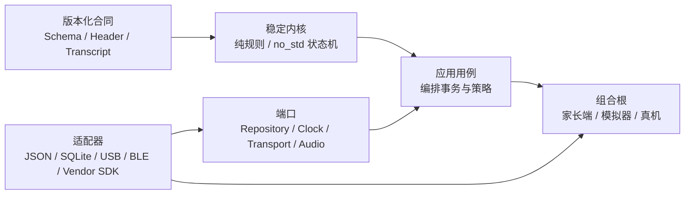

# 益米系统高复用、低维护架构 v1

> 状态：整机研发长期架构门  
> 日期：2026-08-03  
> 机器策略：[`architecture/system-boundaries.v1.json`](../architecture/system-boundaries.v1.json)  
> 验证命令：`npm run validate:architecture`

## 1. 目标

“高复用、低维护、越开发越简单”在益米中定义为：

1. 新板卡、新传输、新存储和新内容来源复用同一产品内核与合同；
2. 变化收敛在 adapter，不沿调用链扩散到领域、协议和 UI；
3. 一个版本化行为只有一个机器合同所有者，其他语言以独立实现加共同向量验证；
4. 新功能优先组合已有用例，新增特殊路径必须同时给出合并或删除日期；
5. 抽象来自第二个真实消费者，不根据未来想象预先堆层。

复用的对象是**稳定语义和验证证据**，不是把全部代码塞进一个“大公共包”。低维护也
不是减少测试，而是用一次定义、多处消费、机器回归替代人工同步。

## 2. 固定形态：稳定内核 + 用例 + 端口 + 适配器 + 组合根



依赖只朝合同和稳定内核方向流动：

```text
composition root → adapter → port/use case → stable kernel → versioned contract
```

合同不导入 App，纯内核不导入文件系统、网络、UI、板厂 SDK 或全局时间/随机数。

## 3. 五级复用顺序

| 优先级 | 复用内容 | 做法 |
|---:|---|---|
| 1 | 行为与数据合同 | 唯一 Schema/Header、错误码、兼容策略 |
| 2 | 中立验证证据 | 黄金向量、transcript、故障注入、C/Rust 差分 |
| 3 | 纯产品内核 | TypeScript 纯规则或 Rust `no_std` 状态机 |
| 4 | 应用用例与端口 | revision/CAS、compile、stage/verify/activate 等流程 |
| 5 | 环境适配器 | 文件、SQLite、USB/BLE、OS、供应商 SDK、UI |

跨 TypeScript、Rust 和 C 的复用以 1–2 级为主。不同语言保留独立实现，使用同一组中立
向量证明语义一致，避免建立难调试的跨语言巨型运行时。

## 4. 单一事实源

| 行为 | 唯一机器所有者 | 消费方式 |
|---|---|---|
| Snapshot 结构与生命周期 | `hardware/evt0/snapshot-v1/` | Node/Rust 独立 adapter 跑同一 transcript |
| Snapshot 跨表语义 | `scripts/snapshot-projection-validator.mjs` + 固定负向集合 | 编译器、产品基线、目标 parser 对齐错误集合 |
| DeviceLink 事务 | `hardware/evt0/device-link-v1/` | Node/Rust 状态机差分 |
| 板级 ABI | `hardware/evt0/platform-ffi-v1/` | C header、Rust wrapper、C11 mock、ABI 向量 |
| 硬件系统拓扑与目标绑定 | `hardware/evt0/hardware-system-v1/` | 稳定块/端口不随板卡变化；intake selector、接口证据与 EDA 准入由 binding 管理 |
| 家庭 Alpha 编译 | `hardware/evt0/family-alpha-v1/` | 兼容 draft/confirmation/Snapshot 编译器回归，既有 27/27 基线保持不变 |
| 家庭 revision、BuildPlan 与逐构建授权 | `hardware/evt0/family-repository-v1/` + `contracts/family-build-plan-v1.mjs` | confirmation-free BuildPlan、BuildAuthorization、build adapter 与 repository adapters 跑共同向量 |
| 完整家庭包 | `hardware/evt0/family-export-v1/` + `contracts/family-export-v1.mjs` | RepositoryBackup 与历史资产组成内容寻址目录；companion 执行检查、portable restore 与负例 |
| 预听确认信任 | `hardware/evt0/confirmation-trust-v1/` + `contracts/confirmation-trust-v1.mjs` | challenge/presentation/proof/replay provider 的 Memory/Atomic adapters 跑同一 17/17 负向门 |
| 本地主机真实预听 | `apps/companion-app/src/prelisten/` | `verified-prelisten-use-case` 被静态与 authored 两条可执行链共用；AudioPlayer、FFmpeg、CLI动作与资产解析分别留在端口/adapter |
| Family authoring | `apps/companion-app/src/authoring/` | 显式 base revision 命令和本地 workspace adapter 复用既有 FamilyRevision/CAS/BuildPlan/prelisten/authorized compiler；来源与路径只在 adapter/catalog |
| Family capture source | `capture-source-use-case.mjs` + `directshow-capture-port.mjs` | 用例只编排 capture→import→discard；Windows/FFmpeg、设备名和临时路径留在 adapter，同一个 imported receipt 进入既有 authoring 主链 |
| Family asset vault maintenance | `apps/companion-app/src/asset-vault/` | 复用 Family Export 的全历史引用收集器；plan/apply只依赖 reference snapshot、inventory、lease和conditional-delete ports，本地路径/quarantine留在adapter |
| Asset vault startup recovery | `apps/companion-app/src/asset-vault/` | 版本化 canonical journal 在首个文件移动前绑定 plan/reference/inventory/limits/有序候选；启动只恢复可证明状态，歧义现场保持并失败闭合 |
| FamilyWorkspace composition | `apps/companion-app/src/family-workspace/` | factory 私有创建 Atomic repository、canonical vault 与唯一 coordinator；file/capture import、authoring、maintenance、export/portable adoption 只暴露 capability API |
| 24码产品切片 | `hardware/evt0/golden-24/codes.json` | 生成 Snapshot design，校验 Family Alpha 子集 |
| 架构边界 | `architecture/system-boundaries.v1.json` | `validate:architecture` 检查依赖和所有权漂移 |

禁止复制一份 Schema 后分别维护。语言类型可生成或手写，但必须声明来源、版本和共同
conformance gate；任何一方的便利类型都不升级为第二事实源。

## 5. 依赖规则

### 5.1 TypeScript

- `packages/core` 保持领域纯净，内部依赖为零；
- `audio`、`content`、`protocol` 只使用策略文件允许的内部包；
- `apps/*` 是组合根，可以装配能力包，能力包不反向导入 App；
- 内部包只从公开包名导入，不使用 `@yimi-pen/pkg/src/...` 深层路径；
- `core`、`protocol` 不出现 Node builtin；文件系统暂由 `content` 的现有适配层持有；
- `audio` 当前把 `ConsoleAudioBackend` 与稳定播放器接口同包放置，作为已记录的兼容例外；真实 `ffplay` 后端已落在 companion adapter，公开 `AudioPlayer/AudioBackend` 端口和 `packages/audio/src` 保持原状；
- 同一 App 内出现第二条真实可执行链时，可提取 App-local 最小用例并删除重复；出现第二个独立
  repository/设备运行时产品消费者后，再评估跨 App 的 application package。

### 5.2 Rust/C

- `yimi-fw-contract`、Snapshot、Runtime、DeviceLink core 保持 `no_std`、无外部生产依赖；
- OS/SoC/供应商变化只落入板级 adapter；
- `unsafe` 集中在 `yimi-platform-ffi/src/raw.rs`，安全 wrapper 与产品内核保持安全 Rust；
- host runner 只负责 conformance，不进入目标固件；
- OpenVela/NuttX、ESP-IDF、Embassy/RTIC 是互斥板级路线，不渗入纯内核。

### 5.3 旧原型防腐层

现有 `Book/DiyBindStore/PointReadEngine/packages/protocol` 是受保护的原型语义；新的
Family/Snapshot/DeviceLink/Rust 路线不直接读写其内部对象。迁移只通过两个显式 adapter：

- `LegacyBook/DiyBinding → FamilyRevision`，并先保存旧行为 characterization；
- `Snapshot execution events ↔ device-sim runtime control/events`。

旧 protocol 定位为运行时控制/事件通道，DeviceLink 只负责管理、诊断和安装事务。两者不
合并为带条件分支的万能协议，也不允许 App 同时直接编排两套安装流程。

## 6. “越开发越简单”的变更预算

| 变更 | 应新增 | 默认保持原状 | 验收方式 |
|---|---|---|---|
| 新主板 | 一个 target binding、board adapter、证据包、构建入口 | HardwareSystem topology、Rust 产品 core、Snapshot、DeviceLink | `validate:hardware-system` + 同一 C/Rust 向量 + 两块同版 HIL |
| 新传输 | framing/IO adapter | DeviceLink 事务、错误码、重放 | 同一 transcript + 断连测试 |
| JSON → SQLite | 一个 FamilyRepository adapter、迁移 | revision/CAS/恢复用例 | repository conformance suite |
| 新 TTS/录音来源 | 一个 importer/job adapter | BuildPlan/preview/challenge/presentation/proof/BuildAuthorization/编译/安装 | 同一黄金产品切片与 confirmation-trust 向量 |
| 新家长端壳 | UI 与组合根 | 家庭用例、端口、合同 | 相同 use-case acceptance |
| 合同升级 | 一个新版本、兼容决策、迁移 | 历史版本只读解释 | 所有消费者共同门 |

每个工作包在评审时回答四个问题：

1. 复用了哪个既有合同、内核和 conformance suite？
2. 变化是否只进入一个 adapter 或一个明确的新合同版本？
3. 是否产生第二条同功能管线；若产生，何时合并或删除？
4. 删除该功能需要触碰多少稳定模块？稳定模块超过一个时重新切边界。

## 7. 抽象与复用门

### 7.1 建立共享抽象

同时满足以下条件时提取共享端口或用例：

- 已出现两个真实消费者或两个可执行 adapter；
- 两者共享的行为可用同一输入/输出和错误语义描述；
- 至少有一组中立正向、负向和恢复向量；
- 提取后删除重复代码，而不是增加一层转发壳。

### 7.2 保持局部实现

以下情况继续局部实现：只有一个消费者、供应商行为尚未实测、接口仍随样品变化，或
抽象后仍需大量目标分支。局部实现必须位于 adapter/experimental 路径，不进入稳定内核。

### 7.3 软件 / 硬件双线输入门

双线并进采用**隔离写入、同步读取**，而不是把两线合并成一个共享实现：

1. 每个软件工作包启动、收口和收益复排时，读取硬件 active anchor、HardwareSystem
   `target-binding`、最新硬件验收报告以及
   [`hardware-software-sync-2026-08-04.md`](./research/hardware-software-sync-2026-08-04.md)；
2. 只比较自上一软件检查点以来的已验收增量；待发送模板、未绑定样品和 `PENDING` 字段仍作为缺口，
   不生成板级常量；
3. 只有以下变化进入软件：Snapshot/manifest 约束、OID event、storage durability、DeviceLink
   transport、audio profile、control/status、diagnostic/BSP 或对应 ReleaseGate；
4. 变化优先落在版本化合同或 board/host adapter；目标无关 core、FamilyRevision 和产品用例保持；
5. 每次检查都记录“影响项、证据身份、受影响 owner、排序变化”；没有增量时明确记为 `NONE`，
   避免把重复阅读变成重复开发。

当前检查点中 `BOARD_TARGET=UNRESOLVED`，HardwareSystem 425/425 只证明18条接口的影响映射完整，
不代表任何 target binding 已冻结；Benchmark Seller Evidence 为20/20合同与9/9准备/隔离自检，但request仍为
`PREPARED_NOT_SENT`，raw/records/complete均为0；真实MB1 receipt/reply、accepted target、released BOM和Lab
qualified仍均为0。因此本轮没有 codec、storage、USB、OID event 或 board adapter 变化。host asset-vault
maintenance、统一 FamilyWorkspace composition 与startup recovery均已收口：repository、vault、reference
coordinator和source ports由一个App-local factory装配，固定资源策略在启动恢复与后续plan/apply间共享；设备
存储回收仍需重新经过 `IF-STORAGE`、目标介质与掉电门。

## 8. FamilyRepository 与 Confirmation Trust v1 作为参考切片

家庭事实、构建计划和逐构建授权已按不同变化率拆开，并分别经 port 接入 adapter：

```text
Family use case
  → FamilyRepository port
      ├─ Memory / Atomic JSON adapter（开发/黄金回归）
      └─ SQLite adapter（产品端出现第二个真实存储消费者后）

FamilyRevision + confirmation-free BuildPlan + resolved assets
  → CompileDraftProjection → preview
  → ConfirmationTrustProvider port
      ├─ Memory challenge store
      └─ Atomic JSON challenge store
  → challenge / presentation / confirmation / Ed25519 proof
  → BuildAuthorization → authorized compile

FamilyRepository backup + all historical asset identities
  → Family Export v1 manifest / exact file closure
  → portable restore with a distinct replica epoch
```

签名 profile、challenge/replay 状态、authority/key 边界与生产证据门详见
[`Confirmation Trust v1`](./confirmation-trust-v1.md)。

Repository port 已冻结 revision/binding transition、CAS、repository/family scope、EventCursor、原子
事务、损坏/空库/格式漂移区分、备份与恢复语义。Memory 与 Atomic JSON 共同通过同一
transcript；后续 SQLite 只实现存储差异。编译用例先读取不可变 revision 并形成 BuildPlan，只有
匹配该 BuildSubject 的 BuildAuthorization 才进入主流程编译；领域层不直接读取某个数据库、账号
系统、key store 或 replay store 的内部结构。

revision store 采用 append-only graph：commit 只追加以当前 head 为 parent 的不可变 revision，
restore 合并 backup 中缺失实体并移动 active head，不删除较新的本地 revision。该选择避免
SQLite、同步与审计层以后再从破坏性恢复迁移；backup recovery 面对损坏 live state 时则以
已验证 backup 为恢复边界，并用新 EventCursor epoch 明示消费者重同步。
跨目录/机器导入走独立的 `restorePortable`：只接收全新空库，把唯一 replica instance 绑定进新
epoch，从 sequence 1 记录恢复事件，避免源库和恢复副本复用同一 cursor。

### 8.1 FamilyRevision、BuildPlan 与 BuildAuthorization 分离

当前 `family-alpha-draft-v1` 同时携带家庭编辑字段与 target、physical code、codec、路径等
构建字段。它从本版起只定义为 **CompileDraftProjection v1 的兼容输入**，不是
FamilyRepository 的持久化模型，也不是新的事实源。

FamilyRepository v1 持有 target-neutral `FamilyRevision`：

- `familyLibraryId / revisionId / parentRevisionId / createdAt`；
- `bindingId / logicalOid / label / kind / playPolicy / cooldownMs`；
- `clipId / assetId / sourceKind / transcript / language / mediaType`；
- 家庭 revision 不保存 confirmation、target 或 release 状态。

编译前另建 confirmation-free `BuildPlan`，持有：

- `buildPlanId / buildSubjectSha256 / familyRevisionId / requestedAt`；
- target profile、physical map、codec profile 和完整 asset catalog；
- fixture/release 输出模式、期望 compiler profile 与 projection source hash。

adapter 将 `FamilyRevision + BuildPlan + resolved assets` 投影成当前编译器兼容输入。preview 形成后，
Confirmation Trust v1 才签发一次性 challenge，验证完整 presentation transcript、confirmation、
guardian authority revision 和 `Ed25519+JCS-prefix-v1` proof，并原子消费 challenge。成功结果确定性生成
`BuildAuthorization`，只授权一个 `buildPlanId / buildSubjectSha256`，带 proof、verification、policy 和
有效期身份；它不回写 FamilyRevision，也不退化为可跨构建复用的布尔开关。

首个真实消费者 `apps/companion-app` 只组装 provisional BuildPlan；projection hash 和
BuildSubject identity 由 family-build-adapter 的同一投影实现最终化，避免 App 复制 draft 算法。
它在唯一 compiler dispatch 点检查 authorization 的 schema、身份、revision/plan/preview/proof/
transcript 绑定与有效期，再调用既有 design-fixture compiler。静态 preview 与 authored preview 已形成
两条 App 内可执行链，所以共同的 challenge→natural-end presentation→显式动作→proof/provider→
BuildAuthorization 顺序已提取到 App-local `verified-prelisten-use-case`；两条旧编排被合并。当前产品组合根
仍只有一个，因此该用例留在 companion 内，尚未提取 `packages/application`，也不触发 SQLite。

文件来源与 DirectShow 来源现在汇入同一个 canonical import 结果。`capture-source-use-case` 只持有
`capture / import / discard` 的生命周期顺序；`directshow-capture-port` 独占 FFmpeg 参数、设备名、临时目录
和清理证据。导入完成且临时源清理成功后，才允许 imported asset 进入既有 revision command。由此新增 TTS、
云下载或移动端录音时只实现来源 adapter，FamilyRevision、BuildPlan、预听确认和 compiler 均保持单一路径。

旧 `BuildRequest v1` 同时携带构建参数和未来 confirmation，存在
`BuildRequest → preview → confirmation → BuildRequest.confirmation` 循环。它只保留为旧黄金输入和
旧调用方的兼容合同；release 路径已封闭，单 receipt 字段不再增加新语义。所有新调用方只走：

```text
BuildPlan → preview → challenge/presentation/confirmation/proof → BuildAuthorization
```

物理码、board/firmware、目标 codec 和文件路径不回写家庭 revision。Schema 与黄金 adapter 已由
`test:family-build-adapter` 关闭：BuildPlan 和旧兼容投影均与 Alpha draft 逐字节一致，23/23 负向及
23/23 零副作用通过。Confirmation Trust v1 独立通过 17/17 负向及 17/17 零副作用，覆盖签名、时间窗、
BuildSubject/preview/presentation/confirmation/authority 绑定、key rotation 和 replay。既有 Family Alpha
编译器仍保持 27/27，不因新授权层改写稳定基线。

companion host acceptance 另有26项 gate、10个当前资产逐字节复算、同 assetId 历史换字节场景、
6项授权负例和6项导出负例。完整包执行内容寻址路径、精确目录闭包、显式资源门、干净恢复与
distinct-replica cursor 复核；失败场景保持目标/既有输出不变。该结果证明首个真实产品调用链；
fixture transcript 仍不替代真实音频播放 callback。新增确定性预听门以 scripted backend 跑19项失败/顺序场景；
主机进程门以16项场景固定 timeout/abort/stop 到真实 `close` 的清理顺序、无重叠重试和录音原子发布；
单列真实主机门对10个 canonical clip 执行固定工具哈希、完整 decode、`ffplay` natural exit、显式动作、
provider 验证与 BuildAuthorization。主机门仍不替代操作员听觉、目标设备音频和声学证据。
capture-authoring 另以12项确定性 gate 贯穿同一 authorized Snapshot 链，并覆盖预取消、运行中取消、timeout、
坏 recorder receipt、import failure 与 cleanup failure 的 pre-commit 边界；报告 SHA-256 为
`5eb3a3e70e4960b69ec40b3901d1529a4f7a3f5a3b1ec42ee447ec4d6a0a1d03`。
asset-vault maintenance 再以21项真实文件/故障注入 gate 证明11个全历史 digest 受保护、老/年轻 orphan
按保留期分流、dry-run 与 apply 身份闭合、引用 mutation 在稳定租约内排队，以及篡改/缺失/异常条目阻断和
quarantine rename 故障全回滚、部分 purge 明确回执/剩余恢复/重规划；报告 SHA-256 为
`c56e2acd468518334d8fb299ceb7d99aa0c4135f6c65b1ee810e067dc9b164df`。

`FamilyWorkspace v1` 随后把真实 Atomic JSON repository、canonical WAV vault、file/capture source ports 与
`FamilyAssetReferenceCoordinator` 收敛到一个 capability-only 入口。source import、initial/authoring commit、maintenance、
complete export 和 portable repository restore 共用同一进程队列；同一路径重复打开复用同一实例，配置漂移显式失败。
Family Export 的 `assets/<sha>.bin` 保持稳定，新的 adoption 流程经既有 inspector 在 staging 中重新 probe 并发布为
`assets/sha256/<sha>.wav`。34/34 真实文件验收覆盖 GC lease/import 竞态、伪造 receipt、重开、distinct epoch、
staging 清理、发布后 adapter 配置失败原子性与重试；报告 SHA-256 为
`094f7607beed195854f4083a1f8851b33af8fcf3bfd62295a66d913e56837254`。

`Asset Vault Recovery v1` 再把进程内异常处理扩展到受控进程中断：canonical journal先于首个
`source → quarantine`移动发布，逐次purge持久记录连续已删前缀；FamilyWorkspace在公开capability前执行恢复，
且恢复完成后只生成新inventory/plan，不续跑旧计划。6个独立child-process退出窗口、重复启动、fresh-plan收敛
与5类篡改/歧义负例合计70/70，报告SHA-256为
`65c2923ada29eb98c65b2d4f83d4b7da971b4c4fb1ef588bff75b20880ecb474`。

FamilyRepository 的 Memory 与 Atomic JSON 各跑 16 步共同 transcript，并以13项 Atomic 边界和14项
core 边界覆盖 scope、普通/portable/recovery epoch cursor、幂等恢复、live-state 身份、格式归一化、
并发和故障注入。当前child-process报告已关闭asset-vault maintenance的受控进程退出/重启状态归一化；
完整导入staging的进程退出回收、跨进程writer、父目录fsync、恢复回执持久审计、目标介质与真实掉电仍是
独立证据门；fixture BuildAuthorization 也不替代生产 provider qualification、真实 authority 或
`release-candidate` 端到端编译证据。

### 8.2 Snapshot 到 Rust 的执行模型

Snapshot 中字符串 `actionId` 定义为 `ActionKey`，用于文件引用、诊断和兼容性；目标 parser
完成全表闭包校验后，按 `actions.actions` 数组顺序生成从 0 开始的稠密 `ActionSlot(u32)`。
OID 常驻索引只保存 `physicalCode → ActionSlot`，`ActionDescriptor[slot]` 保存
`playPolicy / cooldownMs / ordered ClipSlot`。随机策略只消费注入的随机源。

主机层已实现 `ActionKey → ActionSlot` 与 `ClipKey → ClipSlot` parser、逐 action cooldown、
`replace/queue/random_one` planner 和注入式随机源。Family Alpha 实际编译 Snapshot 与
Golden-24 设计夹具分别由独立 Node/Rust 实现生成完整 `ExecutionModel + trace`，结果逐字节
一致，非词法 order-trap 另锁定数组顺序语义；23 条对称负例保持失败输出不覆盖。该复用边界由
[`execution-model-v1`](../hardware/evt0/execution-model-v1/README.md) 持有，新增板卡只实现目标
parser/encoding 和 board adapter，不改产品 planner。

这仍是主机证据。真实码表、目标 RAM/Flash 编码、目标 parser 和两块同版 C/Rust HIL 未到位，
所以架构门 `TARGET_SNAPSHOT_EXECUTION_MODEL_EVIDENCE` 保持 `EVIDENCE_PENDING`，不写成板上执行完成。
ExecutionModel v1 仍注入最终 index；加权语义由独立版本化
[`WeightedRandom v2`](../hardware/evt0/weighted-random-v2/README.md) 持有：正 `u32` 权重、原始
`u64` 随机词、低端前缀拒绝与数组顺序半开累计区间均有精确向量。Node 与无分配 Rust core 的6组结果
逐字节一致，12条对称负例保持输出不覆盖；现有 JoJo/DIY `2:1` 权重和旧 Pack 缺省权重 `1` 只经一个
防腐 adapter 进入新合同。这样换板卡 RNG 时只换 raw-word provider，不复制权重算法。

上述仍是 host 合同证据。Snapshot v1 尚未携带量产权重扩展，目标 RNG provider、两块同版板的原始词流和
非 fixture Snapshot 分布工件仍由 `RG-SNAPSHOT-WEIGHTED-RANDOM-VERIFIED` 约束，不由 host gate 代替。
ExecutionModel 内的两个 raw hash 也只标识 component bytes；
完整 manifest/Snapshot 身份由后续 `EvidenceReceipt` 绑定。

### 8.3 统一发布证据

产品发布现只保留一个 [`ReleaseGateCatalog v1`](../hardware/evt0/release-gates-v1/README.md)：
34 个肯定式稳定 `RG-*` ID 定义适用 subject、producer、证据类别、artifact role 和数量规则。
15 个 host report 通过唯一 adapter 表生成 `EvidenceReceipt`；板级/HIL/制造/生产 provider 后续
使用同一 receipt 合同，不再在各 runner 中维护私有 blocker 数组。

`ReleaseDecision` 固定 catalog 版本、release subject 和排序后的 receipt 身份，确定性派生
passed/failed/missing/blocking 与唯一 `releaseReady`。22 条合同负例覆盖 catalog/receipt/decision
身份、过期 subject、PASS/FAIL 冲突、输入顺序、缺 artifact、陈旧 host run、报告漂移、语义文件漂移及
synthetic 冒充物理证据，并明确拒绝用普通自洽 receipt 自报生产 confirmation provider 合格。Catalog identity 还绑定 receipt/decision Schema、判定函数、report
operator、源码集合算法和当前 evaluator 的原始字节；解释语义变化会生成新 identity。

Confirmation Trust 的两个层级保持正交：`RG-PRODUCTION-CONFIRMATION-TRUST-VERIFIED` 是产品级
provider qualification，证明当前产品 release 的 provider profile、生产 keyring、authority resolver
和 atomic replay store 合格；`BuildAuthorization` 是逐构建授权，只证明一个监护权威完成了一个
BuildPlan/preview。前者不授权任何具体构建，后者不替代产品级 provider qualification；生产候选必须
同时满足二者。

### 8.4 产品任务只组合稳定能力

[`Authoring Product Shell v1`](./authoring-product-shell-v1.md) 是“越开发越简单”的首个产品任务实例：

```text
pure session transition
  → capability/source ports
  → FamilyWorkspace public authoring capability
  → exact FamilyRevision command replay
  → verified review receipt
```

它不创建第二套FamilyRevision、repository、confirmation或compiler语义。新增TTS、移动端录音或另一个文件
picker时，只增一个source adapter和fixture；OS权限、路径、设备名、adapter receipt ID和云token不进入会话状态。commit command
先以单飞、可取消的preparation effect生成，由controller覆盖固定非敏感producer identity，并在`COMMIT_PREPARED`冻结；adapter异常代码先归类为固定公共失败码，网络回包丢失只做原operation重放，stale head开启新会话。33/33机器验收同时证明产品API没有
直接confirm入口，fixture receipt不提升`buildAuthorized`，生产BuildAuthorization与未来DeviceDelivery保持分离。

该能力继续留在companion App内。第二个独立产品组合根出现并产生可删除的重复实现后，再评估共享application
package；同一App的另一个页面不触发抽象升级。

`validate:full` 在独占 runner 内记录开始前报告指纹，重跑全部15个 host producer，要求每个报告本轮刷新且
源码集合在运行期间零漂移，再生成 `release-gate-host-run.json`。Evaluator 只接受该密封 run 的精确报告
hash和当前源码集合；重复评价同一密封 run 复用固定完成时间，所以 receipt set 与 decision ID 保持稳定。
最新封闭运行结果为 15 项 host PASS、0 FAIL、19 项物理/生产
receipt 缺失，因此发布状态仍为 false；host 合同通过不关闭 production/physical gate。旧 ID 只留
`legacyAliases`，catalog 自举和 receipt 迁移机制明确不作为产品 gate。

## 9. 机器门与当前基线

`npm run validate:architecture` 检查：

- TypeScript workspace 实际依赖与允许图完全一致、无环、无深层导入；
- 纯包不引入 Node builtin；
- Rust workspace 成员、生产 path 依赖、纯 core 外部依赖、vendor token 与 `unsafe` 边界；
- 每个版本化合同只有一个 canonical owner，路径和消费者存在；
- JSON Schema `$id` 唯一；
- 24码真源生成的 Snapshot design 逐字节一致，Family 子集结构字段无漂移；
- 必需文档、根脚本、聚合回归和稳定模块保护清单存在。

机器报告写入 `build/architecture-validation.json`。策略首先锁住当前已证实边界，后续每次
调整依赖图都要同时修改策略、理由和回归；绕开策略的临时导入视为架构漂移。

日常反馈分三层，避免每次小改都等待完整工具链：

- `npm run validate:fast`：依赖图、硬件系统证据绑定、24码生成漂移、TypeScript 和内容；
- `npm run validate:hardware-system`：检查 12 个稳定逻辑块、18 条接口、intake/ReleaseGate 引用与 EDA 证据门；
- `npm run validate:contracts`：再加入硬件系统、产品基线、Snapshot、DeviceLink、Family build/repository、Confirmation Trust 与固件合同；
- `npm run validate:full`：完整 Rust、intake 与所有主机回归，并密封源码集合/15份报告后评价发布门。

实物 HIL 继续独立产生带板号/revision 的 receipt，不混入无板开发的快速门。旧 core 的
失效 Jest 路径已替换为 Node 内置 test runner；后续 characterization test 可直接增量加入，
不再维护未声明的测试框架。

GitHub PR/push 执行 `npm test + validate:contracts`，定时/手动任务执行 `validate:full` 并
保留机器报告。官方 Action 版本和 commit 依据记录在
[`github-actions-quality-gate-2026-08-03.md`](./research/github-actions-quality-gate-2026-08-03.md)。
