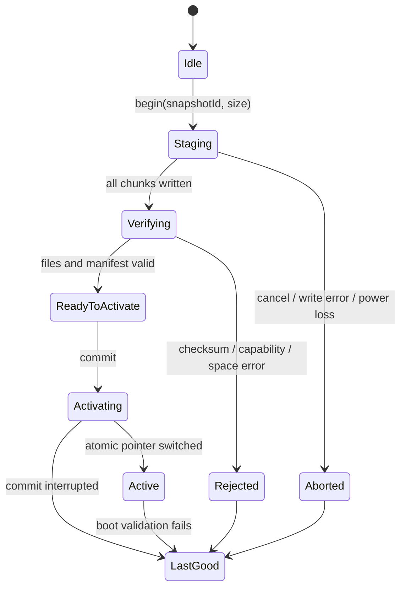

# Content Snapshot v1

> 状态：设计规范 v0.1  
> 目标：把家庭可编辑内容编译成笔端可校验、可原子切换、可回滚的只读执行快照。  
> Schema：[`hardware/evt0/snapshot-v1/schema.json`](../hardware/evt0/snapshot-v1/schema.json)  
> OID 索引 Schema：[`logical-index.schema.json`](../hardware/evt0/snapshot-v1/logical-index.schema.json)  
> Action/Clip Schema：[`actions.schema.json`](../hardware/evt0/snapshot-v1/actions.schema.json)  
> 设计 fixture：[`hardware/evt0/snapshot-v1/design/manifest.json`](../hardware/evt0/snapshot-v1/design/manifest.json)
> RFC 8785 黄金向量：[`hardware/evt0/snapshot-v1/golden-vectors.json`](../hardware/evt0/snapshot-v1/golden-vectors.json)
> 生命周期 transcript：[`hardware/evt0/snapshot-v1/operation-transcript.json`](../hardware/evt0/snapshot-v1/operation-transcript.json)
> 设备管理语义：[`hardware/evt0/device-link-v1/`](../hardware/evt0/device-link-v1/README.md)
> Rust 状态机：[`firmware/crates/yimi-snapshot-core/`](../firmware/crates/yimi-snapshot-core/)

## 1. 证据与设计边界

| 项 | 类型 | 依据 |
|---|---|---|
| OID 到预存声音的本地链路 | `O` | `SRC-OID-001` 方案商官方公开架构 |
| USB/本地存储作为基础内容通道 | `O + E` | `SRC-OID-001` 公开能力 + 益米可复现装包目标 |
| staged/verify/activate/last-good | `E` | 益米对掉电、坏包和离线可用的工程设计 |
| JSON Schema 2020-12 | 标准 | [JSON Schema 2020-12](https://json-schema.org/draft/2020-12/schema) |
| JSON 确定性规范化 | 标准 | [RFC 8785 JSON Canonicalization Scheme](https://www.rfc-editor.org/rfc/rfc8785) |
| 物理码、音频 profile、容量上限 | 待实测 | `BOARD_TARGET`、码工具和固件能力表 |

Snapshot v1 是益米自己的设备契约，并非对某个方案商私有包格式的猜测。

## 2. 核心原则

1. 家长端编辑 `Book/Hotspot/Clip/DiyBinding`，设备只读取编译后的索引和动作；
2. 正常点读不解析编辑域大型 JSON，也不扫描目录；
3. 物理 OID 用十进制字符串保存，避免 JSON 对 `uint64` 的精度损失；
4. 所有设备文件都有大小和 SHA-256；
5. 写入 inactive/tmp 后逐项校验，再原子切换活动指针；
6. 启动时始终存在 last-good；新快照失败时继续使用 last-good；
7. 设计 fixture 可以保留未分配物理码，release-candidate 必须全部分配；
8. VoiceProfile 样本、家庭照片和云任务凭据不进入 Snapshot。

JSON 中所有字节数使用非负整数并限制在 `9007199254740991` 以内，确保 Node、Rust 与其他
RFC 8259/IEEE-754 消费者对同一值无精度分歧；更大容量的后续格式改用 canonical decimal
`u64` 字符串并升版本，不在 v1 中混用表示。

## 3. 目录布局

```text
snapshot/
  manifest.json
  logical-index.json
  actions.json
  audio/<clip-id>.<ext>
  system/<optional-system-audio>
```

路径统一使用 `/`、相对根目录、UTF-8，无盘符、无绝对路径、无 `..`、无可执行脚本。

## 4. Manifest

### 4.1 必填字段

| 字段 | 含义 |
|---|---|
| `schemaVersion` | 固定 `1` |
| `releaseState` | `design-fixture` 或 `release-candidate` |
| `snapshotId` | 设计阶段 `design:*`；发布阶段 `sha256:<64 hex>` |
| `contentRevision` | 家庭库/Pack 的不可变 revision |
| `createdAt` | ISO 8601 构建时间，仅用于追溯，不进入内容 hash |
| `producer` | 编译器名和版本 |
| `target` | 板级、最低固件、物理码状态和能力要求 |
| `oidIndex` | OID 索引文件引用和条目数 |
| `actions` | 动作表文件引用和动作数 |
| `files` | 除 manifest 自身外的全部 payload 文件及 path、size、sha256、role |
| `install` | 逻辑快照树字节数、激活方式和 last-good要求 |
| `evidenceRefs` | 本快照依赖的需求/证据标识 |

### 4.2 Snapshot ID

发布快照 ID 的输入为以下内容：

1. 移除 `createdAt` 和 `snapshotId`；
2. 按 RFC 8785 规范化剩余 manifest；
3. 对规范化 UTF-8 字节计算 SHA-256；
4. 写成 `sha256:<lowercase hex>`。

编译器版本变化但规范化内容相同，应得到同一 ID。第一版实现前用跨语言黄金向量验证 Node 与固件侧结果。

`install.requiredBytes` 精确定义为：**实际 `manifest.json` 字节数 + `files` 中全部
payload 文件字节数**。它与 DeviceLink `totalBytes` 对齐，但不包含目标文件系统块对齐、
目录项、内部 `.complete`/head record、双槽保留或磨损均衡空间。设备容量预检必须在
`requiredBytes` 上再加入由冻结存储器件和文件系统实测得到的 staging overhead/reserve；
主机模拟器当前只验证逻辑树下限，不外推物理介质容量。

## 5. OID 索引

```json
{
  "schemaVersion": 1,
  "physicalMapStatus": "assigned",
  "entries": [
    {
      "physicalCode": "1844674407370955161",
      "logicalOid": "YIMI-EVT0-001",
      "actionId": "action-001"
    }
  ]
}
```

- `physicalCode` 是十进制字符串；
- 必须按数值升序排列，便于二分查找或直接构建哈希索引；
- `physicalCode`、`logicalOid` 和 `actionId` 在一个 Snapshot 内分别唯一；
- `design-fixture` 允许 `physicalCode: null`；`release-candidate` 拒绝任何空值；
- 物理码来自封存的目标码工具，不用顺序整数模拟真实码。

## 6. 动作表

```json
{
  "schemaVersion": 1,
  "actions": [
    {
      "actionId": "action-001",
      "playPolicy": "random_one",
      "clipIds": ["clip-001-a", "clip-001-b"],
      "cooldownMs": 0
    }
  ],
  "clips": [
    {
      "clipId": "clip-001-a",
      "path": "audio/clip-001-a.wav",
      "size": 3884,
      "sha256": "0000000000000000000000000000000000000000000000000000000000000000",
      "codec": "WAV_PCM16_16K_MONO",
      "mediaType": "voice"
    }
  ]
}
```

允许的首版策略：`replace`、`queue`、`random_one`。随机权重编译到独立 clip 描述或动作扩展；随机源必须可注入，以便黄金重放。

权重到 clip 的整数映射已由
[`WeightedRandom v2`](../hardware/evt0/weighted-random-v2/README.md) 单独冻结：缺省权重 `1` 只在旧 Pack
防腐 adapter 处理，设备侧消费正 `u32` 权重和注入的原始 `u64` 随机词。Snapshot v1 本身保持不变；加入
量产权重字段时走 Snapshot v2/兼容迁移，不在 v1 上追加隐含语义。

`clips` 是设备播放资产的最小 catalog：每个 Action 引用的 `clipId` 都必须解析到唯一
catalog 条目，catalog 的 path/size/SHA-256/codec 必须与 manifest 中同一路径的 audio
文件完全一致，且不允许未被 Action 使用的条目。早期 24 码纯逻辑 fixture 在目标 codec
冻结前可省略 catalog；Family Alpha 编译产物必须带完整 catalog。标签、transcript、
`sourceKind` 和家庭原始素材继续留在编辑/预览域。

`release-candidate` 必须含非空 clip catalog 和至少一个 `role=audio` 文件；所有 Action、
clip 与 manifest audio 必须双向闭合，额外未使用音频也会阻断发布。省略 catalog 的
Snapshot 只属于 `design-fixture` 计划，不属于设备可执行发布包。

`logical-index.schema.json` 和 `actions.schema.json` 已封住 assigned/null 与
`replace`/`random_one` 的可表达条件；字段级唯一性、物理码 `u64` 上界、assigned
物理码数值升序、跨表引用、manifest 的 index/action 计数和文件/clip 投影使用共享
[`snapshot-projection-validator.mjs`](../scripts/snapshot-projection-validator.mjs)。
产品基线含相应负向回归；目标板 parser 仍需独立复现这些语义，不能只把 Schema 通过
当成可激活结论。

## 7. 安装状态机



实现可以是双槽，也可以是 inactive 临时区 + 原子指针；对外语义统一为 `staged-atomic`。设备必须先报告容量和能力，主机才开始写入。

## 8. 能力协商

设备至少报告：

- `snapshotSchemaVersions`；
- `boardTarget`、`firmwareVersion`、`storageFreeBytes`；
- `audioCodecs` 及精确参数范围；
- `maxFileBytes`、`maxPathBytes`、`maxEntries`；
- `activationModes`；
- `transportChunkBytes`；
- `supportsRollback`、`lastGoodRevision`。

所有上限来自目标板能力和实测，不在 Snapshot 规范里预填通用数值。

## 9. 错误语义

| 代码 | 含义 | 主机行为 |
|---|---|---|
| `SNAPSHOT_SCHEMA_UNSUPPORTED` | Schema不受支持 | 保留旧快照并提示升级路径 |
| `TARGET_MISMATCH` | 板级/固件不匹配 | 停止写入 |
| `CAPABILITY_MISMATCH` | codec、条目或路径超限 | 重新编译或换兼容内容 |
| `INSUFFICIENT_SPACE` | staging空间不足 | 让家长选择清理，不静默删录音 |
| `FILE_HASH_MISMATCH` | 文件校验失败 | 丢弃 staging，保留 last-good |
| `MANIFEST_HASH_MISMATCH` | manifest/ID不一致 | 拒绝激活 |
| `ACTIVATION_INTERRUPTED` | 激活中断 | 启动 last-good并报告诊断 |
| `ROLLBACK_ACTIVE` | 已回滚 | 显示当前与失败 revision |

## 10. 发布门

`release-candidate` 同时满足：

1. `boardTarget`、`firmwareMin` 是已冻结值；
2. `physicalMapStatus=assigned` 且无空码/重复码；
3. 所有文件存在、大小和 SHA-256 一致；
4. codec 和路径均在设备能力范围；
5. manifest 经过 Schema 和语义校验；
6. `snapshotId` 通过 RFC 8785 + SHA-256 重算；
7. staged、校验失败、掉电和 rollback 测试通过；
8. Snapshot 中不存在家庭原始样本、绝对路径、凭据和脚本。

当前设计 fixture 的目标板、物理码和 codec 仍保持未冻结，因此只用于编译器和状态机开发。

## 11. 当前机器验证

`scripts/snapshot-jcs.mjs` 实现 RFC 8785 所需的 JSON 基元序列化、UTF-16 属性排序、非法代理项拒绝和 SHA-256。黄金向量包含 RFC 数值/字面量示例、RFC UTF-16 属性顺序示例和益米嵌套 manifest 示例。

```powershell
npm run validate:product-baseline
npm run test:snapshot-sim
npm run test:family-alpha-compiler
npm run test:execution-model
```

`tools/snapshot-sim/` 使用真实文件、SHA-256、A/B slot 和追加式 head record，覆盖成功激活、同长度文件损坏、staging断电、head提交前断电、容量不足、release模式拒绝design fixture以及启动时回滚到last-good。设计基线通过只表示 schema、fixture、哈希和事务语义成立；Snapshot runner 不自行拥有 `releaseReady`，唯一发布判定由 ReleaseGateCatalog + receipts 写入 `build/release-gate-current/release-decision.json`。

Rust `yimi-snapshot-core` 另外以目标无关 `no_std` 状态机复现成功激活、校验拒绝、
staging 掉电、activation 中断、active 损坏回滚和 compare-and-swap 过期主机状态。
Node 文件模拟器与 Rust 状态机是两种独立实现；二者已共同消费
`operation-transcript.json` 的 SCN-01..09，并对 `active`、`lastGood`、
`generation`、`snapshot`、`error` 做逐场景差分。Rust host adapter 中的 slot/head
模型只用于匹配已冻结的外部安装语义，不进入 `no_std` 产品核心。

该 9/9 差分结果属于主机证据。实际 Flash/文件系统的原子写粒度、掉电窗口和擦写
寿命仍由冻结目标板、精确存储器件和两块同 revision 样品的 HIL 原始记录关闭。

DeviceLink 另以 16 个共享事务场景验证 manifest-first、分块、幂等、断连、CAS、
abort/rollback 和 11 条失败零副作用路径。Rust adapter 的 FileSpec 来自明确标记的
`hostManifestSurrogate`；它只证明事务核心，不代表目标板已具备 Snapshot JSON Schema、
RFC 8785 canonical hash 和真实存储 parser。该项保留为
`BOARD_MANIFEST_PARSER_HIL_PENDING`，待 `BOARD_TARGET` 的 RAM/Flash/SDK 证据决定受限
JSON parser、预编译描述表或窄 C parser 路线后，再用相同 manifest 和 raw artifact 关闭。

Snapshot 执行表另由
[`ExecutionModel v1`](../hardware/evt0/execution-model-v1/README.md) 冻结。Family Alpha 的实际
编译产物和 Golden-24 设计夹具同时进入 Node/Rust 独立 parser/planner：字符串 key 确定性
映射为稠密 slot，逐 action cooldown、`replace/queue/random_one` 和注入随机选择形成完整 tap
轨迹。Family、Golden-24 和非词法 order-trap 三个场景模型与轨迹逐字节一致，23 条对称
负例通过且失败输出不覆盖。

这些 physicalCode 是有醒目标记的 host surrogate；真实 OID map、目标编码、RAM/Flash 预算、
板上 parser 和两块同版 C/Rust 差分仍由 `BOARD_TARGET` 证据关闭。

`random_one` 的加权选择已另有6组 Node/Rust 逐字节一致向量、精确无偏整除证明和12条零副作用负例；
目标 RNG provider、双板原始词流与非 fixture Snapshot 的分布 receipt 仍是生产门，二者不混写。

