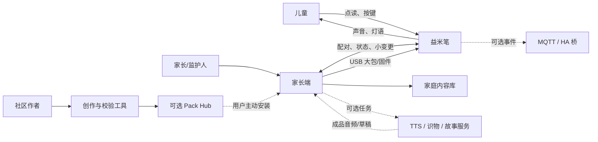
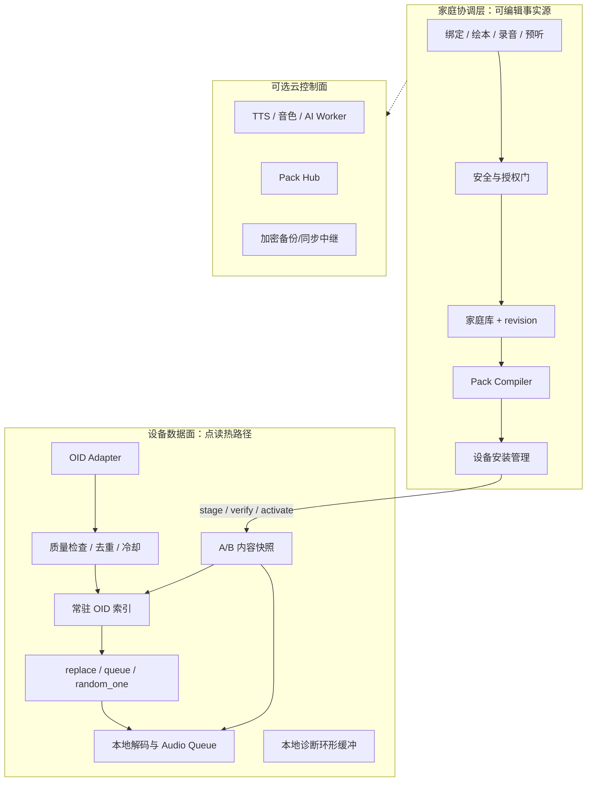
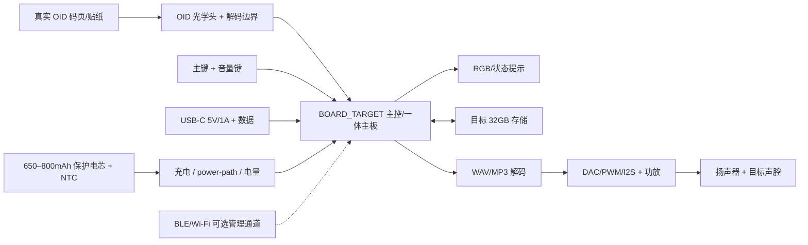
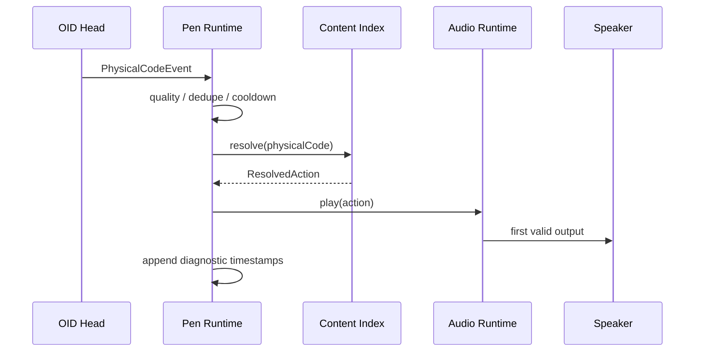
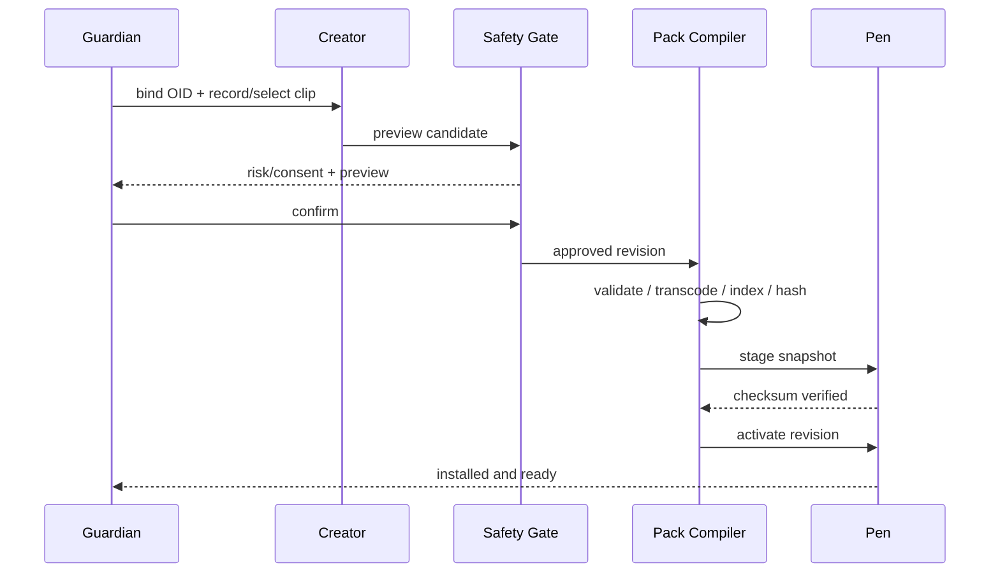
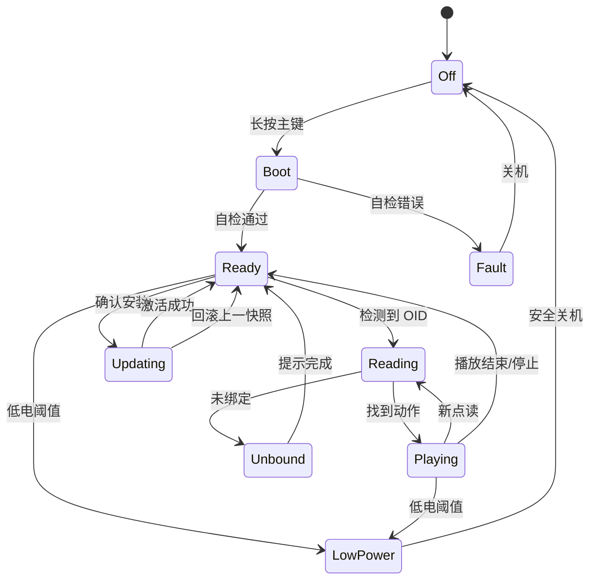

# 益米点读笔 · 系统构思 v0.2

> 状态：系统蓝图草案，供产品、硬件、固件、App 与内容研发共同使用  
> 日期：2026-08-03  
> 上位约束：[产品理论](./theory.md)、[儿童安全](./safety.md)、[硬件与 OID](./hardware-oid.md)、[Gen1 EVT-0](./hardware-gen1-p0.md)  
> 原则：本文负责把既有决策收敛成端到端系统，不替换上述冻结文档。

## 1. 产品定义

益米 Gen1 定义为：

> **面向 3–6 岁家庭的无屏、离线优先、开放内容点读玩具。家长通过 OID 贴纸或自制绘本，把熟悉的物品、故事和家人的声音变成一点即播的内容。**

它的核心不是“笔内大模型”，而是三个确定性价值：

1. **儿童：** 一点就响，反复点仍有变化和彩蛋；
2. **家长：** 几分钟完成一次创作，预听确认后交给孩子；
3. **家庭：** 内容装入后长期离线可用，数据和声音归家庭管理。

首发研发闭环收口为：

```text
一张空白 OID 贴 → 一段真人录音/基础 TTS → 一次装包 → 笔端本地一点即播
```

拍照成书、亲情音色复刻、Pack Hub 和 IoT 均保留在系统架构中，但按阶段叠加。

## 2. 首发产品组成

| 组成 | Gen1 定义 |
|---|---|
| 益米笔 | 无屏、真实 OID、本地索引和音频、内置电池、扬声器、少量按键与状态灯 |
| 开箱样例 | 一套完成度高的预装内容和配套码卡/小绘本，儿童无需配置即可玩 |
| DIY 贴纸 | 物面级空白 OID 贴；食品接触类以后作为独立材料 SKU |
| 家长端 | 配对、绑定、录音、预听、安全确认、装包、备份、删除和诊断 |
| 开放格式 | Pack、Book、Hotspot、Clip、逻辑 OID 和设备快照规范 |
| 可选服务 | 识物、故事草稿、TTS、音色、备份与公开 Pack Hub |

### 2.1 首发主动收口

- 不做屏幕、OCR 搜题或学段教辅主路径；
- 不让网络、手机或云服务进入正常点读热路径；
- 不要求笔端录入语音，录音和创作放在家长端；
- 不以 IoT、在线问答或社区内容数量作为首发核心卖点；
- 不在 `BOARD_TARGET` 冻结前绑定某个操作系统名称。

## 3. 核心用户与任务

| 角色 | 核心任务 | 系统要求 |
|---|---|---|
| 3–6 岁儿童 | 点物体、听角色、重复玩、切换简单模式 | 无屏、盲操作、低延迟、可重复惊喜、清晰失败反馈 |
| 家庭所有者 | 初始化设备、创作内容、授权、备份和删除 | 本地事实源、明确的数据去向、原子装包、完整导出 |
| 其他监护人/老人 | 播放、录一句话、使用已有内容 | 低操作负担，默认不暴露复杂设置 |
| 社区作者 | 制作和发布原创/公版 Pack | 开放格式、离线校验、许可和年龄元数据 |
| 研发与制造 | 复现构建、烧录、校准、验收和追溯 | 固定版本、BOM/固件/快照 revision、机器可读测试证据 |

MVP 权限模型先采用“一个家庭所有者 + 本地备份/转移”。多监护人并发编辑、园所组织和复杂云账号放到后续阶段。

## 4. 产品体验闭环

### 4.1 开箱闭环

1. 长按主键开机，声音和灯语提示就绪；
2. 儿童直接点配套样例页或预绑定贴纸；
3. 角色短句、音效、歌曲和彩蛋立即播放；
4. 无账号、无网络、无手机也能完成开箱体验。

目标：开箱后 `60s` 内获得第一次有效反馈。

### 4.2 贴纸 DIY 闭环

1. 家长端读取或输入空白贴纸的逻辑 OID；
2. 拍照辅助识别或手动命名物体；
3. 选择真人录音、系统 TTS 或已有音频；
4. 若使用 AI，只生成少量候选草稿；
5. 家长预听并确认；
6. Pack Compiler 生成设备快照并写入笔；
7. 儿童离线点贴纸播放。

目标：首次配对后 `10min` 内完成第一张家庭贴纸。

### 4.3 图书 DIY 闭环

图书路径复用同一套 `Pack → Hotspot → Clip` 契约：

```text
家庭照片/画作 → 排版与旁白 → OID 页面/贴纸 → 编译 Pack → 打印 → 点读
```

它是第二个产品闭环；在贴纸 DIY、装包事务和真实 OID 稳定后进入。

## 5. 系统上下文



实线是 Gen1 核心链路；虚线是可选能力。云生成的最终结果必须收敛为普通音频和 Pack，随后按本地路径运行。

## 6. 总体架构

系统采用 **设备数据面 + 家庭协调层 + 可选云控制面**。



### 6.1 架构不变式

1. 正常 `tap → play` 全部在笔内完成；
2. 家长端保存可编辑模型，笔只消费编译后的只读快照；
3. 家庭录音、照片和 VoiceProfile 默认留在家庭域；
4. 设备只接收合成完成的 Clip，不接收音色原始训练样本；
5. 云服务退出后，已安装内容和本地 DIY 仍保持可用；
6. OS、SoC 和供应商 SDK 均位于 HAL 以下，不成为内容和产品契约。

### 6.2 高复用、低维护演进门

整机代码统一采用“稳定内核 + 应用用例 + 端口 + 适配器 + 组合根”。新板卡、传输、
存储和内容来源只增加 adapter，并继续消费同一版本化合同和 conformance suite；跨
TypeScript/Rust/C 的共同事实由 Schema、C header、黄金向量和 transcript 持有，不复制
多份合同正文。

共享抽象只在第二个真实消费者出现且可删除重复实现时建立。每个新功能必须说明复用的
合同/内核、变化落点、平行管线的合并或删除方式，以及删除功能时涉及的稳定模块数。
详细规则与机器门见[高复用、低维护架构](./reuse-maintainability.md)，允许依赖图和合同
所有权冻结在
[`architecture/system-boundaries.v1.json`](../architecture/system-boundaries.v1.json)。

## 7. 硬件系统构思



### 7.1 Gen1 物理边界

| 项 | 系统目标 |
|---|---|
| 形态 | 无屏，长 `135–155mm`，握持直径 `28–36mm`，整机 `<100g` |
| 输入 | 真实 OID 近接触式光学输入；逻辑上至少包含电源/播放与音量控制 |
| 存储 | 目标 32GB，本地索引、音频、系统音、升级和诊断分区 |
| 音频 | WAV 诊断 + MP3 目标播放；所有内容 `<=85dBA @ 50cm` |
| 电源 | 内置保护电芯、NTC、power-path，目标混合工况 `>=6h` |
| 接口 | USB-C 是装包、升级和充电基线；无线退出点读热路径 |
| 反馈 | 启动、成功、未绑定、存储错误、低电、升级均有区分明确的灯语/短音 |

### 7.2 主板与操作系统决策

硬件继续执行“一体主板优先、同版自研板后备”的门控路线：

1. 先冻结同一 `BOARD_MPN / PCB_REV / HEAD_MPN / HEAD_REV / FW_VERSION` 的量产一体板/OID 套件；
2. 满足离线、码工具、音频、电源、日志、构建/烧录和持续供货门时，直接作为 `BOARD_TARGET`；
3. 一体板全部失格后，才进入同版自研 PCB 分支；
4. 自研分支保持多候选：OpenVela/NuttX + Rust staticlib、ESP-IDF + Rust app，或裸机 Rust + Embassy/RTIC；具体 MCU 与运行时由电源、音频、OID、USB、存储和量产证据冻结。

OpenVela 保留为目标运行时候选，评估门包括 BSP、Rust 构建/静态库接入、OID、音频、文件系统、USB、升级、功耗和量产工具。采用 OpenVela 时使用其调度器；Embassy executor 只属于裸机 Rust 分支。上层 Pack、协议和设备快照保持稳定。

## 8. 笔端运行时

### 8.1 点读热路径

```text
PhysicalCodeEvent
  → 状态与质量检查
  → 连续码去重 / 同码冷却
  → physicalCode(uint64) 常驻索引
  → ResolvedAction
  → replace / queue / random_one
  → 本地文件打开与首缓冲
  → WAV/MP3 解码
  → 扬声器首音
```

热路径中不扫描目录、不解析大型 JSON、不访问网络、不等待手机，也不执行现场 TTS。

| 阶段 | 预算 |
|---|---:|
| 光学读码与解码 | `30–80ms` |
| 常驻索引查询 | `<5ms` |
| 文件打开、首缓冲与音频启动 | `20–50ms` 量级 |
| 总目标 | P50 `<150ms`、P95 `<200ms`、P99 `<300ms` |

### 8.2 设备运行时模块

| 模块 | 职责 |
|---|---|
| `OidAdapter` | 把供应商事件/UART/SPI 边界归一成 `PhysicalCodeEvent` |
| `ContentIndex` | `physicalCode → actionId` 常驻映射 |
| `PlaybackPolicy` | 冷却、打断、排队和可注入随机选择；加权字段/分布另走版本化证据门 |
| `AudioRuntime` | 文件、解码、缓冲、音量和功放状态 |
| `SnapshotManager` | stage、校验、A/B 激活和回滚 |
| `DeviceManager` | 按键、灯语、电池、USB、配对和固件状态 |
| `Diagnostics` | 同源时间戳、错误计数和定长环形日志 |

## 9. 家庭协调层

家长端不是遥控播放器，而是家庭内容的事实源和发布工具。

### 9.1 核心模块

| 模块 | 职责 |
|---|---|
| `FamilyLibrary` | Book、DIY、录音、VoiceProfile 和版本管理 |
| `Creator` | 贴纸绑定、绘本编辑、录音、候选文案和预听 |
| `SafetyGate` | 年龄、风险物体、内容过滤、授权与家长确认 |
| `PackCompiler` | 校验、转码、索引、容量规划和 checksum |
| `InstallManager` | 能力协商、stage、verify、activate、rollback |
| `DeviceRegistry` | 家庭设备、固件、容量、installed revision 和转移 |
| `JobManager` | TTS/音色/识图异步任务；产物回到家庭库 |
| `BackupExport` | 本地备份、完整导出、恢复和删除 |

开发期可继续使用 JSON 文件；家庭产品版本迁移到 SQLite，并加入 revision、CAS、原子事务和 outbox。USB 用于大包，BLE 用于配对、状态和小变更；具体传输能力服从 `BOARD_TARGET`。

## 10. 内容与数据契约

### 10.1 三种模型分离

| 域 | 核心模型 | 用途 |
|---|---|---|
| 编辑域 | `Book / Page / Hotspot / Clip / DiyBinding / VoiceProfile` | 家长和作者可编辑、可预览 |
| 物理域 | `PhysicalCodeEvent` | 屏蔽光头和供应商协议 |
| 执行域 | `OidIndexEntry / ResolvedAction / ClipDescriptor` | 笔端低延迟查表和播放 |
| 发布域 | `SnapshotManifest / FileChecksum / InstallState` | 原子装包、回滚和追溯 |

逻辑 OID 继续使用可治理字符串；装包时将它编译为真实 `physicalCode(uint64) → actionId`。页坐标和预览信息不进入 Gen1 OID 热索引。

### 10.2 设备快照

目标 `Snapshot v1` 至少包含：

- `snapshotId`、内容 revision、格式版本和最低固件版本；
- 物理 OID 索引与执行动作；
- 音频文件描述、大小、编码和 SHA-256；
- 总容量、来源和构建时间；
- 当前、上一良好版本和安装状态。

安装流程固定为：

```text
编译 → 写入 inactive/tmp → 逐文件校验 → 原子切换 active 指针 → 回报 revision
```

断电、坏包、满盘或版本不匹配时继续启动上一完整快照。

## 11. 关键时序

### 11.1 离线点读



### 11.2 家庭 DIY 发布



## 12. 无屏状态设计



| 状态 | 儿童可感知反馈 | 家长端信息 |
|---|---|---|
| 启动/就绪 | 短启动音 + 固定灯色 | 电量、固件、内容 revision |
| 读码成功 | 极短触发反馈后直接播放 | 可选记录匿名诊断计数 |
| 未绑定码 | 温和短音/一句提示，避免沉默 | 显示物理码并进入绑定入口 |
| 识别失败 | 与未绑定区分的短灯语 | 质量、重试和光学诊断 |
| 音频缺失/损坏 | 本地错误音，不尝试联网补播 | 文件和 checksum 错误 |
| 低电 | 降低提示频率，保留明确警告 | 百分比/充电建议 |
| 装包/升级 | 独立灯语，点读暂时锁定或继续旧快照 | 进度、校验和回滚结果 |
| 严重故障 | 固定错误码音/灯 | 可导出诊断包 |

具体颜色、节奏和按键位置在竞品实测与结构样机阶段冻结。

## 13. 安全、隐私与信任

### 13.1 儿童安全

- 出厂中低音量，家长童锁最大音量，所有内容做响度归一；
- 药品进入警示模板，清洁剂、刀具、烟酒等进入强提醒流程；
- 普通贴只标称物面使用，食品接触贴单独验证材料和标识；
- 笔尖、网罩、键帽和其他小零件经过拉力、跌落和耐久门；
- AI 识物和故事只生成候选，家长预听确认后才进入笔。

### 13.2 数据边界

| 数据 | 默认归属 | 入笔内容 |
|---|---|---|
| 家庭照片 | 家庭端 | 不入笔；只入最终素材或音频 |
| 真人录音 | 家庭端 | 经确认的成品 Clip |
| VoiceProfile 样本/模型引用 | 家庭端 | 不入笔 |
| 合成音频 | 家庭端缓存 | 经确认后入笔 |
| 点读诊断 | 笔内定长缓冲 | 用户主动导出 |
| 公开 Pack | 作者/权利人 | 许可和安全校验后安装 |

### 13.3 系统信任

- Pack 和设备快照执行 schema、路径、容量、OID 冲突和 checksum 校验；
- 装包使用配对设备、事务和回滚，不直接覆盖活动内容；
- 固件、Pack 和硬件 revision 分开管理；
- 社区 Pack 不包含可执行脚本，家庭音色不随公开 Pack 发布；
- 首阶段不收集广告画像，不让诊断遥测进入点读热路径。

## 14. 质量目标

| 维度 | Gen1 目标 |
|---|---|
| 标准码读取 | 1,000 次成功率 `>=98%`，错码 `0` |
| 负样误触发 | 空白/普通印刷 500 次误触发 `0` |
| 首音 | P50 `<150ms`、P95 `<200ms`、P99 `<300ms` |
| 离线 | 断开无线和电脑后 `100/100` 正确播放 |
| 连续运行 | 1,000 次随机点读无死机、串码和存储损坏 |
| 内容安装 | 500MB 原子写入、校验、回滚和重启共 3 轮通过 |
| 续航 | 目标混合点读工况 `>=6h` |
| 声压 | 所有内容和提示音 `<=85dBA @ 50cm` |
| 结构 | 1.2m、6 面各 2 次跌落后无危险和核心功能失效 |
| 按键/笔尖 | 各 10,000 次耐久后功能与识别指标保持通过 |

产品体验同步观察：开箱首次反馈时间、首贴完成率、家庭 DIY 数、7 日复点率、家长确认放弃率以及失败后恢复率。

## 15. 自研与采购边界

| 自研/掌握 | 首期采购/合作 |
|---|---|
| Pack/快照规范、逻辑 OID 治理 | OID 光学头、解码边界和码工具 |
| 点读规则、家庭库和创作体验 | 满足证据门的一体主板或关键 IC |
| 装包事务、校验、诊断和验收 | PCB/SMT、结构加工、电芯与扬声器 |
| 家长端、模拟器和内容工具链 | 初期 TTS/识图服务或可替换本地模型 |
| 固件 HAL 与产品级测试 | 认证、材料和可靠性实验服务 |

无论采购哪种板，益米必须掌握：内容格式、家庭数据、装包与回滚、产品验收、版本映射和后续同版供货证据。

## 16. 当前代码资产与缺口

### 16.1 可复用资产

- `packages/core`：Book、Hotspot、Clip、DIY、VoiceProfile 和播放策略；
- `packages/audio`：AudioBackend 和队列抽象；
- `packages/protocol`：消息与 Transport/PenSession 方向；
- `packages/content`：基础 manifest、读写和校验；
- `apps/device-sim`：语义参照、黄金回放和故障注入候选；
- `apps/admin-web`：研发期内容查看器；
- `apps/companion-app`：首个家庭协调层产品组合根；已打通本地 repository、完整家庭包、canonical
  import、target-neutral authoring/CAS、materialized preview、真实主机播放器 callback、显式确认、
  逐构建授权与 authored design Snapshot；文件与 DirectShow 来源汇入同一 canonical import/authoring 主链，
  静态/创作两条链共用 App-local verified-prelisten 用例；全历史资产 mark、dry-run、保留期、稳定引用租约和
  条件 orphan 清理已进入独立 App-local maintenance use-case/adapter；版本化journal与FamilyWorkspace启动恢复
  已覆盖受控进程中断后的quarantine回滚、连续purge前缀确认和fresh-plan重规划；
- `tools/family-alpha-compiler`：隔离的家庭 draft → 可审计 preview → 精确确认 → Snapshot v1 编译器与黄金回归；
- `tools/family-build-adapter`：target-neutral FamilyRevision + BuildPlan/兼容 BuildRequest → Alpha 编译投影、BuildPlan 最终化入口与23场景回归；
- `tools/execution-model`：Family/Golden-24 Snapshot → Node/Rust 稠密执行表与点读轨迹的独立交叉验证；
- `tools/release-gates`：host/物理/生产证据 → canonical receipt → 唯一发布决策的聚合边界；
- L0/L1 TTS 脚本和样例内容：创作与验收 fixtures；
- 嘉立创EDA/Codex 桥：后续原理图、PCB、BOM、ERC/DRC 评审入口。

### 16.2 系统缺口

1. `BOARD_TARGET`、OID 光头、码工具和固件 SDK 尚未冻结；
2. 还没有目标板固件、真实 OID 常驻索引和音频输出热路径；
3. Snapshot/DeviceLink 的主机合同、双实现 transcript、Family Alpha 编译器和 Snapshot→ExecutionModel Node/Rust 字节级交叉验证已经成立；目标 parser、真实存储同步、USB 重连和掉电原子性仍待板级 HIL；
4. FamilyRevision/BuildPlan、BuildAuthorization、兼容投影和 FamilyRepository revision/CAS/事务/恢复已成立；companion 已把 CLI 文件与注入式 DirectShow capture 汇入同一 target-neutral revision，经 CAS、BuildPlan、preview、显式确认、provider 验证和授权编译生成绑定的 `design:` Snapshot；framework-neutral产品壳已以33/33闭合source/内容寻址permission/adapter异常归类/metadata/command preparation/frozen commit/bound review receipt任务，并保证fixture receipt不提升生产授权事实；一次真实麦克风 host receipt、具体UI、生产账号权威、密钥生命周期、人员听觉/目标音频与产品级重放存储 adapter 待接入；
5. DeviceLink 已有严格 Schema、幂等、分块、断连、CAS 和回滚合同；目标传输 framing、能力实测和 board port 待冻结；
6. Atomic JSON adapter 已区分损坏、空库和格式漂移；Family Export v1 已把 repository backup、
   全部历史引用资产、精确目录闭包和 distinct-replica epoch 组合为可迁移主机包；普通用户交互、
   主机 asset vault 已有21项 mark/dry-run/retention/conditional-delete及70项进程退出/startup recovery验收；
   产品workspace统一租约和purge中断恢复已成立，多进程writer、异常退出的完整导入staging回收、产品存储
   adapter、父目录fsync、恢复回执持久审计与目标介质掉电耐久仍待后续证据；
7. 新 `no_std` 执行核心已使用事件时间和注入 Random，并通过黄金向量；旧应用引擎接入新合同仍需防腐 adapter；
8. 还没有实际嘉立创EDA工程、目标 PCB/BOM 或结构 CAD；
9. 真实 OID、印刷、声学、电池和可靠性仍等待实物闭环。
10. 当前统一 ReleaseDecision 已有15项 host PASS、0 FAIL，另有19项物理/生产 receipt 缺失；
    该数字来自 catalog evaluator，不由各 runner 手写。

## 17. 分阶段实现

### Phase 0：系统契约与目标板冻结

- 冻结首发闭环、Pack/Snapshot v1 字段和 24 码黄金内容；
- 执行现有采购队列和卖家证据门；
- 冻结 `BOARD_TARGET + OID_TARGET_HEAD + BOM-REV-A`；
- 明确 build、flash、log、码生成和印刷工具链。

**完成门：** 两套同 revision 套件身份一致，24 码可离线复现，系统版本链可追溯。

### Phase 1：Gen1 EVT-0 真实点读闭环

- 固件 HAL、本地索引、WAV/MP3、打断/冷却和同源时间戳；
- Snapshot v1、USB stage/verify/activate/rollback；
- 24 码黄金包和系统灯语/提示音；
- 目标电池、声腔、外壳与完整可靠性门。

**完成门：** `<200ms P95`、离线、1,000 次点读、坏包恢复和目标形态全部通过。

### Phase 2：家庭 Alpha

- 家长端本地家庭库、贴纸绑定、真人录音和基础 TTS；
- 安全确认、容量规划、备份恢复和 USB 装包；
- 未绑定贴纸从笔端诊断进入绑定入口；
- 小规模真实家庭任务测试。

**完成门：** 新家庭 10 分钟完成第一贴，断网重复点读，内容可编辑、删除、备份和恢复。

### Phase 3：双 DIY 与亲情音色

- VoiceProfile 授权、录入、异步合成和删除；
- 拍照成书、打印模板、码位套准和多页故事；
- BLE 状态/小差量、多 Pack 和格式迁移。

### Phase 4：生态与量产

- Pack Hub、作者发布、许可/年龄/安全 CI；
- 可选备份、同步和 AI worker；
- DFM/DFT、校准、认证、第二来源和试产；
- MQTT/HA、园所管理等增值能力。

## 18. 当前拍板项

| ID | 决策 |
|---|---|
| SC-01 | 首发核心用户为 3–6 岁家庭，产品是无屏点读玩具而非教辅终端 |
| SC-02 | 首个完整闭环是“贴纸 + 真人录音/基础 TTS + 本地装包 + 离线点读” |
| SC-03 | 真机正常点读由设备本地解析与播放，手机和云退出热路径 |
| SC-04 | 采用设备数据面 + 家庭协调层 + 可选云控制面 |
| SC-05 | 家长端保存可编辑模型，笔消费编译后的 Snapshot v1 |
| SC-06 | 逻辑 OID 与物理码分离，物理码在装包时编译为 `uint64` 索引 |
| SC-07 | 大包优先 USB，BLE/Wi-Fi 只做可选管理；具体能力服从目标板 |
| SC-08 | OS 选择服从 `BOARD_TARGET`，OpenVela位于 HAL 以下且不是首发前提 |
| SC-09 | 一体主板优先，同版自研板仅在完整证据门失败后进入 |
| SC-10 | 亲情音色样本留家庭端，笔只接收家长确认后的成品音频 |
| SC-11 | 拍照成书是第二闭环，Pack Hub 和 IoT 后置 |
| SC-12 | 官方服务退出后，已有笔、贴纸和 Pack 继续离线工作 |
| SC-13 | 新板卡、传输、存储、内容来源和应用壳默认只增加 adapter，并复用稳定合同/core/conformance |
| SC-14 | 发布状态只由一个版本化 ReleaseGateCatalog、EvidenceReceipt 集合和确定性 ReleaseDecision 派生 |

## 19. 下一工作包

以下是整机工作包地图，不是固定顺序。当前助手范围只执行软件，因此每个软件包完成或获得新证据后，
按关键路径解锁、证据就绪、可验证闭环、复用收益、成本和返工风险在软件候选池重排；硬件项只提供输入 gate：

1. **`WP-01 产品切片`：** 固定首发开箱包、24 码黄金内容、第一贴 UX 和状态灯语；
2. **`WP-02 目标板`：** 执行 `hardware/evt0/purchase-plan.csv`，冻结或淘汰一体板候选；
3. **`WP-03 Snapshot v1`：** 写出 schema、编译器输入/输出、checksum 和回滚测试向量；
4. **`WP-04 Rust 固件契约`：** 冻结安全 `no_std` 核心、窄 C ABI、PhysicalCodeEvent、DeviceLink、TestResult、时间戳、索引和 AudioRuntime 接口；
5. **`WP-05 家庭 Alpha`：** 已以隔离合同冻结本地绑定、FamilyRepository、BuildPlan、预览、
   确认信任、Snapshot 兼容编译、完整资产迁移、真实主机预听和真实资产 authoring/CAS/授权编译纵切；
   CLI 文件与可选 DirectShow 录音已接到同一用例；全历史 vault maintenance、统一workspace composition与
   startup recovery与framework-neutral产品壳已完成；实际设备/权限host receipt和具体UI保持独立adapter门；
6. **`WP-06 工程评审`：** 目标板冻结后在嘉立创EDA建立工程快照、BOM/网络评审和制造发布结构。

`WP-01` 与 `WP-03` 的设计基线已落盘；`WP-04` 的目标无关层已完成 Snapshot 9 场景、
DeviceLink 16 场景、窄 C ABI 与 Node/Rust 主机差分，但精确 board port 仍属于 `WP-02`
实物门。`WP-05` 的第一段家庭模型 → 可审计 preview → 精确确认 → Snapshot 编译闭环
已在隔离目录完成，并以 27 条负向场景守住设计夹具/生产信任/发布边界；DeviceLink 发布合同按设计
拒绝 `design:` Snapshot。FamilyRepository 已用 target-neutral revision、repository/family
scope、binding transition、CAS、epoch cursor、backup/restore/recovery 和两种 adapter 的共同
transcript 封闭存储边界。confirmation-free BuildPlan 已打断旧 BuildRequest 的确认循环；Ed25519/JCS
proof、一次性 challenge、BuildAuthorization 和 replay adapter 已由 17 条零副作用负例关闭 host 合同，
 companion host 另以26项 acceptance、10个当前资产复算、同 assetId 历史换字节场景、6项授权负例
和6项导出负例证明实际调用链与完整迁移边界；真实预听再以19项确定性负例、16项主机进程生命周期门、
5项共享编排顺序门和两条10/10固定 `ffplay` 链证明主机 adapter。authored 链进一步逐字节复算最终
design Snapshot 中的替换音频；capture-authoring 以12项确定性门覆盖成功、取消、timeout、坏 receipt、
import/cleanup failure，并明确保留人员听觉、真实麦克风 host run 和目标音频边界；产品 provider
qualification 和每次真实家庭授权仍保持独立证据门。asset-vault maintenance 另以21项真实文件/故障注入
证明全历史 mark、保留期、引用竞态重检、quarantine rollback、部分 purge 恢复/重规划与重复周期；
FamilyWorkspace 再以34项真实文件验收把 Atomic repository、canonical vault、唯一 coordinator 和 file/capture
source ports 收敛为 capability-only 组合根，并证明 import/authoring/maintenance/export/portable adoption 共用队列；
Asset Vault Recovery再以6个独立child-process退出窗口、重复启动、fresh-plan收敛和5类歧义/篡改负例形成
70/70：journal先于首个移动绑定plan/reference/inventory/limits/候选，startup recovery只归一化可证明状态；
跨进程writer、父目录fsync、恢复审计持久化和真实掉电继续保持独立门；
Snapshot→Rust ExecutionModel 的主机 parser/planner 已由 Family 与
Golden-24 加非词法 order-trap 三组 Node/Rust 字节级结果和23条对称负例关闭；真实码、目标编码和双板 C/Rust HIL
继续留在物理证据门。WeightedRandom v2 另以6组 Node/Rust 逐字节一致向量、精确整除证明和12条零副作用负例
冻结正整数权重语义；目标 RNG、双板原始词流和量产 Snapshot 仍留在生产证据门。
ReleaseGateCatalog/EvidenceReceipt/ReleaseDecision 已统一15项 host 与19项
物理/生产门；host receipt 只从一次源码零漂移、15份报告均确认本轮刷新的密封 full run 生成，重复评价
同一 run 保持 decision 身份稳定。持久化maintenance journal与startup recovery已收口；framework-neutral
authoring产品壳再以33/33复用source、permission、metadata、FamilyWorkspace commit和bound review receipt，
同时保持UI框架与设备交付独立；production provider 与 DeviceLink 继续按证据复排；
目标板和 HIL receipts 继续作为外部输入门。
两条路径继续共享 24 码、manifest、DeviceLink transcript 和 C/Rust 向量，不提前改写
稳定应用包。
