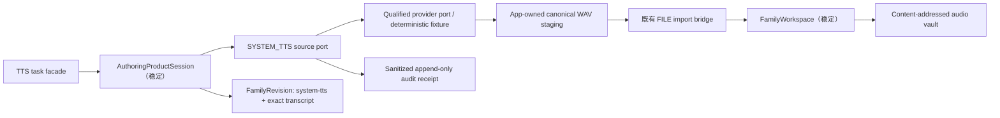

# System TTS Source Adapter v1

> 工作包：`SW-TTS-SOURCE-ADAPTER-01`  
> 状态：确定性 fixture 合同与产品接线已通过；真实 provider 仍在资格化门内  
> 日期：2026-08-04

## 1. 这次交付解决什么

首个产品切片需要同时支持文件、真人录音和基础系统 TTS。前两个来源已经进入
`AuthoringProductSession → FamilyWorkspace → FamilyRevision → review` 路径。本包用第三个来源验证：

> 新增内容来源只增加 App-local adapter、fixture 和组合接线；产品 session core、
> FamilyWorkspace、FamilyRevision、CAS、capture、prelisten 和编译合同保持稳定。

产品侧来源名为 `SYSTEM_TTS`，写入长期家庭事实时仍使用既有
`sourceKind: "system-tts"`。最终公开素材保持统一六字段：

```text
assetId / contentPath / bytes / sha256 / durationMs / codec
```

音频统一为 `WAV_PCM16_16K_MONO`。这只是当前主机家庭资产规范；最终设备 codec、安装格式和
目标存储继续由 `BOARD_TARGET` 与设备交付证据决定。

## 2. 结构



新增文件：

| 文件 | 单一职责 |
|---|---|
| `apps/companion-app/src/authoring/tts-source-contract.mjs` | request、provider descriptor、resource policy、private run receipt 和 sanitized audit receipt |
| `apps/companion-app/src/authoring/family-workspace-tts-source-adapter.mjs` | provider → staging → 既有导入桥 → cleanup → audit |
| `apps/companion-app/src/authoring/tts-authoring-task-facade.mjs` | 冻结合成文本，并自动提交同一份 `system-tts` metadata |
| `apps/companion-app/src/authoring/run-tts-source-adapter-acceptance.mjs` | 确定性成功、失败、取消、资源、隐私和稳定模块保护验收 |

### 为什么有 TTS task facade

通用 session 有意把 source request 保持为 adapter-private，并在 source 完成后提供通用
`submitMetadata()`。因此，仅增加 source port 还不足以证明“合成文本等于最终 transcript”。

TTS facade 不向 TTS UI 暴露通用 metadata 修改入口：

1. `selectSynthesis()` 冻结 `transcript / language / mediaType`；
2. `synthesizeAndPrepare()` 调现有 `session.acquire()`；
3. 成功后由 facade 以同一冻结 request 自动提交 `sourceKind: system-tts`；
4. 修改文本等同新任务，而不是修改已经合成的素材说明。

这样补齐语义，又保持纯状态机和通用 controller 的字节不变。

## 3. 冻结合同

### 3.1 Adapter-private request

```json
{
  "schemaVersion": 1,
  "profile": "authoring-system-tts-request-v1",
  "transcript": "这是香蕉，黄黄的，香香的。",
  "language": "zh-CN",
  "mediaType": "voice"
}
```

- exact keys；
- transcript 为 1–1000 个 UTF-16 code units，与既有 FamilyRevision v1 上限一致；
- 首包 `mediaType` 固定为 `voice`，与黄金 FamilyRevision 的系统音素材一致；
- request 中没有 provider 选择、账号、token、endpoint、绝对路径或声音样本。

### 3.2 Provider descriptor

descriptor 由 JCS 内容寻址，`providerDescriptorId` 覆盖以下事实：

- provider ID、实现版本、类别和资格状态；
- `NO_NETWORK_FIXTURE / LOCAL_ENGINE_CANDIDATE`；
- v1 固定 `LOCAL_ONLY`；
- privacy、rights、voice identity 和 qualification evidence 引用；
- `SUPERVISED_ABORT_AND_WAIT` 生命周期能力；
- canonicalizer ID/版本；
- 输出 codec。

允许的组合保持封闭：

| providerClass | qualification | network | privacy | 当前用途 |
|---|---|---|---|---|
| `FIXTURE_LOCAL` | `FIXTURE` | `NO_NETWORK_FIXTURE` | `LOCAL_ONLY` | 本包确定性合同验收 |
| `LOCAL_SYSTEM` | `QUALIFIED` | `LOCAL_ENGINE_CANDIDATE` | `LOCAL_ONLY` | 后续资格化 registry 的候选描述格式 |

当前 source composition 还进一步只接收显式启用且 descriptor ID 精确匹配
`SYSTEM_TTS_V1_APPROVED_FIXTURE_DESCRIPTOR` 的 `FIXTURE_LOCAL`。该固定描述符把黄金 WAV 的实际 SHA-256
纳入 qualification evidence；任意另造的 fixture ID 在 provider `start()` 前失败。一个格式正确的
`qualificationEvidenceSha256` 只是自述引用，不等于受信任资格证明，因此 `LOCAL_SYSTEM` 尚未进入产品组合根。
`REMOTE_SERVICE / CLOUD_REQUIRED / REMOTE_TEXT_PROCESSING` 在 v1 descriptor 创建时直接失败。Azure 保留为
未来带独立 cloud-policy、家长确认和资格 registry 的版本化路线。

`requiredCapability` 在 v1 固定为 `null`。这是工程推导：现有 permission port 表示产品 session 的用户/OS
能力决议；provider credential、网络策略、服务条款和内容权利属于组合根的 provider qualification，
不混入同一个 permission receipt。

### 3.3 Resource policy

```json
{
  "schemaVersion": 1,
  "profile": "authoring-system-tts-resource-policy-v1",
  "maxTranscriptChars": 1000,
  "maxOutputBytes": 1048576,
  "timeoutMs": 30000,
  "maxConcurrentJobs": 1
}
```

`maxOutputBytes` 必须小于或等于同一组合根传给 FamilyWorkspace 的 import 上限。provider 的 `start()`
必须立即返回 `{ providerRunId, completion, cancelAndWait }` 监督句柄。provider 收到子 `AbortSignal`、
watchdog 和输出上限；取消与超时调用 `cancelAndWait()`，并在 bounded settlement 内同时等待精确取消证明和
`completion` 终结。settlement 或 discard 越界后会隔离该 provider composition，后续任务在 start 前失败。

### 3.4 两类 receipt

provider private run result 只在 adapter 生命周期内使用：

```text
providerRunId / requestSha256 / audioSha256 / audioBytes / codecProfile
```

provider 收不到 App staging root 或 output path。adapter 对 completion result 只读一次并复制快照，验证
request/run/audio hash、codec 和资源上限；传回 provider `discard()` 的 cleanup receipt 也只含 run/request/audio
identity，不含字节或路径。公开 session、FamilyRevision、BuildPlan 和 Snapshot 均看不到这些私有值。

sanitized audit receipt 使用 `assetSha256` 与家庭事实连接，并持有：

```text
request/text hash
完整嵌套、可重新内容寻址验证的 provider descriptor
network/privacy/rights policy references
canonicalizer identity
canonical imported asset identity
```

其中没有原始 token、endpoint、临时路径、provider job ID 或原始诊断。receipt 先完成 staging 清理，
再写 supervised append-only audit port。`startAppend()` 返回
`{ auditRunId, completion, cancelAndWait }`；只有 exact ack `{ receiptId, persisted: true }` 才越过真相屏障。
请求取消会立即以 `REQUEST_ABORTED` 触发结算，并优先完成已发布资产的审计；timeout 使用第二段 bounded
settlement。`completion` reject 也不直接等同“未写入”：adapter 会以 `APPEND_FAILED` 调用 `cancelAndWait()`；
只有精确 settlement 证明 `persisted=true` 才视为已审计，证明 `persisted=false` 才允许按可重试写失败返回。
若迟到持久化状态在边界内仍未知，audit channel 被隔离，新任务在 provider start 前失败；迟到的同一内容寻址
receipt 仍是幂等真相，不被当作通道已恢复。失败记录 `importedAssetPublished=true` 并阻断 metadata/commit。

## 4. 生命周期与失败语义

```text
validate request/provider/policy
→ reserve single-flight slot
→ plan App-owned staging path
→ provider.start + supervised completion
→ validate/copy canonical audio bytes（provider 没有 staging path capability）
→ App exclusive write + root/file identity witness
→ verify regular file / containment / byte limit
→ reuse FILE import bridge and FamilyWorkspace CAS
→ verify imported assetId / byte count / SHA against the private provider receipt
→ provider discard + owned-path cleanup
→ supervised append sanitized receipt
→ return only { importedAsset }
```

| Adapter code | Product session 分类 | 语义 |
|---|---|---|
| `TTS_REQUEST_ABORTED` | `CANCELLED` | 终态；等待 provider/import/audit settlement |
| `TTS_PROVIDER_TIMEOUT` | `TRANSIENT` | watchdog 已触发，provider 已观察 abort 并结算 |
| `TTS_PROVIDER_SETTLEMENT_FAILED` | `TRANSIENT` | 强制结算证明缺失；provider composition 已隔离 |
| `TTS_STAGING_ROOT_INVALID` / `TTS_STAGING_WRITE_FAILED` | `INTEGRITY` / `TRANSIENT` | 根身份漂移或 App 写入失败；按文件 witness 收口 |
| `TTS_PROVIDER_UNAVAILABLE` / `TTS_RIGHTS_UNAVAILABLE` | `UNAVAILABLE` | provider 或资格证据缺失 |
| `TTS_RIGHTS_DENIED` | `DENIED` | policy 拒绝 |
| `TTS_*_INVALID` / `TTS_*_MISMATCH` | `INTEGRITY` | request、receipt、路径或 canonical audio 不一致 |
| `TTS_RESOURCE_BUSY` / `TTS_AUDIT_WRITE_FAILED` | `TRANSIENT` | 可在 settlement 后重试 |
| `TTS_AUDIT_SETTLEMENT_FAILED` / `TTS_AUDIT_UNAVAILABLE` | `TRANSIENT` / `UNAVAILABLE` | 审计状态未知时保持隔离；后续版本再引入显式 reconcile |
| `TTS_STAGING_CLEANUP_FAILED` | `TRANSIENT` | 保留 cleanup 失败事实；已导入资产事实仍准确 |

## 5. 一手资料交叉验证

### Windows System.Speech / SAPI

Microsoft 文档确认 `SpeechSynthesizer` 操作已安装的合成引擎，`GetInstalledVoices()` 可枚举声音，
`VoiceInfo` 暴露名称、区域和 ID；`SetOutputToWaveFile` 可指定 Wave 输出，
`SpeakAsyncCancelAll()` 可取消异步队列。`SelectVoice(string)` 是区分大小写的子串匹配，所以资格化
必须在选择后回读精确 voice identity，而不是只记录输入名称。

- [SpeechSynthesizer](https://learn.microsoft.com/en-us/dotnet/api/system.speech.synthesis.speechsynthesizer?view=windowsdesktop-9.0)
- [VoiceInfo](https://learn.microsoft.com/en-us/dotnet/api/system.speech.synthesis.voiceinfo?view=windowsdesktop-9.0)
- [SetOutputToWaveFile](https://learn.microsoft.com/en-us/dotnet/api/system.speech.synthesis.speechsynthesizer.setoutputtowavefile?view=windowsdesktop-9.0)
- [SpeakAsyncCancelAll](https://learn.microsoft.com/en-us/dotnet/api/system.speech.synthesis.speechsynthesizer.speakasynccancelall?view=windowsdesktop-9.0)
- [SelectVoice](https://learn.microsoft.com/en-us/dotnet/api/system.speech.synthesis.speechsynthesizer.selectvoice?view=windowsdesktop-9.0)

本机只读探测观察到中文声音包括 `Microsoft Huihui Desktop`、`Microsoft Huihui`、
`Microsoft Kangkang`、`Microsoft Yaoyao`。这证明当前主机有候选引擎；具体 voice ID、程序集/OS
版本、实际格式、断网冷启动、内容用途和策略证据仍需生成 qualification receipt。

### Azure Speech

Azure 是当前资料最完整的云候选。官方 REST/SDK 文档给出 resource endpoint、region、认证、
输出格式和停止接口；配额文档给出实时 TTS 的请求频率、并发和单次输出限制；数据页面区分实时
prebuilt voice、batch/long audio 与 custom voice 的数据边界。

- [REST Text to Speech](https://learn.microsoft.com/en-us/azure/ai-services/speech-service/rest-text-to-speech)
- [Speech synthesis SDK workflow](https://learn.microsoft.com/en-us/azure/ai-services/speech-service/how-to-speech-synthesis)
- [StopSpeakingAsync](https://learn.microsoft.com/en-us/dotnet/api/microsoft.cognitiveservices.speech.speechsynthesizer.stopspeakingasync?view=azure-dotnet)
- [Speech quotas and limits](https://learn.microsoft.com/en-us/azure/ai-services/speech-service/speech-services-quotas-and-limits)
- [TTS data, privacy and security](https://learn.microsoft.com/en-us/azure/ai-foundry/responsible-ai/speech-service/text-to-speech/data-privacy-security)

工程结论：首个云资格化包只考虑 realtime prebuilt voice，并绑定 region、voice short name、输出格式、
SDK 版本、policy URL/访问日期和配额快照。服务声音名不等于模型 build hash，因此不声明跨时间字节一致。

### Android、Apple 与 Piper

- Android `TextToSpeech` 可枚举 engine/voice，异步 `synthesizeToFile`，提供 `stop()`；voice 还声明
  locale、quality、latency 和 network-required 特征。输出格式仍要按 bytes 解析并 canonicalize。
  [Android TextToSpeech](https://developer.android.com/reference/android/speech/tts/TextToSpeech)
- Apple `AVSpeechSynthesizer.write` 输出 buffer，voice 有 identifier、language 和 quality，支持停止。
  [AVSpeechSynthesizer](https://developer.apple.com/documentation/avfaudio/avspeechsynthesizer) ·
  [write to buffer](https://developer.apple.com/documentation/avfaudio/avspeechsynthesizer/write(_:tobuffercallback:))
- Piper 当前主仓是本地 TTS 候选，但代码为 GPL-3.0，并要求逐声音检查 `MODEL_CARD`；engine 与模型
  许可必须分别形成证据。[Piper repository](https://github.com/OHF-Voice/piper1-gpl) ·
  [voice/model-card guide](https://github.com/OHF-Voice/piper1-gpl/blob/e7db87bddfb61efb6af68b498f8c405262d18336/docs/VOICES.md)

### 现有 edge-tts 与 L1 PoC

`edge-tts` 上游明确面向 Microsoft Edge 的在线 consumer service，当前源码固定消费服务 endpoint、
headers 和 MP3 输出面。它缺少 Azure resource/region/key/quota/data-policy 产品合同，因此保留为旧 CLI/PoC，
不接本包 provider port。[edge-tts README](https://github.com/rany2/edge-tts)

`scripts/tts-l0.mjs` 和 `scripts/tts-l1.mjs` 同样保持原样：它们的自动 fallback、混合输出格式、动态后端、
取消、资源和资格证据还未达到新合同。

## 6. 验收结果

确定性 runner 当前通过 **41/41**：

- happy path、TTS transcript 强绑定、FamilyRevision join；
- provider descriptor 内容寻址、完整嵌套重验、固定 fixture ID/资产 SHA、组合快照与 fixture authority；
- extra-key、文本上限、provider 资格/隐私组合；
- 超大输出、非 canonical WAV、私有 receipt extra-key 与 getter 快照；
- provider 不获得 App path；无效 receipt 不驱动 discard，旁路 sentinel 保持；
- staging 根目录 junction 换身不触发外部删除，provider 随即隔离；
- 同 inode 写后换字节会在 FamilyWorkspace import 后由 byte-count/SHA join 阻断，且不会写 audit/metadata；
- provider 原始错误脱敏；
- audit reject-before-persist、reject-after-persist、无效 ack、hang timeout、请求取消即时 settlement 和迟到持久化
  隔离后的 published-asset truth；
- 合成前、provider 中、导入后取消；
- provider watchdog、迟到 completion 无落盘能力、强制 settlement、discard timeout、cleanup-proof 失败与隔离；
- write 已建文件后报错仍以 inode witness 清理；
- single-flight 并发限制；
- 全部 staging WAV 清理；
- 8 个稳定软件文件与 3 个硬件输入文件前后 SHA-256 一致；报告另绑定 4 个本包 subject 文件 SHA-256。

```powershell
npm run test:companion-tts-source-adapter
```

报告：`build/companion-tts-source-adapter-validation/report.json`  
当前报告 SHA-256：`d2488e26f3363e7b46d57c2475c524ce6c096c98cc8a3e754e2c77c1c967a5db`

## 7. 硬件双线同步

本包启动与验收时的只读输入：

| 输入 | SHA-256 / 状态 |
|---|---|
| 硬件 owner anchor | `8ce718d502965bcd67e570af641a260d9b7fb9e9702940b0f04618bc9e5f64e3` |
| HardwareSystem topology bytes | `96431fecb220882b16745082d803e9349675802d234eb5ddf75fa197dd5f63d5` |
| target binding bytes | `ccb6efefadc6b438646c69160bc882229465b3639c130aa044a08330de35e202` |
| `BOARD_TARGET` | `UNRESOLVED` |
| interface bindings | 18/18 `TARGET_EVIDENCE_PENDING` |

本包前后上述文件字节一致；没有 codec、存储、USB、OID event、板级 audio 或 firmware adapter 新绑定。
因此 `hardwareImpact=NONE`，`offlineReady=false`。未来硬件线冻结目标 codec/存储后，只替换设备编译/安装
adapter；家庭创作 TTS、canonical host asset 和 FamilyRevision 语义保持。

## 8. 真实 provider 进入条件

真实 Windows、Azure、Android、Apple 或 Piper adapter 在进入产品组合根前，至少生成并验证：

1. provider/interface/binary 或 SDK 版本；
2. 精确 voice/model identity 与证据 SHA；
3. OS build、region/endpoint class 或 engine package identity；
4. 实际源格式、canonicalizer identity 与最终 WAV SHA；
5. 取消、超时、进程/连接和临时文件 settlement；
6. 文本、输出、并发、配额与磁盘上限；
7. privacy/rights/model-card 官方引用、访问日期和用途结论；
8. 本地候选的 outbound-blocked 冷启动实测，或云候选的显式 cloud classification；
9. `fixtureOnly=false` 的生产 review authority 仍由独立 Confirmation Trust 门提供；
10. 设备离线可用仍由 DeviceDelivery、目标板和实物/HIL 证据提供。

所以本包证明的是“第三来源以稳定 adapter 加入，后续 provider 可替换”，而不是把某个现成引擎直接标为
量产能力。
